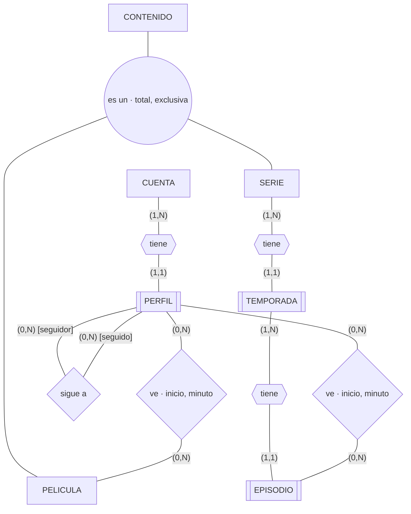
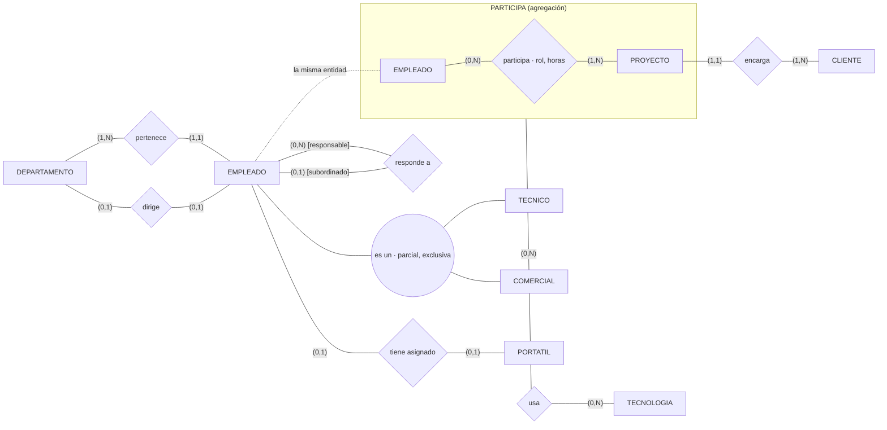
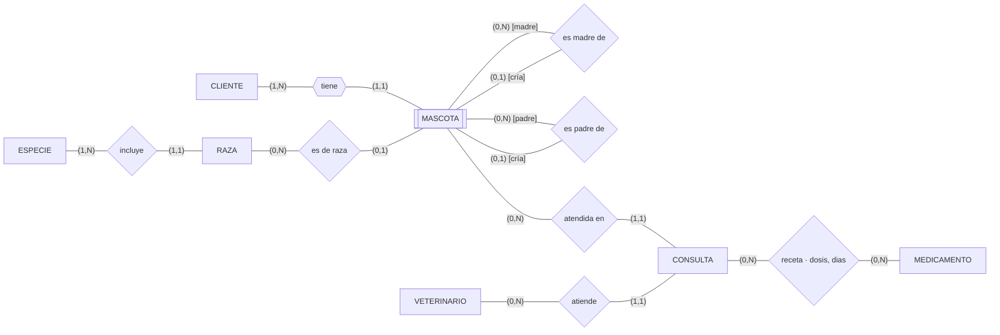
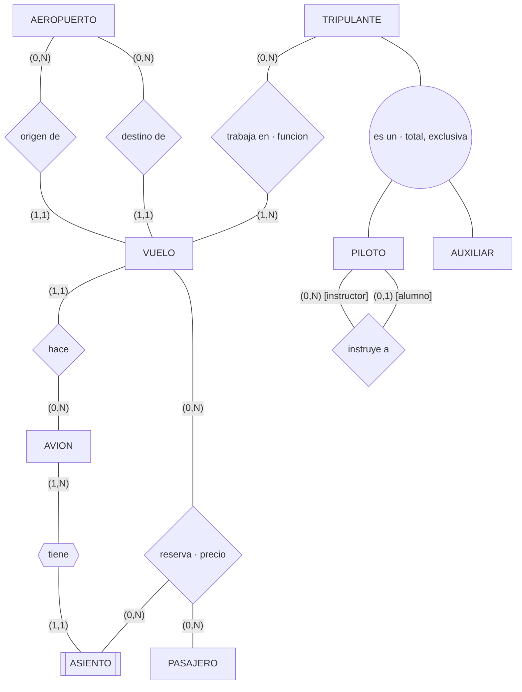
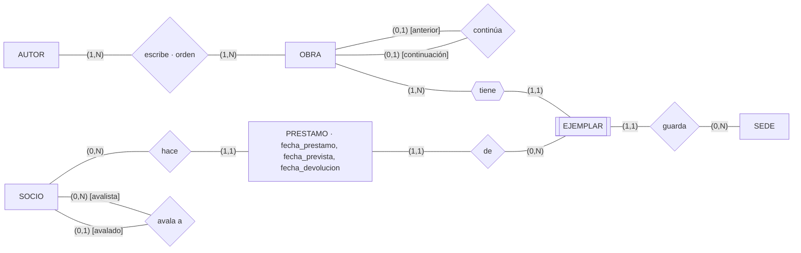

# Ejercicios E/R 3 · Ejercicios de equipo · Soluciones

Soluciones del profesorado de los cinco ejercicios de equipo de esta carpeta (G1–G5), corregidos en
clase.

Notación de tablas, la de `../../teoria/teoria-2-er-y-relacional.md`: `PK`, `FK → TABLA`, `?` para columna que
admite nulo, `UK(…)` para clave alternativa. En los diagramas, `[[X]]` es entidad débil, `{{x}}`
relación identificadora, el círculo doble la jerarquía, el recuadro con título una agregación (una
relación que se trata como un bloque para relacionarla con otra entidad), y en las reflexivas el
papel va entre corchetes junto a la cardinalidad.

Hay más de una solución buena en todos. Lo que se evalúa es que cada decisión esté justificada y que
las preguntas del enunciado se contesten recorriendo las tablas.

| | Reflexiva | Débil | 1:1 | Ternaria | Jerarquía | Compuesto / multivaluado | Derivado | N:M con atributos | Dos relaciones mismas entidades |
|---|---|---|---|---|---|---|---|---|---|
| G1 · Vídeo | N:M | ✔✔✔ | | | ✔ | ✔ / ✔ | ✔ | ✔ | |
| G2 · Software | 1:N | | ✔✔ | agregación | ✔ parcial | ✔ | | ✔ | ✔ |
| G3 · Veterinaria | 1:N ×2 | ✔ | | | | ✔ / ✔ | ✔ | ✔ | ✔ (madre, padre) |
| G4 · Aerolínea | 1:N | ✔ | | ✔ | ✔ | — / ✔ | ✔ | ✔ | ✔ (origen, destino) |
| G5 · Bibliotecas | 1:1 y 1:N | ✔ | ✔ | | | ✔ / ✔ | ✔ | ✔ → entidad (historial) | |

**En la presentación**, para cada ejercicio hay abajo «puntos de debate». Si nadie del público
encuentra nada, se lanza uno. El profesor elige quién del equipo contesta, no el equipo.

**Qué se recoge** (en `bd/ejercicio-equipo/` del repositorio de cada equipo): foto del borrador,
JSON, PNG y SQL de DrawDB, y `respuestas.md`. Es entrenamiento de RA2 a, b, c, d, e, f, i: no
califica por sí solo; prepara E4–E6 y la defensa E9.

---

## G1 · Plataforma de vídeo



```text
CUENTA(id_cuenta PK, email, contrasena_hash, plan, fecha_alta, calle, cp, ciudad)   UK(email)
PERFIL(id_cuenta FK → CUENTA, nombre)                         PK(id_cuenta, nombre)
SIGUE(id_cuenta_seguidor, nombre_seguidor,  FK → PERFIL
      id_cuenta_seguido,  nombre_seguido)   FK → PERFIL
      PK(las cuatro)
CONTENIDO(id_contenido PK, titulo, anio, edad_minima, tipo)
IDIOMA_AUDIO(id_contenido FK → CONTENIDO, idioma)             PK(id_contenido, idioma)
PELICULA(id_contenido PK FK → CONTENIDO, duracion_min)
SERIE(id_contenido PK FK → CONTENIDO)
TEMPORADA(id_serie FK → SERIE, num_temporada)                  PK(id_serie, num_temporada)
EPISODIO(id_serie, num_temporada FK → TEMPORADA, num_episodio, titulo, duracion_min)
         PK(id_serie, num_temporada, num_episodio)
VISTA_PELICULA(id_cuenta, nombre_perfil FK → PERFIL, id_pelicula FK → PELICULA, inicio, minuto)
               PK(id_cuenta, nombre_perfil, id_pelicula, inicio)
VISTA_EPISODIO(id_cuenta, nombre_perfil FK → PERFIL,
               id_serie, num_temporada, num_episodio FK → EPISODIO, inicio, minuto)
               PK(id_cuenta, nombre_perfil, id_serie, num_temporada, num_episodio, inicio)
```

| Decisión | Por qué |
|---|---|
| PERFIL débil | «Peques» solo identifica dentro de la cuenta |
| TEMPORADA y EPISODIO débiles en cadena | La clave crece: la de EPISODIO arrastra la de SERIE y la de TEMPORADA |
| Jerarquía con opción B | La película tiene duración; la serie, temporadas. Lo común (título, idiomas) en CONTENIDO |
| `IDIOMA_AUDIO` tabla | Multivaluado (regla 10) |
| `inicio` en la PK de las vistas | Se puede ver la misma película dos veces |
| `plan` como atributo | Vale mientras no se pida precio por plan. Si se pide, entidad |
| Nº de temporadas no se guarda | Derivado: se cuentan |

**Puntos de debate.**

- **Las claves que crecen.** VISTA_EPISODIO tiene una PK de seis columnas y dos FK compuestas.
  Pregunta: «¿qué ganaríais con un `id_perfil` subrogado?». Es el argumento práctico a favor de las
  subrogadas aunque la entidad sea débil en el E/R. Las dos soluciones valen si se justifican.
  En DrawDB las FK compuestas salen como varias líneas: se ve el problema.
- **Película o episodio.** Dos tablas de vistas, o una sola con `id_pelicula?` y el episodio
  opcional y la regla «uno de los dos, no los dos». Es la misma exclusión que *montado en* /
  *guardado en* del almacén.
- **SERIE sin atributos propios.** ¿Hace falta la tabla? Sí, si TEMPORADA ha de apuntar a una
  serie y no a una película; si no existe, la FK de TEMPORADA apunta a CONTENIDO y nada impide
  temporadas de una película.

**Restricciones no representables.** Como mucho cinco perfiles por cuenta. Un perfil no se sigue a
sí mismo. `minuto` no supera la duración. Exclusiva y total de la jerarquía. Una vista es de una
película o de un episodio, no de las dos.

## G2 · Empresa de desarrollo de software



```text
DEPARTAMENTO(id_departamento PK, nombre, id_director? FK → EMPLEADO)   UK(nombre) UK(id_director)
EMPLEADO(id_empleado PK, nombre, email, fecha_alta, id_departamento FK → DEPARTAMENTO,
         id_responsable? FK → EMPLEADO)                                UK(email)
TECNICO(id_empleado PK FK → EMPLEADO, nivel, especialidad)
COMERCIAL(id_empleado PK FK → EMPLEADO, comision_pct, zona)
PORTATIL(num_inventario PK, modelo, fecha_compra, id_empleado? FK → EMPLEADO)  UK(id_empleado)
CLIENTE(id_cliente PK, razon_social, cif, contacto_nombre, contacto_telefono, contacto_email)  UK(cif)
PROYECTO(id_proyecto PK, nombre, fecha_inicio, fecha_fin?, id_cliente FK → CLIENTE)
PARTICIPA(id_empleado FK → EMPLEADO, id_proyecto FK → PROYECTO, rol, horas_semana)
          PK(id_empleado, id_proyecto)
TECNOLOGIA(id_tecnologia PK, nombre)                                   UK(nombre)
USA(id_empleado, id_proyecto FK → PARTICIPA, id_tecnologia FK → TECNOLOGIA)
    PK(id_empleado, id_proyecto, id_tecnologia)
```

| Decisión | Por qué |
|---|---|
| Director y pertenencia, dos relaciones | Regla 6. Director 1:1 con `UK` |
| `id_director?` | Vacante (lo dice el enunciado) |
| `id_responsable?` | Reflexiva 1:N; nulo para la consejera delegada |
| Jerarquía parcial, exclusiva | Administración no es ni técnico ni comercial. Opción B |
| FK del portátil en PORTATIL | 1:1 con los dos lados opcionales. Cualquiera vale; en PORTATIL, «sin asignar» es `id_empleado` nulo y la pregunta 3 es inmediata |
| Contacto: compuesto | Tres columnas con prefijo `contacto_`. Si hubiera varios contactos, entidad |
| USA sobre la agregación | «Qué usa Ana en este proyecto»: la tecnología se usa **dentro de una participación**. USA es N:M entre PARTICIPA (como bloque) y TECNOLOGIA; PK de tres |
| FK compuesta de USA a PARTICIPA | No a EMPLEADO y a PROYECTO por separado: así nadie usa una tecnología en un proyecto en el que no participa |
| PARTICIPA y USA separadas | Juntas, rol y horas se repiten por cada tecnología (dependen solo de empleado + proyecto), y quien no usa tecnología (jefe de proyecto) no cabe: `id_tecnologia` nulo en la PK |

**Puntos de debate.**

- **¿Hace falta PARTICIPA si ya está USA?** Es el debate central. Sin PARTICIPA no hay dónde poner
  las horas, y quien no usa tecnología desaparece del proyecto. Si las juntan en una tabla, las
  horas de Ana en Bodegas Aragón salen dos veces (PHP y Docker) y la pregunta 4 suma mal.
- **Ternaria o agregación.** Una ternaria USA(empleado, proyecto, tecnología) independiente de
  PARTICIPA también contesta las preguntas, pero deja meter tecnologías de alguien que no está en el
  proyecto. Vale si lo ponen en las restricciones no representables.
- **Agregación o N:M con atributo.** Quien ponga `tecnologias` como texto en PARTICIPA ha metido un
  valor no atómico.
- **Pregunta 1 (directa o indirectamente).** Con la FK reflexiva se contesta repitiendo el salto
  tantas veces como niveles haya. Se puede, y en SQL es una consulta recursiva: se nombra, no se
  explica.

**Restricciones no representables.** El director es empleado de su departamento. Nadie es su propio
responsable; sin ciclos. `horas_semana` sumadas no pasan de 40. Exclusiva de la jerarquía. (Que quien usa
una tecnología en un proyecto participe en él ya no va aquí: lo garantiza la FK de USA a PARTICIPA.)

## G3 · Clínica veterinaria



```text
CLIENTE(dni PK, nombre, calle, cp, ciudad, email?)
TELEFONO_CLIENTE(dni FK → CLIENTE, telefono)                    PK(dni, telefono)
ESPECIE(id_especie PK, nombre)                                   UK(nombre)
RAZA(id_raza PK, nombre, id_especie FK → ESPECIE)                UK(nombre, id_especie)
MASCOTA(dni_cliente FK → CLIENTE, nombre, fecha_nacimiento, sexo, microchip?,
        id_especie FK → ESPECIE, id_raza? FK → RAZA,
        dni_madre?, nombre_madre?   FK → MASCOTA,
        dni_padre?, nombre_padre?   FK → MASCOTA)
        PK(dni_cliente, nombre)                                  UK(microchip)
VETERINARIO(num_colegiado PK, nombre)
CONSULTA(id_consulta PK, fecha_hora, motivo, peso_kg, diagnostico,
         dni_cliente, nombre_mascota FK → MASCOTA, num_colegiado FK → VETERINARIO)
MEDICAMENTO(id_medicamento PK, nombre, principio_activo)
RECETA(id_consulta FK → CONSULTA, id_medicamento FK → MEDICAMENTO, dosis, dias)
       PK(id_consulta, id_medicamento)
```

| Decisión | Por qué |
|---|---|
| MASCOTA débil de CLIENTE | «Luna» solo identifica dentro de la familia. El microchip no sirve de clave: no todas lo tienen (UK que admite nulo) |
| Madre y padre, dos reflexivas | Regla 6 + regla 7. Opcionales: no siempre son pacientes |
| `id_especie` en MASCOTA además de la raza | Las mestizas no tienen raza, pero sí especie |
| CONSULTA fuerte con subrogada | Se podría hacer débil de MASCOTA con `fecha_hora` de discriminante; con la subrogada, RECETA tiene una FK de una columna |
| Edad derivada | No se guarda |

**Puntos de debate.**

- **¿Qué pasa si Luna cambia de dueño?** Cambia su PK, y con ella todas las FK que la apuntan
  (consultas, crías). Es el mejor argumento de la sesión para una subrogada `id_mascota` con
  `(dni_cliente, nombre)` como UK. Si un equipo lo hace así desde el principio, que lo explique.
- **Especie en MASCOTA y en RAZA.** Para una mascota con raza, la especie está dos veces y puede no
  cuadrar. Es una restricción («la raza es de la especie de la mascota») o un motivo para quitar la
  especie de MASCOTA y crear una raza «mestizo» por especie. Debate abierto.
- **FK compuestas reflexivas.** En DrawDB, cuatro líneas de MASCOTA a sí misma. Se ve el coste de
  la clave compuesta.

**Restricciones no representables.** La madre es hembra y el padre macho, de la misma especie que la
cría, y nacidos antes. Una mascota no es su propia madre. La raza es de la especie de la mascota. La
fecha de la consulta es posterior al nacimiento.

## G4 · Aerolínea



Cardinalidades de la ternaria, fijando dos:

| Fijo | Pregunto por | Respuesta |
|---|---|---|
| vuelo + asiento | pasajeros | uno |
| vuelo + pasajero | asientos | uno |
| pasajero + asiento | vuelos | varios |

```text
AEROPUERTO(codigo_iata PK, nombre, ciudad, pais)
AVION(matricula PK, modelo, anio)
ASIENTO(matricula FK → AVION, fila, letra, clase)               PK(matricula, fila, letra)
VUELO(id_vuelo PK, codigo, fecha, hora_salida, hora_llegada,
      origen FK → AEROPUERTO, destino FK → AEROPUERTO, matricula FK → AVION)   UK(codigo, fecha)
PASAJERO(id_pasajero PK, documento, nombre, fecha_nacimiento, email)       UK(documento)
RESERVA(id_vuelo FK → VUELO, id_pasajero FK → PASAJERO,
        matricula, fila, letra FK → ASIENTO, precio)
        PK(id_vuelo, id_pasajero)                                UK(id_vuelo, matricula, fila, letra)
TRIPULANTE(num_empleado PK, nombre, tipo)
PILOTO(num_empleado PK FK → TRIPULANTE, num_licencia, horas_vuelo,
       id_instructor? FK → PILOTO)                               UK(num_licencia)
AUXILIAR(num_empleado PK FK → TRIPULANTE)
IDIOMA_AUXILIAR(num_empleado FK → AUXILIAR, idioma)             PK(num_empleado, idioma)
TRIPULACION(num_empleado FK → TRIPULANTE, id_vuelo FK → VUELO, funcion)
            PK(num_empleado, id_vuelo)
```

| Decisión | Por qué |
|---|---|
| Origen y destino | Dos relaciones entre las mismas entidades, dos FK con nombre de papel |
| ASIENTO débil | «12C» solo identifica dentro de un avión |
| VUELO con subrogada y `UK(codigo, fecha)` | El código se repite cada día |
| RESERVA ternaria con dos máximos 1 | Dos claves candidatas: vuelo + pasajero, y vuelo + asiento. Una PK y la otra UK. Es la ternaria más interesante de los cinco |
| Instructor en PILOTO, no en TRIPULANTE | Solo los pilotos tienen instructor: es una relación propia del subtipo, y por eso compensa la jerarquía |
| Idiomas: multivaluado del subtipo | Tabla aparte colgando de AUXILIAR |
| Duración derivada | `hora_llegada − hora_salida` |

**Puntos de debate.**

- **La matrícula está dos veces.** En RESERVA (por el asiento) y en VUELO. Nada impide reservar un
  asiento de otro avión: «el asiento es del avión que hace el vuelo» es la restricción estrella del
  ejercicio.
- **¿Ternaria o dos binarias?** Si alguien hace PASAJERO–VUELO y aparte ASIENTO–VUELO, pierde qué
  asiento es de quién.
- **¿Y si el asiento se elige después?** El asiento en RESERVA admitiría nulo, y deja de ser una
  ternaria pura. Buen «qué pasaría si».

**Restricciones no representables.** Origen distinto de destino. El asiento es del avión del vuelo.
Un instructor no es su propio alumno. Un tripulante no está en dos vuelos que se solapan. Cada vuelo
tiene exactamente un comandante. Llegada posterior a salida.

## G5 · Red de bibliotecas



```text
SEDE(id_sede PK, nombre, calle, cp, ciudad, telefono)
OBRA(isbn PK, titulo, anio, editorial, isbn_anterior? FK → OBRA)      UK(isbn_anterior)
MATERIA_OBRA(isbn FK → OBRA, materia)                                 PK(isbn, materia)
AUTOR(id_autor PK, nombre)
ESCRIBE(isbn FK → OBRA, id_autor FK → AUTOR, orden)                   PK(isbn, id_autor)
EJEMPLAR(isbn FK → OBRA, num_ejemplar, estado, id_sede FK → SEDE)     PK(isbn, num_ejemplar)
SOCIO(num_carne PK, nombre, fecha_nacimiento, calle, cp, ciudad,
      id_avalista? FK → SOCIO)
TELEFONO_SOCIO(num_carne FK → SOCIO, telefono)                        PK(num_carne, telefono)
PRESTAMO(id_prestamo PK, num_carne FK → SOCIO, isbn, num_ejemplar FK → EJEMPLAR,
         fecha_prestamo, fecha_prevista, fecha_devolucion?)
```

| Decisión | Por qué |
|---|---|
| *Continúa* reflexiva 1:1 | FK a la propia tabla con `UK` (regla 7 + UK). La FK en el tomo 2 apuntando al 1 |
| EJEMPLAR débil | Numerado dentro de la obra |
| `orden` en ESCRIBE | Es de la pareja obra–autor, no de ninguno de los dos |
| Materias: multivaluado | Tabla. Si se quiere controlar la lista, entidad MATERIA y N:M |
| Avalista: reflexiva 1:N | `id_avalista?`: los adultos no tienen |
| PRESTAMO entidad, no relación | Una relación se identifica por la pareja socio–ejemplar, y esa pareja se repite (el mismo socio vuelve a llevarse el mismo ejemplar). Además tiene fechas y ciclo de vida propio. Dos 1:N, SOCIO–PRESTAMO y PRESTAMO–EJEMPLAR: las FK van en PRESTAMO |
| PRESTAMO con subrogada | El mismo socio y el mismo ejemplar se repiten: `PK(num_carne, isbn, num_ejemplar)` no deja el segundo préstamo. La alternativa es añadir `fecha_prestamo` a la PK |
| `fecha_devolucion?` | Nula = no devuelto. Es lo que contesta las preguntas 1 y 2 |
| Retraso y préstamos activos | Derivados |

**Puntos de debate.**

- **La PK del préstamo.** El debate central, y el mismo que tendrán con las reservas del reto:
  cuando una N:M guarda **historia**, la pareja de claves no basta. Pedir a otro equipo que meta
  dos préstamos del mismo ejemplar al mismo socio con su esquema.
- **La saga completa (pregunta 3).** Se recorre la reflexiva hacia atrás y hacia delante. Como el
  organigrama de G2.
- **¿Préstamo como entidad o como relación?** Quien lo dibuje como rombo N:M entre SOCIO y EJEMPLAR
  tiene que explicar cómo guarda el segundo préstamo de la misma pareja: no puede, y al pasar a
  tablas acaba metiendo una subrogada, que es reconocer que es entidad. Es el comentario de la S2L:
  «una N:M con muchos atributos suele ser una entidad». Como relación solo valdría guardando el
  préstamo actual, sin historial.

**Restricciones no representables.** Como mucho tres préstamos sin devolver por socio. Un ejemplar
no está prestado dos veces a la vez. Los menores de 14 tienen avalista, y el avalista es adulto.
Nadie se avala a sí mismo. `fecha_prevista` posterior a `fecha_prestamo`. Una obra no es
continuación de sí misma.

---

Última actualización: 2 de octubre de 2026.
