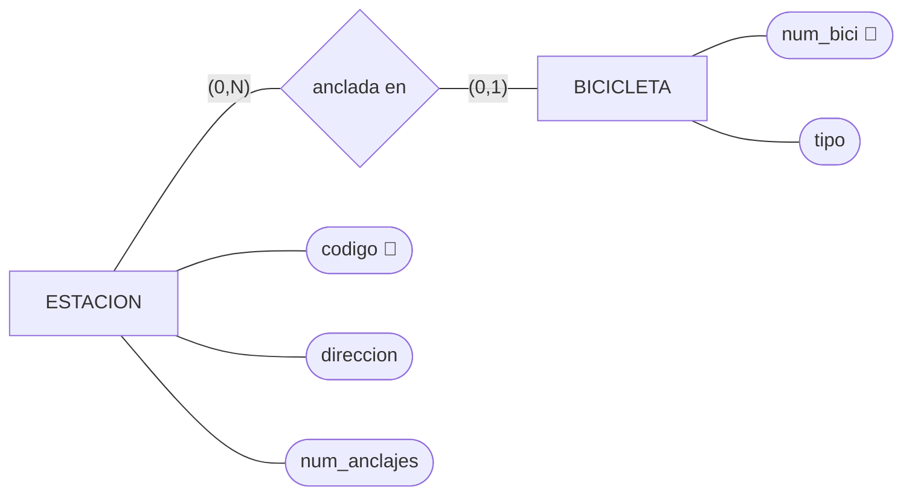
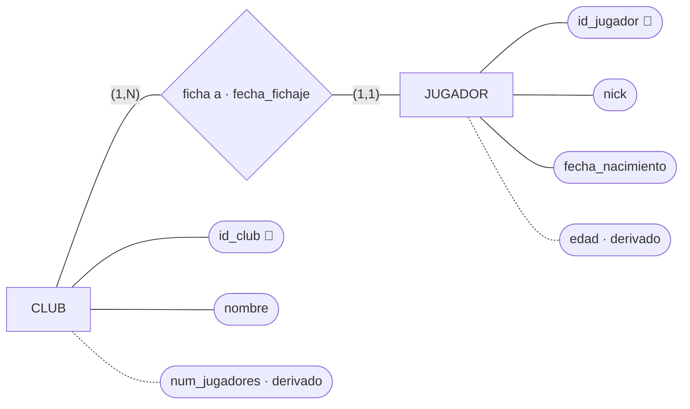
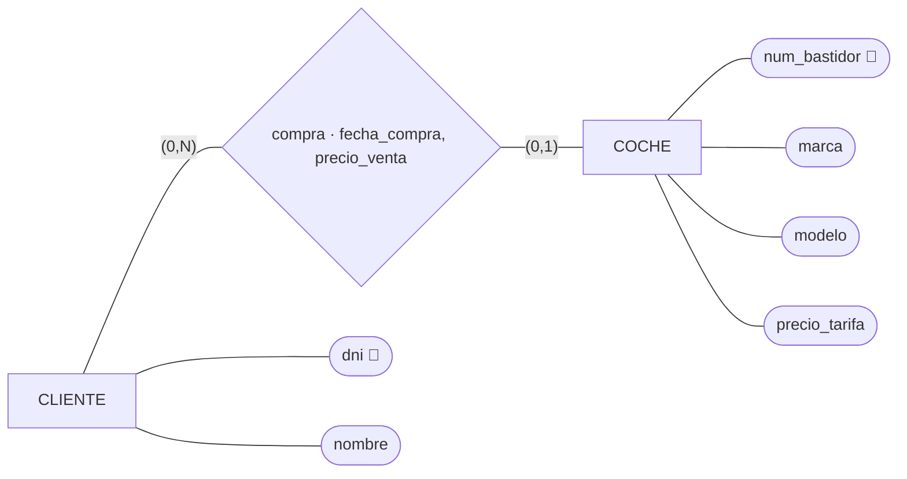
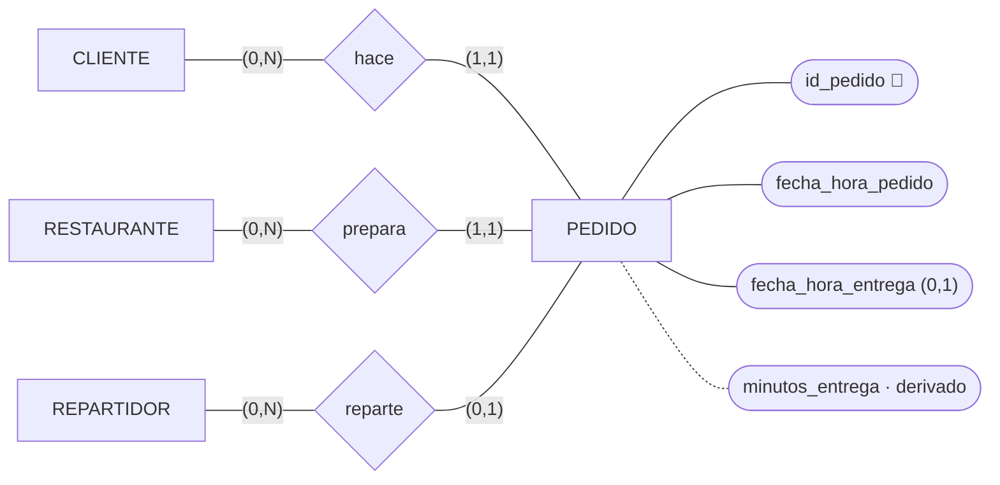
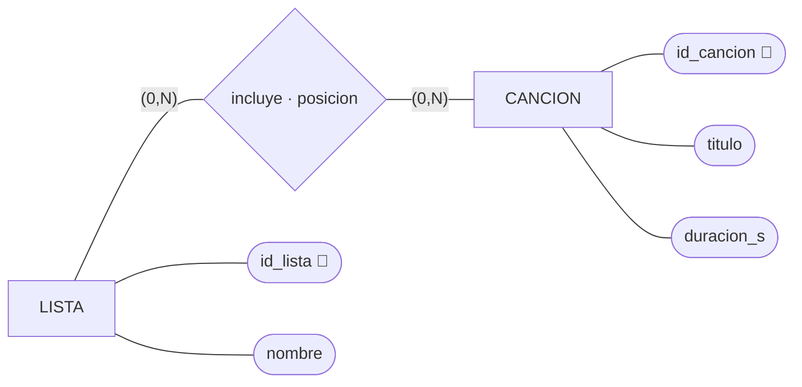
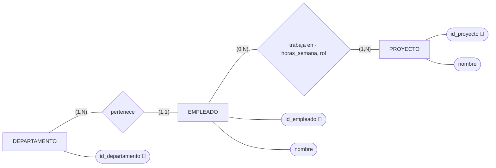
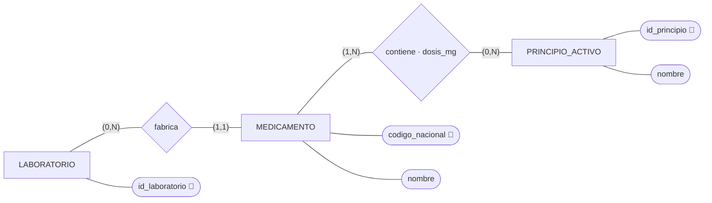

# GBD · Ejercicios E/R 4 · Paso a tablas, reglas 1 a 3

Nueve ejercicios para hacer en clase, por parejas, de menos a más. En los siete primeros el
diagrama E/R ya está hecho: solo hay que pasarlo a tablas. En el 8 haces tú el E/R. El 9 va al
revés: de las tablas al E/R.

La teoría está en [`../teoria/teoria-2-er-y-relacional.md`](../teoria/teoria-2-er-y-relacional.md):
apartado 2.3 (notación), 2.5 (reglas 1 a 3) y 1.6 (dato derivado y dato histórico).

| # | Dominio | Qué practica |
|---|---|---|
| 1 | Bicicletas municipales | Regla 2 con mínimo 0: clave ajena que admite nulo |
| 2 | Clubes de e-sports | Regla 2 con mínimo 1. Clave alternativa. Atributo de la relación. Derivados |
| 3 | Concesionario | Atributos de una 1:N opcional. Dato histórico |
| 4 | Comida a domicilio | Tres relaciones 1:N hacia la misma tabla |
| 5 | Listas de reproducción | Regla 3. ¿Puede repetirse la pareja? |
| 6 | Proyectos | Reglas 2 y 3 juntas, con atributos en la N:M |
| 7 | Medicamentos | Reglas 2 y 3 juntas |
| 8 | Alquiler de patinetes | Todo: haces el E/R. Una relación que guarda historia |
| 9 | Festival de música | Al revés: de las tablas al E/R |

## Qué se hace en cada ejercicio

| # | Qué | Cómo |
|---|---|---|
| A | Las tablas | Notación de texto del apartado 2.3: `PK`, `FK → TABLA`, `?` para lo que admite nulo, `UK(…)` |
| B | La regla de cada clave ajena y de cada tabla que no sale de una entidad | Una línea: «`id_estacion` en BICICLETA: regla 2, BICICLETA tiene `(0,1)`» |
| C | Las preguntas del ejercicio | Qué tablas miras y por qué columnas las enlazas |

Antes de poner una clave ajena, pregúntate: **una ocurrencia de esta entidad, ¿con cuántas de la
otra como máximo?** Si la respuesta es una, la clave ajena va aquí.

Si te da tiempo, monta el 4 y el 6 en DrawDB y comprueba que la pata de gallo dice lo mismo que las
cardinalidades del E/R.

---

## 1 · Bicicletas municipales

> El ayuntamiento tiene estaciones de bicicletas. De cada estación, un código, la dirección y el
> número de anclajes. De cada bicicleta, su número y el tipo (mecánica o eléctrica). Una bicicleta
> está anclada en una estación o circulando; en una estación hay muchas bicicletas.



Preguntas: ¿qué bicicletas están circulando ahora? ¿Cuántas hay en la estación `E-07`?

---

## 2 · Clubes de e-sports

> Cada jugador ficha por un club, y un club tiene al menos un jugador. De cada club, nombre (no se
> repite). De cada jugador, su nick, que es único, y su fecha de nacimiento. Se guarda la fecha de
> fichaje. Interesa también la edad de cada jugador y cuántos jugadores tiene cada club.



Preguntas: ¿en qué club juega el nick `Zeta`? ¿Desde cuándo? ¿Qué jugadores tiene el club con más
jugadores?

Piensa: `nick` es único, pero la clave es `id_jugador`. ¿Qué es entonces `nick`?

---

## 3 · Concesionario

> De cada coche, el número de bastidor, la marca, el modelo y el precio de tarifa. Un coche lo compra
> como mucho un cliente; un cliente puede comprar varios coches o ninguno (hay clientes que solo han
> pedido presupuesto). De cada compra se guarda la fecha y el precio que se pagó, que puede no
> coincidir con el de tarifa por los descuentos.



Preguntas: ¿qué coches no se han vendido? ¿Qué descuento se hizo en cada venta?

Piensa: ¿`precio_venta` es derivado de `precio_tarifa`? ¿Puede `fecha_compra` estar rellena y el
cliente vacío?

---

## 4 · Comida a domicilio

> Cada pedido lo hace un cliente y lo prepara un restaurante. Cuando se asigna, lo lleva un
> repartidor; hasta entonces, el pedido no tiene repartidor. De cada pedido, la fecha y hora en que se
> hizo y en la que se entregó, que está vacía mientras no llega. El tiempo de entrega se calcula.



Preguntas: ¿qué pedidos esperan repartidor? ¿Cuántos pedidos ha entregado cada repartidor? ¿Qué
restaurante tarda más de media?

---

## 5 · Listas de reproducción

> Una lista de reproducción tiene muchas canciones, y una canción está en muchas listas. De cada
> canción en cada lista, la posición que ocupa.



Preguntas: ¿qué canciones tiene la lista «Para estudiar», en orden? ¿En cuántas listas está cada
canción?

Piensa: con tus tablas, ¿puede la misma canción estar dos veces en la misma lista? ¿Y dos canciones
en la misma posición? Si quisieras permitir lo primero e impedir lo segundo, ¿qué cambiarías?

---

## 6 · Proyectos

> Cada empleado pertenece a un departamento. Un empleado trabaja en varios proyectos, o en ninguno, y
> en cada proyecto trabaja al menos un empleado. De cada empleado en cada proyecto, las horas a la
> semana y el rol (analista, programador, pruebas…).



Preguntas: ¿quién trabaja en el proyecto 4 y con qué rol? ¿Cuántas horas a la semana dedica cada
departamento a cada proyecto?

Piensa: ¿qué cardinalidades del E/R no quedan garantizadas por las tablas?

---

## 7 · Medicamentos

> Cada medicamento lo fabrica un laboratorio. Un medicamento contiene uno o varios principios
> activos, y un principio activo está en muchos medicamentos. De cada principio activo en cada
> medicamento, la dosis en miligramos.



Preguntas: ¿qué medicamentos llevan ibuprofeno y en qué dosis? ¿Qué laboratorios fabrican algún
medicamento con paracetamol?

---

## 8 · Alquiler de patinetes

Aquí haces tú el E/R antes de las tablas.

> Una empresa alquila patinetes eléctricos. De cada usuario, un identificador, el nombre y el email,
> que no se repite. De cada patinete, la matrícula y el modelo; cada patinete está asignado a una zona
> de la ciudad (código y nombre). Un usuario alquila patinetes muchas veces, y el mismo patinete lo
> alquila mucha gente, también la misma persona varias veces. De cada alquiler, cuándo empieza,
> cuándo acaba (vacío mientras está en curso) y el precio por minuto que se aplicó, porque la tarifa
> cambia. El importe de cada alquiler se calcula.

Preguntas: ¿qué patinetes están alquilados ahora? ¿Cuánto pagó un usuario por un alquiler? ¿Cuántas
veces ha alquilado Ana el patinete `PT-120`?

Piensa: si haces del alquiler una N:M entre USUARIO y PATINETE, ¿cabe que Ana alquile `PT-120` el
lunes y otra vez el jueves? ¿El precio por minuto es derivado o histórico?

---

## 9 · Festival de música · De las tablas al E/R

Estas son las tablas de un festival. Dibuja el E/R del que salen.

```text
ESCENARIO(id_escenario PK, nombre, aforo)
REPRESENTANTE(id_representante PK, nombre, telefono)
GRUPO(id_grupo PK, nombre, id_representante? FK → REPRESENTANTE)
ACTUACION(id_grupo FK → GRUPO, id_escenario FK → ESCENARIO, dia, hora_inicio)
          PK(id_grupo, id_escenario)
```

1. Dibuja el E/R con todas las cardinalidades que puedas deducir. ¿Cuáles no se pueden saber mirando
   solo las tablas?
2. ¿Qué es ACTUACION en el E/R: una entidad o una relación? ¿Por qué?
3. Con estas tablas, ¿puede un grupo tocar dos días en el mismo escenario? ¿Pueden dos grupos tocar
   a la vez en el mismo escenario? Propón una clave primaria para ACTUACION que permita lo primero e
   impida lo segundo.

---

Última actualización: 4 de octubre de 2026.
