<div dir="rtl">

> ترجمة عربية لملف `teoria-1-introduccion-bd.md`. النسخة الإسبانية هي المرجع؛ أسماء الجداول والأعمدة تبقى بالإسبانية لتطابق التمارين.

# GBD · النظرية 1 · مدخل إلى قواعد البيانات

ملخّص بالإسبانية للوحدة 1 من مادة *Gestió de bases de dades* ‏(CFGS ASX، ‏M02،
Institut Obert de Catalunya، رخصة CC BY-NC-SA). ملف PDF الأصلي لدى الأستاذ.

هذه هي وثيقة الدراسة الخاصة بـ **RA1** (نتيجة التعلّم 1): تتبع بنية الأصل في نسخة مختصرة، مع
الأمثلة في شكل مخططات، وتضيف ما لا تغطيه تلك المادة —التي تعود إلى 2011— ويشترطه المنهج:
ملفات CSV والترميز، وتنظيم الملفات، وNoSQL، وموقع نظام الإدارة، وتصنيف أنظمة الإدارة الحالية.
في النهاية يوجد [مسرد للمصطلحات](#المسرد)، و
[تقييم ذاتي](#التقييم-الذاتي) مع الإجابات، و
[ملحق لأنواع البيانات](#ملحق--أنواع-البيانات).

الأقسام 4.5 ومن 5.3 إلى 5.7 تتجاوز ما هو مطلوب في RA1: أُدرجت
لأنها تكمّل الموضوع، لا لأنها تدخل في الامتحان.

| القسم | المحتوى | RA |
|---|---|---|
| [1](#1-البيانات-وقواعد-البيانات) | البيانات، الكيانات، الصفات، المفاتيح، الملفات، CSV | RA1.a, RA2 |
| [2](#2-الملفات-وقواعد-البيانات) | أصل قواعد البيانات، مقارنة، التنظيم، الوصول، مستويات التجريد | RA1.a, RA1.d |
| [3](#3-أنظمة-إدارة-قواعد-البيانات-sgbd) | التطوّر، الأهداف، اللغات، المستخدمون، المكوّنات، القاموس | RA1.d, RA1.e |
| [4](#4-نماذج-قواعد-البيانات) | ANSI/SPARC، الهرمي، الشبكي، العلائقي، الكائنات، NoSQL | RA1.b |
| [5](#5-موقع-قواعد-البيانات) | مُضمَّنة، على خادم، في السحابة؛ مركزية وموزّعة | RA1.c |
| [6](#6-تصنيف-أنظمة-إدارة-قواعد-البيانات) | معايير تصنيف نظام الإدارة | RA1.f |

**للتوسّع**، في ملف PDF الخاص بـ IOC (الوحدة 1، بالكتالونية):

| قسم هذا الموضوع | IOC، الوحدة 1 | الصفحات |
|---|---|---|
| 1 · البيانات وقواعد البيانات | 1.1 *Les dades i les bases de dades* | 19–28 |
| 2 · الملفات وقواعد البيانات | 1.2 *Conceptes de fitxers i bases de dades* | 29–35 |
| 3 · أنظمة إدارة قواعد البيانات | 1.3 *Els SGBD* | 36–54 |
| 4 · نماذج قواعد البيانات | 2.1 و2.2 *Arquitectura dels SGBD*، *Els models de bases de dades més comuns* | 55–64 |
| 5 · الموقع | 2.3 *Bases de dades distribuïdes* | 65–82 |
| 6 · التصنيف | غير موجود في IOC لأنه من 2011: هي أنظمة الإدارة الحالية | — |

---

## 1. البيانات وقواعد البيانات

### 1.1 العوالم الثلاثة

يتطلّب العمل مع البيانات التمييز بين ثلاثة مجالات:


العالم الحقيقي نفسه يولّد عوالم مفاهيمية مختلفة بحسب ما يهمّ الملاحِظ، وكل عالم مفاهيمي
يقبل عدة تمثيلات. وليست كلها متكافئة: قرارات التصميم والتقنية المختارة تغيّر كفاءة النتيجة.

### 1.2 الكيانات والصفات والقيم

| العنصر | ما هو | مثال |
|---|---|---|
| الكيان (*entidad*) | شيء من العالم الحقيقي نحوّله إلى مفهوم، ويمكن تمييزه عن غيره | الجهاز `EQ-04` |
| الصفة (*atributo*) | خاصية من خصائص الكيان تهمّنا | `num_serie`، `estado`، `ram_total` |
| القيمة (*valor*) | المحتوى الملموس للصفة | `SN-7781`، `arranca`، `8` |

باثنين فقط من الثلاثة لا توجد معلومة: الرقم `8` دون معرفة الجهاز ولا الخاصية لا
يعني شيئًا.

يجب أن تحفظ الصفة **قيمة واحدة فقط** في كل لحظة. الصفات متعددة القيم (*atributos multivaluados*)
(قائمة داخل خلية واحدة) غير متوافقة مع النموذج العلائقي.

### 1.3 نوع الكيان ونسخة الكيان

- **نوع الكيان** (*entidad tipo*): الصنف العام — الأجهزة بشكل عام.
- **نسخة الكيان** (*entidad instancia*): شيء محدّد — الجهاز `EQ-04`.

بلغة المجموعات، نوع الكيان هو المجموعة وكل نسخة عنصر فيها.

### 1.4 نوع البيانات والمجال

- **نوع البيانات** (*tipo de dato*): مجموعة من القيم ذات خصائص مشتركة ولها عمليات
  مسموح بها. الأعداد الصحيحة تقبل القسمة الصحيحة، لا القسمة الدقيقة.
- **المجال** (*dominio*): مجموعة القيم الصالحة لصفة محدّدة. لا يعرّف عمليات، وهو
  عمليًا مجموعة جزئية من نوع بيانات.

مثال: `ram_gb` من نوع عدد صحيح، لكن مجاله هو القيم `1, 2, 4, 8, 16, 32`.

### 1.5 القيمة الفارغة

القيمة الفارغة (*valor nulo*، ‏NULL) تدلّ على **غياب القيمة**: مجهولة أو غير موجودة. تُقبل أو لا تُقبل عند تعريف
مجال الصفة.

ليست الصفر ولا السلسلة النصية الفارغة، فهذه قيم لها معنى خاص بها. `ram_gb = 0` تعني
«ليس فيه RAM»؛ و`ram_gb = NULL` تعني «لا نعرف كم فيه».

### 1.6 الصفات المعرِّفة والمفاتيح

- **الصفة المعرِّفة** (*atributo identificador*): قيمتها فريدة ولا تتكرّر بين النسخ.
- **المفتاح** (*clave*): كل صفة أو مجموعة صفات تعرّف النسخ دون أي لبس.

كل معرِّف هو مفتاح، لكن قد يحتاج المفتاح إلى عدة صفات. وكون الصفة تصلح
معرِّفًا يعتمد على ما يمثّله الكيان:

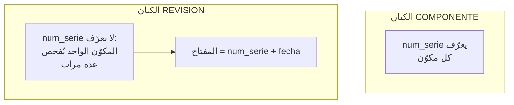

لا المعرِّفات ولا الصفات التي تشكّل جزءًا من مفتاح تقبل القيمة الفارغة أبدًا.

### 1.7 التمثيل الجدولي والملفات

التمثيل المعتاد في قواعد البيانات هو **الجدول** (*tabla*): كل صف نسخة كيان،
وكل عمود صفة، وكل خلية قيمة.

تطبيقه في الحاسوب هو **ملف البيانات** (*fichero de datos*): يُسمّى الصف **سجلًّا** (*registro*) ويُسمّى
العمود **حقلًا** (*campo*). يُحفظ في الذاكرة الخارجية (القرص) لأن الذاكرة الداخلية متطايرة.

إضافة نسخ أو صفات لا تضيف إلا صفوفًا أو أعمدة: البنية لا تزداد تعقيدًا.

### 1.8 الملفات النصية والملفات الثنائية

| | نصي | ثنائي |
|---|---|---|
| ماذا يحتوي | أحرفًا مقروءة، سطرًا بعد سطر | بايتات بالصيغة التي يقرّرها البرنامج |
| كيف يُفتح | بأي محرّر (`nano`، المفكرة Bloc de notas، VS Code) | فقط بالبرنامج الذي يفهمه |
| أمثلة | `.csv`، `.txt`، `.json`، `.xml`، `.sql`، `.html` | `.xlsx`، `.ods`، `.jpg`، `.pdf`، الملفات الداخلية لقاعدة بيانات |
| الميزة | يقرؤه أي أحد، على أي نظام، بعد 30 سنة | يشغل مساحة أقل، يُعالَج أسرع، يحفظ التنسيق |
| المشكلة | الترميز (*codificación*): حرف `ñ` المحفوظ بترميز Windows-1252 يظهر `ñ` إذا قُرئ بترميز UTF-8 | إذا اختفى البرنامج لا يمكن قراءة الملف |

ملف `.xlsx` أو `.ods` هو في الحقيقة ملف `.zip` بداخله ملفات XML: هو ثنائي بالنسبة إلى
المستخدم، رغم وجود نص في داخله.

**CSV** (*comma-separated values*، القيم المفصولة بفواصل) هو نص عادي فيه سجلّ واحد في كل سطر والحقول مفصولة
بحرف معيّن. تفهمه في آن واحد جداول البيانات ونظام إدارة قواعد البيانات و
السكربت، ولهذا هو صيغة التبادل المعتادة.

```text
Equipo;Aula;Grupo;Placa;RAM;Obs.
EQ-01;1.12;G1;Asus P8H61-M LX;2x4GB DDR3 Kingston;
EQ-02;1.12;G1;Asus P8H61-M LX;"4GB DDR3 kingston; 2GB Samsung";ranura 3 rota
EQ-03;1.12;Grupo 2;ASUS P8H61-MLX;4096MB DDR3 KINGSTON;no arranca
```

| العنصر | ما هو | ما الذي يفشل إذا لم يُحترم |
|---|---|---|
| الترويسة (*cabecera*) | السطر الأول، ويحتوي أسماء الحقول | بدونها لا أحد يعرف ما هو كل عمود |
| الفاصل (*separador*) | الحرف بين الحقول. `,` في الإنجليزية؛ `;` في الإسبانية، لأن الفاصلة هي فاصل الكسور العشرية | القيمة `3,2 GHz` مع الفاصل `,` تقسم الحقل إلى اثنين |
| علامات الاقتباس (*comillas*) | تحيط بحقل يحتوي على الفاصل | بدون علامات اقتباس، `4GB DDR3 kingston; 2GB Samsung` يتحوّل إلى حقلين ويُخِلّ بالصف |
| الترميز (*codificación*) | UTF-8 في أغلب الأحيان | تلف علامات التشكيل الإسبانية وحرف ñ عند فتحه على نظام آخر: `Pérez` إذا قُرئ بالترميز الخاطئ يظهر `Pérez` |
| علامات الاقتباس داخل الحقل | تُكتب مضاعفة: `"monitor de 24"" pulgadas"` | ينقطع الحقل حيث لا ينبغي |
| BOM | بضعة بايتات غير مرئية يضعها Excel في بداية ملف CSV بترميز UTF-8 | يقرؤها برنامج آخر كجزء من اسم العمود الأول |
| نهاية السطر | يستخدم Windows حرفين (CR LF)؛ ويستخدم Linux حرفًا واحدًا (LF) | يظهر حرف غريب في نهاية الحقل الأخير من كل صف |

هذه القواعد مجموعة في معيار، هو RFC 4180، وإن كان كل برنامج يطبّقها على
طريقته.

ما **لا** يملكه CSV: أنواع البيانات (كل شيء نص)، والقواعد (لا شيء يمنع كتابة `Grupo 2`
حيث يكتب آخرون `G2`)، والعلاقة مع ملفات أخرى.

### 1.9 قواعد البيانات: ملفات مترابطة

عادةً توجد عدة أنواع كيانات، والجداول التي تمثّلها ليست مستقلة. **العلاقات البينية**
(*interrelaciones*) تربط الكيانات بعضها ببعض، عبر حقول من النوع نفسه تخزّن
القيم نفسها.

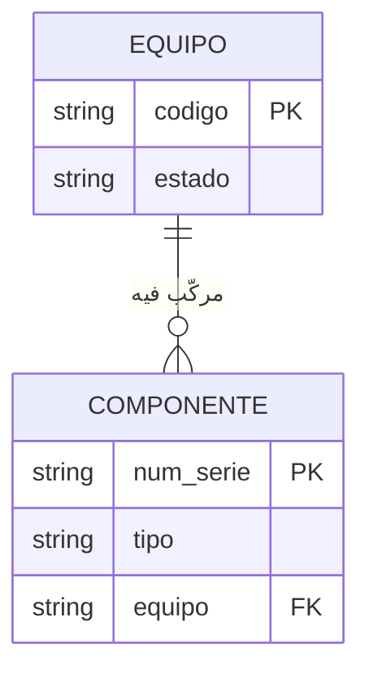

> قاعدة البيانات (*base de datos*، BD) هي مجموعة من ملفات البيانات المترابطة.

الحفاظ على هذا الاتساق يدويًا مكلف: إذا تغيّرت أو حُذفت قيمة تُستخدم للربط، يجب
عكس ذلك في كل الملفات المعنية. ومن هنا جاءت أنظمة إدارة قواعد البيانات (SGBD).

### 1.10 المستوى المنطقي والمستوى المادي

| المستوى | مع ماذا نعمل | متى |
|---|---|---|
| المنطقي (*lógico*) | الجداول، الحقول، السجلات، العلاقات البينية | كلما أمكن: هو الأكثر إنتاجية |
| المادي (*físico*) | ربط السجلات بالسلاسل، الضغط، أنواع الفهارس | فقط عند الحاجة إلى التحسين |


## 2. الملفات وقواعد البيانات

### 2.1 من أين جاءت قواعد البيانات


كان كل تطبيق جديد ينسخ في ملف خاص به البيانات الموجودة أصلًا في ملف آخر. كان ذلك
يبسّط البرنامج، لكنه يُنتج **التكرار** (*redundancia*) ومعه خطر عدم الاتساق (*incoherencia*).

> قاعدة البيانات هي التمثيل الحاسوبي لمجموعات من نسخ الكيانات من أنواع كيانات
> مختلفة وللعلاقات بينها، قابلة للاستخدام بشكل مشترك ومتزامن من قِبل
> عدة مستخدمين.

### 2.2 الملفات مقابل قواعد البيانات

| الجانب | الملفات | قواعد البيانات |
|---|---|---|
| أنواع الكيانات | نوع واحد لكل ملف | كثيرة، ومترابطة |
| العلاقات البينية | النظام لا يعرفها | لدى النظام أدوات لها |
| التكرار | ملف مخصّص لكل تطبيق | كل التطبيقات تعمل على قاعدة البيانات نفسها |
| عدم الاتساق (*inconsistencias*) | ممكن إذا لم يحدّث المبرمج كل النسخ | البيان يُحفظ مرة واحدة فقط |
| الحصول على البيانات | برنامج مخصّص، ترجمته وتنفيذه | استعلام مباشر، دون برمجة |
| السلامة (*integridad*) | يطبّقها كل برنامج | يطبّقها نظام الإدارة |
| الذرّية (*atomicidad*) | صعبة الضمان جدًا | المعاملات |
| التزامن (*concurrencia*) | التحديث المتزامن يسبّب عدم الاتساق | الأقفال |
| الأمان (*seguridad*) | ملف واحد، رؤية واحدة، كل شيء أو لا شيء | العروض والصلاحيات لكل مستخدم |

تبقى الملفات الخيار المعقول عندما يكون الحجم صغيرًا أو لا توجد
علاقات بينية: ملفات إعدادات التطبيقات والأنظمة، وسجلّات
الأحداث (*logs*). تركيب نظام SGBD هناك لن يؤدي إلا إلى إضعاف الأداء.

#### مشكلات جدول البيانات، بأسمائها

ما وُجد في جدول جرد الفصل له اسم تقني:

| المشكلة | الاسم | في جدول الفصل |
|---|---|---|
| خلية فيها أكثر من قيمة | **قيمة غير ذرّية** (*valor no atómico*) | `2x4GB DDR3 Kingston`؛ `WD 1TB, Kingston SSD 240` |
| البيان نفسه مكتوب بعدة أشكال | **غياب التحكم في المجال** (*sin control de dominio*): لا شيء يحدّ القيم الصالحة | `Kingston`، `kingston`، `KINGSTON` |
| الحقيقة نفسها مكرّرة في صفوف كثيرة: عند تغييرها يجب تغييرها كلها | **شذوذ التحديث** (*anomalía de actualización*) | مقبس (socket) اللوحة الأم، مكرّر في كل جهاز يحملها |
| لا يمكن حفظ شيء دون اختلاق بقية الصف | **شذوذ الإدراج** (*anomalía de inserción*) | القرص المنفرد الموجود في الخزانة لا مكان له: ليس له جهاز |
| عند حذف صف تضيع معلومات لا علاقة لها به | **شذوذ الحذف** (*anomalía de borrado*) | حذف EQ-04 يحذف الأثر الوحيد لقرص SSD الخاص به |
| قيمة تُحسب من قيم أخرى، محفوظة يدويًا | **بيان مشتق** (*dato derivado*) | إجمالي RAM للجهاز EQ-02 لا يطابق وحداته |
| قاعدة يجب أن تحترمها البيانات دائمًا | **قيد السلامة** (*restricción de integridad*): لا مكان في الجدول لكتابته | إعارتان للجهاز نفسه في الساعة نفسها؛ `EQ-4` بدلًا من `EQ-04` |

وصف Codd، مبتكر النموذج العلائقي، أنواع الشذوذ الثلاثة. التصميم الجيد للجداول
([النظرية 2](../teoria-2-er-y-relacional.md)) يتجنّبها: وهذا ما نكسبه بنقل الجدول إلى قاعدة
بيانات.

### 2.3 تنظيم الملفات

**نظام التخزين المنطقي** (*sistema lógico de almacenamiento*) هو الطريقة التي تُنظَّم بها البيانات لحفظها و
استرجاعها، بغضّ النظر عن القرص المادي الذي تنتهي إليه. قبل قواعد البيانات، كان كل
برنامج يحفظ بياناته في ملفات خاصة به بأحد هذه التنظيمات:

| التنظيم | كيف تُحفظ السجلات | كيف يُبحث عن سجلّ | الميزة | العيب |
|---|---|---|---|---|
| **التسلسلي** (*secuencial*) | واحدًا تلو الآخر، بترتيب وصولها | بالقراءة من البداية حتى العثور عليه | بسيط؛ يستغل كل المساحة | مع مليوني سجلّ، البحث عن واحد يعني قراءة مليونين |
| **المباشر** (*directa*، العشوائي، *hash*) | في موضع يُحسب انطلاقًا من المفتاح | يُحسب الموضع ويُقفز إليه | وصول فوري بالمفتاح | لا يصلح للمرور بالترتيب؛ قد يعطي مفتاحان الموضع نفسه (تصادم *colisión*) |
| **التسلسلي المفهرس** (*secuencial indexada*) | مرتّبة حسب المفتاح، مع فهرس فيه موضع كل كتلة | يُراجع الفهرس، ثم يُقفز إلى الكتلة ويُقرأ جزء قصير | جيد للبحث عن سجلّ واحد وللمرور بالترتيب | الإدراجات تُخِلّ بترتيب الملف ويجب إعادة تنظيمه |
| **المفهرس** (*indexada*) | بأي ترتيب، مع فهرس واحد أو أكثر منفصل | بالفهرس المناسب | عدة طرق للوصول: بالملصق، بالرقم التسلسلي | الفهارس تشغل مساحة ويجب إبقاؤها محدّثة |

**الفهرس** (*índice*) يعمل مثل فهرس الكتاب: قائمة مرتّبة من المفاتيح مع الصفحة التي
يوجد فيها كل منها. ما زالت أنظمة الإدارة تستخدم الفهارس داخليًا؛ والفرق أن النظام هو من يديرها،
لا البرنامج.

ملف CSV الخاص بجدول الفصل هو ملف نصي ذو تنظيم تسلسلي.

### 2.4 أنواع الوصول إلى البيانات

تصنيفان متقاطعان: تسلسلي أو مباشر، بالموضع أو بالقيمة.

| | بالموضع (P) | بالقيمة (V) |
|---|---|---|
| **تسلسلي (S)** | SP · عرض كل الأجهزة دون ترتيب | SV · عرضها مرتّبة حسب الرمز |
| **مباشر (D)** | DP · فهرس *hash*، البحث الثنائي (*búsqueda dicotómica*) | DV · الحصول على سجلّ `EQ-04` |

### 2.5 الرؤى الثلاث للبيانات

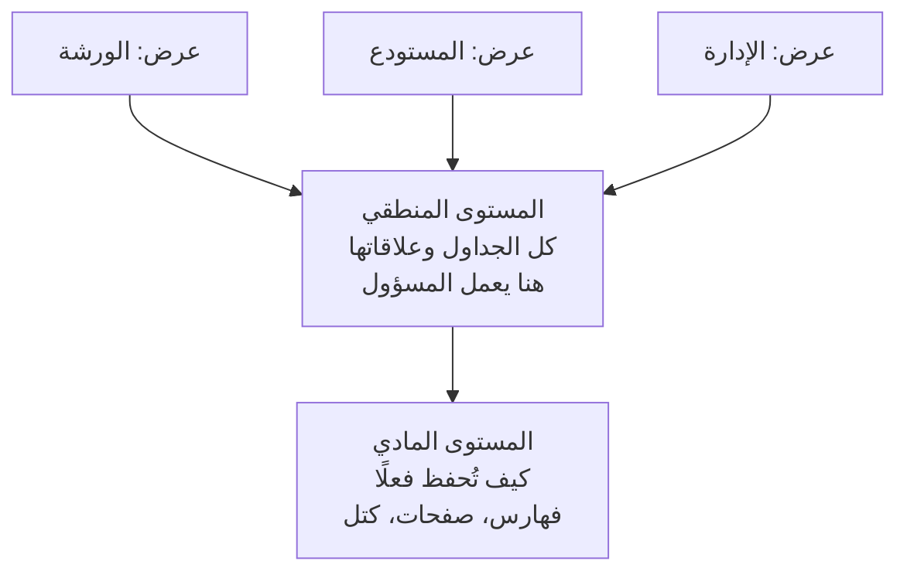

- **المادي**: الأدنى. لا يُلمس إلا للتحسين.
- **المنطقي**: الأوسط. يصف كل البيانات ببنى بسيطة (جداول).
- **مستوى العروض** (*vistas*): الأعلى. كل عرض يصف فقط جزء قاعدة البيانات الذي يحتاجه مستخدم ما.
  يبسّط العمل ويوفّر الأمان والخصوصية.

---

## 3. أنظمة إدارة قواعد البيانات (SGBD)

> نظام إدارة قواعد البيانات (*SGBD*، بالإنجليزية DBMS) هو البرمجيات التي غايتها إدارة قواعد البيانات والتحكم فيها.

### 3.1 التطوّر

| المرحلة | ما يميّزها |
|---|---|
| الخمسينيات | أشرطة مثقّبة ومغناطيسية: وصول تسلسلي فقط، معالجة على دفعات |
| الستينيات-السبعينيات | أنظمة مركزية، طرفيات بلا قدرة معالجة ذاتية. البرامج تعتمد على المستوى المادي |
| الثمانينيات | أنظمة SGBD العلائقية. توحيد معيار SQL في 1986 (ANSI) وانتشار استخدامها |
| التسعينيات | قواعد بيانات موزّعة، معمارية العميل/الخادم، لغات الجيل الرابع (4GL) |
| الوقت الحالي | الوسائط المتعددة، التوجّه للكائنات، الإنترنت، مستودعات البيانات، XML |

عُرّف النموذج العلائقي في بداية السبعينيات، لكنه استغرق عقدًا ليصل إلى
السوق: في البداية كان أداؤه أسوأ من الهرمي والشبكي.

### 3.2 الأهداف والوظائف

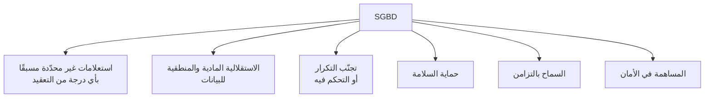

**استعلامات غير محدّدة مسبقًا.** في السابق كان يجب عرض الملف كله والاختيار يدويًا، أو
كتابة برنامج. أما SGBD فيجيب بنفسه على جملة SQL.

**الاستقلالية** (*independencia*). التغييرات المادية (إضافة فهرس) لا تُلزم بتعديل الاستعلامات ولا
التطبيقات. والتغييرات المنطقية (إضافة صفة) لا تمنع تنفيذ العمليات غير
المتأثرة.

**التكرار.** كلفة التخزين قليلة الأهمية اليوم؛ أما خطر فقدان السلامة عند
التحديث فمهم. يجب أن يسمح نظام الإدارة بالنسخ المتماثلة وبـ**البيانات المشتقة** (نتيجة حسابات على
بيانات أخرى)، متكفّلًا هو بإبقائها محدّثة.

**السلامة.** تُحمى بقواعد السلامة وبالنسخ الاحتياطية.

| نوع القاعدة | من يعرّفها | مثال |
|---|---|---|
| قيد النموذج | ملازم للنموذج، ونظام الإدارة يتضمّنه | لا يمكن أن يكون لصفّين المفتاح الأساسي (*clave primaria*) نفسه |
| قيد المستخدم | المصمّم أو المسؤول | المكوّن المسحوب من الخدمة لا يمكن أن يكون مركّبًا في جهاز |

**التزامن.** تقنيتان:

- **المعاملة** (*transacción*): مجموعة من العمليات تُنفَّذ كوحدة واحدة. إما كلها، أو لا شيء منها.
- **القفل** (*bloqueo*): منع الوصول إلى بيانات معيّنة ما دامت معاملة تستخدمها، كي
  تُنفَّذ المعاملات كما لو كانت معزولة.

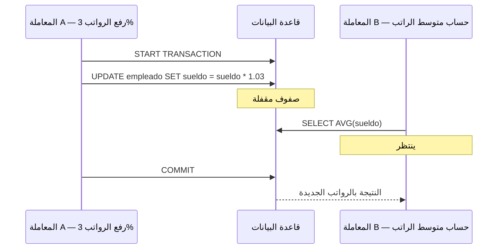

**الأمان.** تراخيص على مستوى قاعدة البيانات، والكيان، والصفة، ونوع العملية، على
مستخدمين معرَّفين. إضافة إلى التشفير: يضعف الأداء، لكن كلمات المرور تُشفَّر
دائمًا.

### 3.3 اللغات

تميّز المادة الكلاسيكية بين نوعين من اللغات، **DDL** و**DML**. وفي الممارسة الحالية،
تُجمَع جمل SQL —وهي لغة واحدة— في أربع لغات فرعية:

| اللغة الفرعية | لماذا | الجمل |
|---|---|---|
| **DDL** · تعريف البيانات | إنشاء البنية وتعديلها وحذفها | `CREATE`، `ALTER`، `DROP` |
| **DML** · معالجة البيانات | الاستعلام عن المحتوى وتعديله | `SELECT`، `INSERT`، `UPDATE`، `DELETE` |
| **DCL** · التحكم في البيانات | منح الصلاحيات وسحبها | `GRANT`، `REVOKE` |
| **TCL** · التحكم في المعاملات | التأكيد أو التراجع | `COMMIT`، `ROLLBACK`، `SAVEPOINT` |

في نتيجة التعلّم هذه يكفي التعرّف عليها ومعرفة المجموعة التي تنتمي إليها كل جملة. وتُكتب ابتداءً من
RA3.

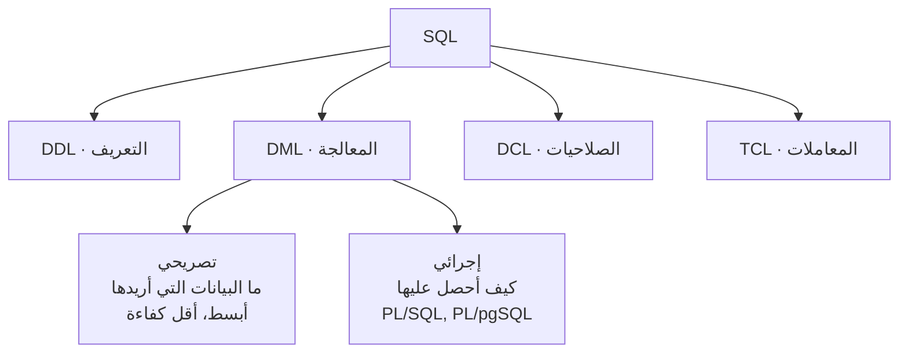

من لغات البرمجة الخارجية توجد طريقتان للوصول: استدعاء مكتبات
تطبّق معايير الاتصال (**ODBC**، **JDBC**)، أو تضمين جمل SQL داخل
البرنامج المضيف.

### 3.4 المستخدمون والمسؤولون

| النوع | كيف يتفاعل |
|---|---|
| المستخدم الخارجي | عبر تطبيق أعدّه آخرون. مثل من يسحب المال من صرّاف آلي |
| المستخدم المتمرّس | مباشرةً، بكتابة استعلامات بلغة SQL |
| مبرمج التطبيقات | يكتب البرامج التي يستخدمها المستخدمون الخارجيون |
| المسؤول (DBA) | يدير ويتحكّم: المخطّطات، الصلاحيات، النسخ الاحتياطية، المساحة، الأداء |

مهام المسؤول: إنشاء المخطّطات وإدارتها، إدارة الأمان، عمل نسخ احتياطية
دورية، مراقبة مساحة القرص، السهر على السلامة، متابعة الأداء، تقديم المشورة
للمبرمجين والمستخدمين، تغيير التصميم المادي وحلّ الطوارئ. مسؤوليته
الأساسية ليست إصلاح الأعطال، بل تجنّبها.

### 3.5 المكوّنات الوظيفية

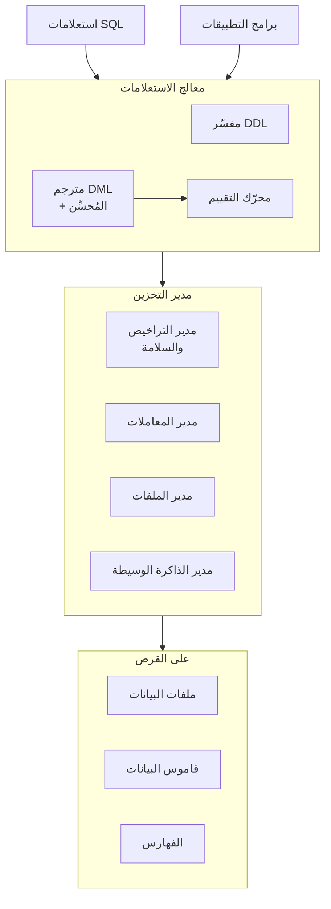

### 3.6 قاموس البيانات

قاموس البيانات (*diccionario de datos*) هو مجموعة من **البيانات الوصفية** (*metadatos*) فيها معلومات عن محتوى قاعدة البيانات وتنظيمها.
ويُسمّى أيضًا فهرس النظام (*catálogo del sistema*) أو مستودع البيانات الوصفية. يحتوي على:

- تعريفات المخطّط.
- وصف الجداول والحقول والعروض والفهارس والدوال والإجراءات والمشغّلات (*disparadores*).
- قيود السلامة المرجعية.
- التحكم في الوصول: المستخدمون، الأدوار، الامتيازات.
- معاملات موقع التخزين وإحصاءات الاستخدام.

كل نظام إدارة يطبّقه على طريقته:

```sql
-- Oracle: عروض بالبادئة USER_ أو ALL_ أو DBA_
SELECT owner, object_name, object_type FROM ALL_OBJECTS;

-- MySQL و MariaDB: المخطّط INFORMATION_SCHEMA
SELECT table_name, table_type, engine
FROM information_schema.tables
WHERE table_schema = 'inventario';
```

---

## 4. نماذج قواعد البيانات

> نموذج البيانات (*modelo de datos*) هو مجموعة من الأدوات المنطقية لوصف البيانات، و
> علاقاتها البينية، ومعناها، والقيود التي تضمن اتساقها.

كل نموذج يقدّم ثلاثة أشياء: **بنى البيانات** (جداول، أشجار)، و**قواعد السلامة**
(الأنواع، المجالات، المفاتيح)، و**العمليات** (الإضافة، الحذف، التعديل، الاستعلام).

### 4.1 معمارية ANSI/SPARC ‏(1975)

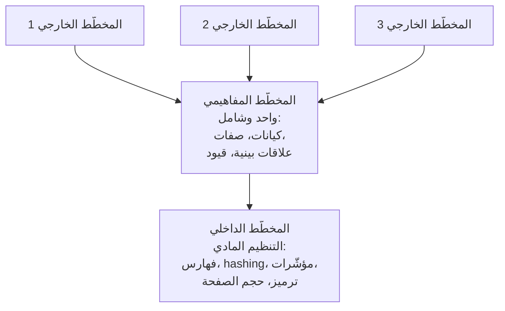

**المخطّط** (*esquema*) هو وصف بنية قاعدة البيانات، ويحتاجه SGBD باستمرار
ليعمل. يمكن للمخطّط الخارجي أن يعيد تسمية الصفات، وأن يعرّف بيانات مشتقة، وأن يعرض
كيانًا واحدًا كأنه اثنان أو عدة كيانات كأنها واحد.

### 4.2 النماذج الأكثر شيوعًا

**الهرمي** (*jerárquico*، الستينيات). شجرة مقلوبة: لكل عقدة أب عدة أبناء، والجذر ليس له
أب، والأوراق ليس لها أبناء. تُنشأ العلاقات على المستوى المادي، بمؤشّرات إلى
عنوان السجلّ الأب.

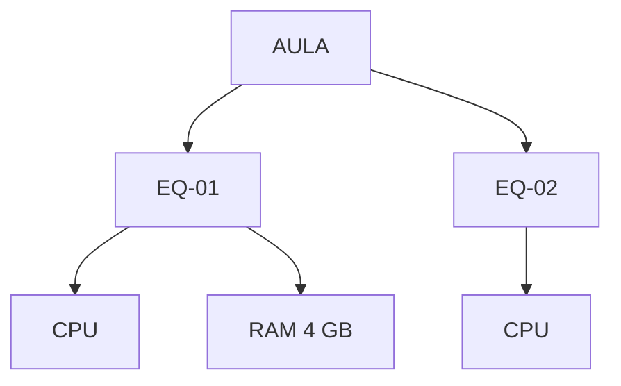

أداء جيد جدًا باتجاه الجذر، وسيئ جدًا في الاتجاه المعاكس: يُلزم بالمرور على كل
السجلات. لا يتجنّب التكرار ولا يضمن السلامة المرجعية: عند حذف الأب يبقى
الأبناء يتامى. أنظمة الإدارة: IMS ‏(IBM)، وAdabas ‏(Software AG).

**الشبكي** (*en red*، السبعينيات). مثله، لكن يمكن أن يكون للعقدة **أكثر من أب**. يتحكّم بشكل أفضل في
التكرار، على حساب إدارة معقّدة. المعيار CODASYL؛ نظام الإدارة: IDMS.

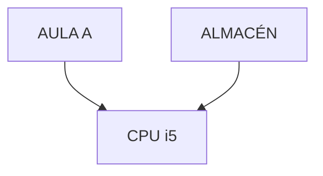

**العلائقي** (*relacional*، ‏Codd، 1970؛ تجاري في الثمانينيات). يقوم على منطق المحمولات ونظرية
المجموعات. عنصر واحد فقط: **العلاقة** (*relación*) أو الجدول. تُطبَّق العلاقات البينية بواسطة
**المفاتيح الأجنبية** (*claves ajenas*) التي تشير إلى المفتاح الأساسي لجدول آخر.

مزاياه على ما سبقه: يتجنّب تكرار السجلات، ويسهر على السلامة المرجعية
(يمنع عمليات الحذف والتعديل أو ينشرها بشكل متتالٍ *en cascada*)، ويقتصر على المستوى المنطقي، مما يمنح
استقلالية مادية للبيانات.

**العلائقي مع الكائنات والموجّه للكائنات.** الأول يوسّع العلائقي بقبول
أنواع بيانات مجرّدة. والثاني يعرّف قاعدة البيانات بلغة الكائنات وخصائصها و
عملياتها (**التوابع** *métodos*)؛ والكائنات ذات البنية نفسها تشكّل **صنفًا** (*clase*) والأصناف
تُنظَّم في تسلسلات هرمية مع الوراثة.

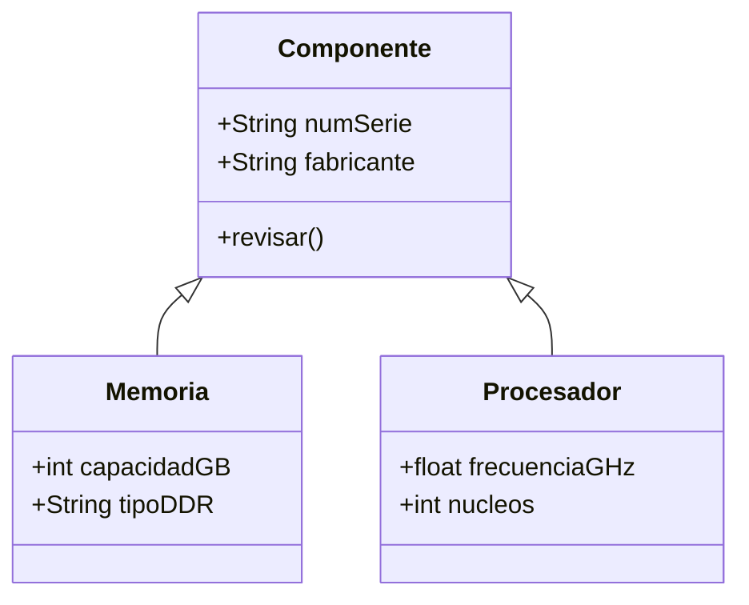

### 4.3 النماذج الجديدة

عندما يجب الاستعلام عن ملايين السجلات التاريخية لاتخاذ القرار، لا يستجيب العلائقي
بكفاءة كافية. ومن هنا:

- **مستودعات البيانات** (*almacenes de datos*، *data warehouse*): نسخ معالَجة من بيانات العمليات
  اليومية، مع أدوات للاستخراج والتحويل والتحميل.
- **قواعد البيانات متعددة الأبعاد** (*multidimensionales*): محسَّنة للمعالجة التحليلية عبر الإنترنت (**OLAP**). تُنظَّم
  البيانات في **مكعّبات** (*cubos*)، حيث كل بُعد هو منظور للاستعلام: حسب
  المنتج، حسب الفترة، حسب المنطقة السكانية.
- **قواعد البيانات متعددة القيم** (*multivalor*، ما بعد العلائقية): الصفات تحفظ قوائم من القيم. لغات أقرب
  إلى اللغة الطبيعية من SQL، لكن دون معيار مشترك.

### 4.4 NoSQL

مادة IOC تعود إلى 2011 ولا تصل إلى هنا، لكن المنهج يطلب التعرّف على أنواع قواعد
البيانات حسب النموذج، ومنذ 2009 تشمل الخريطة أنظمة الإدارة **NoSQL**: اسم جامع
لكل ما ليس علائقيًا. نشأت مع الويب الواسع النطاق، مع بيانات ومستخدمين أكثر مما
يستطيع خادم علائقي واحد خدمته، ومع بيانات لا تتلاءم مع جداول ثابتة.

البيان نفسه، «EQ-04 موجود في الورشة (Taller) وفيه وحدة 8 GB DDR4 Crucial»، في ثلاثة نماذج:

**العلائقي** · جداول مرتبطة بالمفاتيح:

| id_equipo | aula |
|---|---|
| EQ-04 | Taller |

| id_componente | id_equipo | tipo | fabricante | capacidad_gb |
|---|---|---|---|---|
| C-0117 | EQ-04 | RAM DDR4 | Crucial | 8 |

**الوثائقي** (*documental*) · وثيقة JSON واحدة لكل جهاز، فيها كل شيء:

```json
{
  "equipo": "EQ-04",
  "aula": "Taller",
  "componentes": [
    { "tipo": "RAM DDR4", "fabricante": "Crucial", "capacidad_gb": 8 }
  ]
}
```

**مفتاح-قيمة** (*clave-valor*) · مفتاح وقيمة، لا يفسّرها نظام الإدارة:

```text
equipo:EQ-04:aula   →  "Taller"
equipo:EQ-04:ram_gb →  8
```

العائلات الأربع:

| العائلة | كيف تحفظ | فيمَ تتميّز | أمثلة |
|---|---|---|---|
| **الوثائقية** | وثائق JSON؛ يمكن أن تكون لكل منها حقول مختلفة | بيانات ذات بنية متغيّرة، كتالوجات، محتوى الويب | MongoDB، CouchDB |
| **مفتاح-قيمة** | أزواج مفتاح → قيمة، غالبًا في الذاكرة | السرعة: ذاكرات التخزين المؤقت (cachés)، جلسات المستخدمين، الطوابير | Redis، Valkey |
| **العمودية** (*columnar*، ذات الأعمدة العريضة) | صفوف فيها عائلات أعمدة يمكن أن تختلف من صف لآخر، موزّعة على خوادم كثيرة | الكتابات الضخمة: المستشعرات، السجلّات، المراسلة | Cassandra، HBase |
| **الرسوم البيانية** (*grafos*) | عقد وحواف لها خصائص | العلاقات: الشبكات الاجتماعية، المسارات، التوصيات | Neo4j |

| | العلائقي | NoSQL |
|---|---|---|
| المخطّط | ثابت: تُعرَّف الجداول والأعمدة قبل الحفظ | مرن: كل وثيقة أو مفتاح يمكن أن يكون مختلفًا |
| السلامة | يضمنها نظام الإدارة (المفاتيح الأجنبية، القيود) | عادةً يضمنها التطبيق |
| المعاملات | ACID | تعتمد على نظام الإدارة؛ كثير منها يعطي الأولوية للسرعة والتوافر |
| الاستعلام | SQL، معياري | لغة خاصة بكل نظام إدارة |
| التوسّع | أفضل على خادم أكبر (عمودي) | مصمَّمة لتتوزّع على خوادم كثيرة (أفقي) |
| متى | بيانات منظَّمة حيث يهمّ الاتساق: الجرد، الفوترة، التسجيل الدراسي | حجم هائل، بنية متغيّرة أو سرعة قصوى |

جرد التحدّي (*reto*) علائقي لأن قيمته في العلاقات (مكوّن، طراز،
مُصنِّع، جهاز) وفي أن يمنع نظام الإدارة البيانات غير المتسقة.

### 4.5 النمذجة بلغة UML

مخططات الأصناف في UML تعبّر عن الشيء نفسه الذي تعبّر عنه مخططات E/R (الكيان/العلاقة) في الجزء الثابت من نظام
المعلومات.

| مخطط E/R | مخطط أصناف UML |
|---|---|
| نوع الكيان | الصنف: مستطيل فيه الاسم والصفات والعمليات |
| علاقة بينية ثنائية | الارتباط (*asociación*): خط متصل بين الأصناف، مع اسم أو أدوار |
| صفات العلاقة البينية | مستطيل إضافي موصول بخط متقطّع |
| العددية (*cardinalidad*) ‏`máx..mín` | مثلها، لكن `n` تُكتب `*` والعلامات توضع في الجهة المقابلة |
| التعميم (*generalización*) | خط يذهب من الصنف الفرعي إلى الصنف الأعلى، برأس سهم مجوّف |

في التعميم **المتداخل** (*solapada*) لكل صنف فرعي سهمه الخاص؛ وفي **المنفصل** (*disjunta*)، تلتقي
الخطوط في رأس واحد. العلاقات البينية من درجة أعلى من 2 لا يمكن
تمثيلها مباشرة في UML.

---

## 5. موقع قواعد البيانات

سؤالان مختلفان يُخلط بينهما كثيرًا: **أين يوجد نظام الإدارة** (من يشغّل
البرمجيات وكيف نصل إليه) و**أين توجد البيانات** (في جهاز واحد أو موزّعة).

### 5.1 أين يوجد نظام الإدارة

| النوع | كيف يعمل | المزايا | العيوب | أمثلة |
|---|---|---|---|---|
| **المُضمَّنة** (*embebida*، محلية) | قاعدة البيانات ملف داخل التطبيق؛ ونظام الإدارة مكتبة في البرنامج نفسه. لا يوجد خادم | صفر تثبيت وصفر إدارة | برنامج واحد فقط يكتب في الوقت نفسه؛ بلا مستخدمين ولا وصول عبر الشبكة | SQLite في كل هاتف Android، وفي Firefox وفي WhatsApp |
| **عميل-خادم** (*cliente-servidor*، على خادم خاص) | عملية خادم تخدم عبر الشبكة عملاء كثيرين | مستخدمون كثيرون في الوقت نفسه، صلاحيات، تحكّم كامل | يجب تثبيته وصيانته وحمايته وعمل نسخ احتياطية | MariaDB في الفصل، PostgreSQL في السنة الثانية |
| **في السحابة** (*en la nube*، DBaaS) | مزوّد يقدّم نظام الإدارة كخدمة؛ والدفع حسب الاستخدام | بلا عتاد خاص؛ النسخ الاحتياطية والتوافر العالي مشمولة | كلفة مستمرة، اعتماد على المزوّد، بيانات خارج المؤسسة (حماية البيانات) | Amazon RDS، Azure SQL، Google Cloud SQL، MongoDB Atlas |

### 5.2 أين توجد البيانات

| النوع | ماذا يعني | مثال |
|---|---|---|
| **المركزية** (*centralizada*) | كل البيانات في مكان واحد | MariaDB الخاص بالفصل |
| **الموزّعة** (*distribuida*) | البيانات موزّعة على عدة خوادم في أماكن مختلفة، لكن المستخدم يراها كقاعدة بيانات واحدة | شركة لها مقرّ في كل مدينة؛ كل مقرّ يحفظ بياناته ويُستعلَم عنها معًا |
| المجزّأة (*fragmentada*) | موزّعة حيث يحفظ كل خادم جزءًا مختلفًا | زبائن أراغون في سرقسطة، وزبائن كتالونيا في برشلونة |
| المنسوخة (*replicada*) | موزّعة حيث تحفظ عدة خوادم نسخة من البيانات نفسها | خادم رئيسي ونسخة متماثلة تتولّى العمل إذا تعطّل الرئيسي (يُركَّب في السنة الثانية) |

قاعدة البيانات الموزّعة تكسب التوافر —إذا تعطّل موقع تستمر المواقع الأخرى— وتقرّب
البيانات ممّن يستخدمها؛ في المقابل، يصبح الحفاظ على اتساق كل النسخ أصعب بكثير. تطوّر
الأقسام التالية هذا بتفاصيل المادة الأصلية.

### 5.3 معماريات الأنظمة الموزّعة

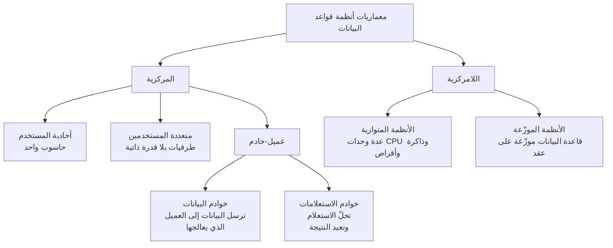

في معمارية عميل-خادم، التمييز **منطقي لا مادي**: يمكن للعميل أن يطلب من عدة
خوادم، وللخادم أن يخدم عملاء كثيرين، ويمكن أن يكونا كلاهما على الجهاز نفسه. خوادم
الاستعلامات هي الأكثر انتشارًا.

**الأنظمة المتوازية** (*sistemas paralelos*). تزيد سرعة المعالجة والإدخال/الإخراج باستخدام وحدات CPU والذاكرة و
الأقراص بالتوازي. لا غنى عنها مع قواعد بيانات بحجم التيرابايتات أو آلاف المعاملات في الثانية. شبكات
الربط: الناقل (*bus*، معالجات قليلة)، الشبكة (*malla*، كل عقدة متصلة بالمجاورة لها)، المكعّب الفائق (*hipercubo*)
(أقل تأخير: كل عنصر متصل بـ log(n) عقدة على الأكثر). النماذج: ذاكرة مشتركة، أقراص
مشتركة، بلا مشاركة، وهرمي.

**الأنظمة الموزّعة** (*sistemas distribuidos*). مجموعة من قواعد البيانات المستقلة جزئيًا، على حواسيب مختلفة،
تتشارك مخطّطًا مشتركًا وتنسّق المعاملات التي تصل إلى بيانات بعيدة. لا تتشارك
لا الذاكرة ولا الأقراص.

| | المتجانسة (*homogéneos*) | غير المتجانسة (*heterogéneos*) |
|---|---|---|
| SGBD | النظام نفسه في كل العقد | نظام مختلف في كل عقدة |
| الترابط | قوي، وتفاعل بسيط | أصعب، ويتطلّب عادةً تحويلات |
| تحديث نظام الإدارة | يؤثّر في كل العقد | كل عقدة على حدة |

لا يحتاج المستخدم إلى معرفة أين توجد البيانات ولا كيف تُنظَّم: هذه هي
**الشفافية** (*transparencia*). أما المسؤول فيحتاج إلى ذلك.

| المزايا | العيوب |
|---|---|
| المشاركة مع استقلالية محلية | كلفة أكبر لتطوير البرمجيات |
| الموثوقية والتوافر عند الأعطال | احتمال أكبر للأخطاء: العقد تعمل بالتوازي |
| استعلامات قابلة للتقسيم إلى استعلامات فرعية متوازية | وقت إضافي لتبادل الرسائل |

### 5.4 تصميم التوزيع

الأهداف: تعزيز **المعالجة المحلية** (تقريب البيانات ممّن يستخدمها أكثر)، وتوزيع
**عبء العمل** جيدًا، والتحكم في **كلفة التخزين**. قد يتعارض الهدفان الأولان.

| الاستراتيجية | متى | كيف |
|---|---|---|
| تصاعدية (*bottom-up*) | دمج قواعد بيانات موجودة مسبقًا مع الحفاظ على موقعها | تجميع المخطّطات المنطقية المحلية وصولًا إلى المخطّط الشامل |
| تنازلية (*top-down*) | قواعد بيانات وتطبيقات جديدة | من تحليل المتطلّبات إلى التصميم المفاهيمي، ثم المنطقي مع قرارات التوزيع |

الأنظمة الناتجة عن تصميم تصاعدي تكون عادةً غير متجانسة؛ وفي التصميم التنازلي يُستحسن
اختيار نظام متجانس.

### 5.5 منهجيات التوزيع

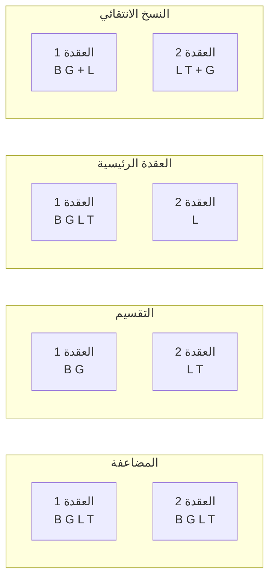

| المنهجية | الميزة | العيب |
|---|---|---|
| المضاعفة (*multiplicación*) · قاعدة البيانات كاملة في كل عقدة | استعلامات محلية وسريعة جدًا؛ تتحمّل الأعطال | كل تحديث يذهب إلى كل العقد: حركة مرور كثيفة. تتضاعف المساحة |
| التقسيم (*división*) · لا يُنسخ أي جزء | تحديثات بسيطة؛ المساحة هي مساحة قاعدة بيانات مركزية | تقريبًا كل الاستعلامات شاملة. إذا تعطّلت عقدة ضاع جزؤها |
| العقدة الرئيسية (*nodo principal*) · واحدة فيها قاعدة البيانات كاملة، والبقية جزؤها | تعزّز المعالجة المحلية، توافر جيد | التحديث والتخزين أغلى منهما في المركزية |
| النسخ في عقد مختارة (*duplicación en nodos seleccionados*) · لا توجد عقدة فيها كل شيء، لكن كل شيء منسوخ | مثل السابقة، مع توافر أكثر قليلًا | مشابهة للسابقة |

### 5.6 النسخ والتجزئة

- **النسخ** (*duplicación*): نسخ متطابقة من علاقة في عدة عقد. يحسّن التوافر و
  التوازي؛ ويُثقل التحديثات، التي يجب أن تحافظ على اتساق النسخ المتماثلة.
- **التجزئة** (*fragmentación*): تقسيم العلاقات إلى أجزاء تحتوي كل المعلومات
  اللازمة لإعادة بناء العلاقة الأصلية.

انطلاقًا من العلاقة `PROVEEDOR(NIF, nombre, telefono, direccion, localidad)`:

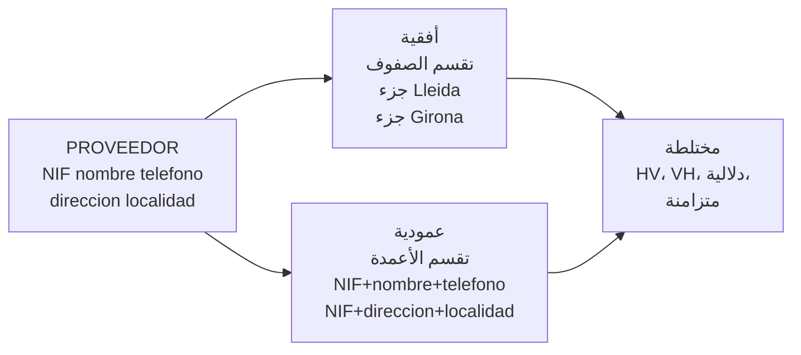

| التجزئة | ماذا تقسم | الشرط |
|---|---|---|
| الأفقية (*horizontal*) | الصفوف (*tuplas*)، حسب قيم صفة أو أكثر | كل صفّ في جزء واحد على الأقل |
| العمودية (*vertical*) | الصفات (الأعمدة) | كل جزء يتضمّن المفتاح الأساسي، لإمكان إعادة التركيب |
| المختلطة (*mixta*) | الاثنتان، بترتيب أو بآخر | VH، HV، دلالية ومتزامنة |

**درجة التجزئة** تتراوح من الصفر (الوحدة هي العلاقة كاملة) إلى الحدّ الأقصى (كل صفّ أو
كل صفة جزء). والمعتاد هو البحث عن حلّ وسط حسب الاستخدام الفعلي.

### 5.7 المعاملات وبروتوكولات الالتزام

خصائص **ACID**، التي يجب أن يضمنها كل SGBD:

| الخاصية | ماذا تعني |
|---|---|
| الذرّية (*atomicidad*) | إما أن تُنفَّذ كل عمليات المعاملة، أو لا شيء منها |
| الاتساق (*consistencia*) | إذا نُفّذت المعاملة منفردة، فإنها تحافظ على اتساق قاعدة البيانات |
| العزل (*aislamiento*) | مع التزامن، تُنفَّذ كل معاملة كأن المعاملات الأخرى لم تبدأ أو انتهت بالفعل |
| الديمومة (*durabilidad*) | بعد انتهائها بنجاح، تبقى التغييرات حتى عند أعطال النظام |

في نظام موزّع، يصعب أكثر ضمان الذرّية والعزل للمعاملات الشاملة.
ولهذا تُستخدم **بروتوكولات الالتزام** (*protocolos de compromiso*).

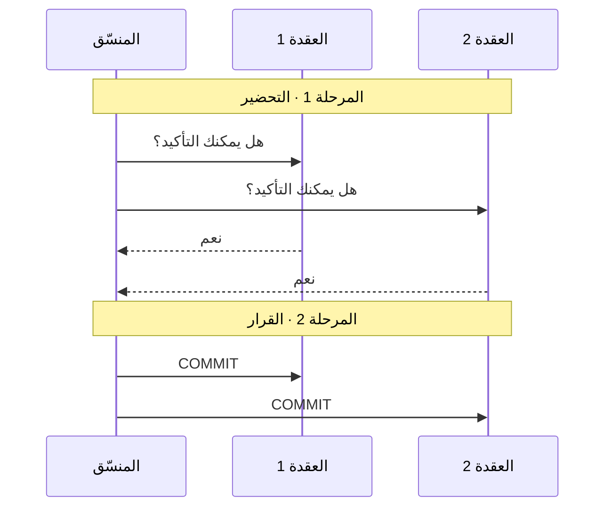

إذا أجابت أي عقدة بلا، يُلغي المنسّق المعاملة في كل العقد.

نقطة ضعف **الالتزام على مرحلتين** (*compromiso en dos fases*) هي الانسداد: إذا تعطّل المنسّق بين
المرحلتين، لا تستطيع العقد الأخرى الإلغاء من تلقاء نفسها —لا تعرف إن كانت عقدة ما قد أكّدت— فتنتظر
إلى ما لا نهاية. **الالتزام على ثلاث مراحل** (*compromiso en tres fases*) يتجنّب ذلك بإشراك عقد إضافية في
القرار، لكنه يضيف تعقيدًا وعبئًا كبيرين لدرجة أنه نادرًا ما يُستخدم.

---

## 6. تصنيف أنظمة إدارة قواعد البيانات

يُصنَّف نظام الإدارة بعدة معايير في الوقت نفسه. لا يوجد تصنيف صحيح وحيد: يجب
معرفة ما هو نظام إدارة معيّن حسب كل معيار.

| المعيار | الفئات |
|---|---|
| **نموذج البيانات** | هرمي، شبكي، علائقي، كائني-علائقي، موجّه للكائنات، NoSQL (وثائقي، مفتاح-قيمة، عمودي، رسوم بيانية) |
| **الرخصة** (*licencia*) | حرّة (يمكن استخدامها ودراستها وتعديلها وإعادة توزيعها)؛ احتكارية (*propietario*، مدفوعة، شيفرة مغلقة)؛ مع إصدار مجاني محدود؛ شيفرة متاحة (*código disponible*، يمكن رؤية الشيفرة، لكن الرخصة تقيّد الاستخدامات، وخاصة تقديمه كخدمة) |
| **الموقع والمعمارية** | مُضمَّن، عميل-خادم، موزّع، في السحابة |
| **عدد المستخدمين** | أحادي المستخدم (مستخدم واحد في كل مرة) أو متعدد المستخدمين |
| **الغرض** | عام، أو خاص (السلاسل الزمنية، البحث في النصوص، الجغرافي) |
| **نوع الحمل** | معاملاتي (OLTP: عمليات صغيرة كثيرة، مثل الحجوزات أو المبيعات) أو تحليلي (OLAP: استعلامات قليلة ضخمة على البيانات التاريخية، مثل التقارير) |

> **أنظمة الإدارة المحدّدة، في البحث.** الجدول الذي يصنّف MariaDB وPostgreSQL وSQLite
> وMongoDB وRedis وOracle واحدًا واحدًا غير موجود هنا عن قصد: فهو بالضبط ما تطلبه بطاقة
> [`investigacion-1-gestores.md`](../../ejercicios/investigacion-1-gestores.md)، ويُستخرج من الوثائق الرسمية لكل
> نظام. سيُنشر في هذا المستند بعد العرض التقديمي يوم 9 أكتوبر.

---

## المسرد

| المصطلح | تعريف موجز |
|---|---|
| ACID | الذرّية، الاتساق، العزل، الديمومة: الضمانات الأربع للمعاملة |
| قاعدة البيانات (*base de datos*) | مجموعة من ملفات البيانات المترابطة، بلا تكرار غير ضروري، يمكن لعدة مستخدمين وبرامج الوصول إليها |
| القفل (*bloqueo*) | منع الوصول إلى بيانات ما دامت معاملة تستخدمها |
| المفتاح (*clave*) | صفة أو مجموعة صفات تعرّف نسخة دون أي لبس |
| التزامن (*concurrencia*) | عدة مستخدمين يصلون إلى البيانات نفسها في الوقت نفسه |
| CSV | ملف نصي فيه سجلّ واحد في كل سطر والحقول مفصولة بحرف معيّن |
| البيان المشتق (*dato derivado*) | بيان مخزَّن ناتج عن حساب على بيانات أخرى في قاعدة البيانات نفسها |
| DBaaS | قاعدة البيانات كخدمة، في السحابة |
| DDL · DML · DCL · TCL | جمل التعريف، والمعالجة، والتحكم في الصلاحيات، والتحكم في المعاملات |
| قاموس البيانات (*diccionario de datos*) | بيانات وصفية عن محتوى قاعدة البيانات وتنظيمها: الجداول، الأعمدة، الأنواع، المفاتيح، المستخدمون |
| المجال (*dominio*) | مجموعة القيم الصالحة لصفة |
| المُضمَّنة (*embebida*) | قاعدة بيانات داخل التطبيق نفسه، بلا خادم |
| المخطّط (*esquema*) | وصف بنية قاعدة بيانات |
| التجزئة (*fragmentación*) | تقسيم علاقة إلى أجزاء موزّعة على العقد |
| عدم الاتساق (*inconsistencia*) | نسخ من البيان نفسه لا تتطابق |
| الاستقلالية المادية / المنطقية (*independencia física / lógica*) | تغيير التخزين، أو البنية، دون المسّ بالتطبيقات |
| الفهرس (*índice*) | بنية مرتّبة تتيح العثور على السجلات دون المرور على كل شيء |
| السلامة (*integridad*) | أن تحترم البيانات القواعد: الأنواع، المفاتيح، المراجع الصالحة |
| البيانات الوصفية (*metadatos*) | بيانات تصف بيانات أخرى |
| نموذج البيانات (*modelo de datos*) | طريقة تنظيم البيانات وربطها: علائقي، وثائقي… |
| NoSQL | أنظمة إدارة غير علائقية: وثائقية، مفتاح-قيمة، عمودية، رسوم بيانية |
| التكرار (*redundancia*) | تكرار غير مرغوب للبيانات، مع خطر فقدان السلامة |
| السجلّ / الحقل (*registro / campo*) | تطبيق صفّ / عمود في ملف |
| SGBD | برمجيات تنشئ قاعدة بيانات وتصونها وتتحكّم في الوصول إليها |
| المعاملة (*transacción*) | مجموعة من العمليات تُنفَّذ كوحدة واحدة |
| الشفافية (*transparencia*) | ألّا يحتاج المستخدم إلى معرفة أين توجد البيانات ولا كيف تُنظَّم |
| القيمة الفارغة (*valor nulo*) | غياب القيمة؛ تختلف عن الصفر وعن السلسلة النصية الفارغة |
| العرض (*vista*) | وصف جزئي لقاعدة البيانات مكيَّف لمستخدم أو مجموعة |

---

## التقييم الذاتي

حاول الإجابة قبل قراءة الجواب، الموجود في الاقتباس أسفل كل سؤال. الأسئلة من
نمط الامتحان.

**1. تفتح ملف CSV مُصدَّرًا من جدول البيانات فتجد أن صفّ EQ-02 فيه حقل زائد عن البقية. ماذا حدث وكيف يُتجنّب ذلك؟**

> أحد الحقول يحتوي على حرف الفاصل (`4GB DDR3 kingston; 2GB Samsung` مع الفاصل `;`) وليس
> بين علامات اقتباس، فيُقرأ كحقلين. يُتجنّب ذلك بإحاطة هذا الحقل بعلامات اقتباس أو،
> وهو الأفضل، بعدم حفظ بيانين في خلية واحدة.

**2. لماذا ملف ‎.xlsx ليس ملفًا نصيًا رغم أنه يحتوي على XML في داخله؟**

> لأنه ملف `.zip`: لقراءته يجب فكّ ضغطه وتفسير صيغته ببرنامج.
> إذا فُتح بمحرّر نصوص يظهر غير مقروء.

**3. ملف فيه مليونا مكوّن منظَّم بشكل تسلسلي. ما كلفة العثور على مكوّن برقمه التسلسلي؟ أي تنظيم يحسّن ذلك؟**

> في أسوأ الحالات يجب قراءة المليوني سجلّ. التنظيم المفهرس (أو المباشر حسب
> الرقم التسلسلي) يتيح الذهاب إلى السجلّ دون المرور على الملف.

**4. اذكر أربع مشكلات لحفظ الجرد في جدول بيانات وما يقدّمه SGBD لكل منها.**

> أي أربع من جدول القسم 2.2. مثلًا: `4096MB` / `4 GB` / `4` ← نوع
> رقمي ووحدة ثابتة في العمود؛ حجز لـ `EQ-4` ← مفتاح أجنبي يرفض الأجهزة
> غير الموجودة؛ شخصان يعدّلان في الوقت نفسه ← التحكم في التزامن؛ لا يمكن إخفاء
> البريد الإلكتروني ← صلاحيات لكل عمود؛ نسخة غير مكتملة ← نسخ احتياطية متسقة.

**5. إلى أي لغة فرعية تنتمي GRANT وALTER وDELETE وROLLBACK؟**

> `GRANT`: ‏DCL. ‏`ALTER`: ‏DDL. ‏`DELETE`: ‏DML. ‏`ROLLBACK`: ‏TCL.

**6. ماذا يحفظ قاموس البيانات؟ أعطِ مثالًا على شيء يمكنك معرفته بالاستعلام عنه.**

> البيانات الوصفية: ما الجداول الموجودة، وأعمدتها، وأنواعها، ومفاتيحها، وقيودها، والمستخدمون والصلاحيات.
> مثال: ما الأعمدة الموجودة في الجدول `EQUIPO` وما نوع كل منها، دون النظر إلى البيانات.

**7. انقطع التيار الكهربائي في منتصف تسجيل إعارة: كان الحجز قد أُنشئ لكن الجهاز لم يُعلَّم بعد كمُعار. أي خاصية من خصائص المعاملات تحلّ ذلك وماذا يفعل نظام الإدارة عند عودته؟**

> الذرّية. بما أن المعاملة لم يتم تأكيدها، يتراجع عنها نظام الإدارة عند تشغيله مستخدمًا
> سجلّ المعاملات: يختفي الحجز وتبقى البيانات كما كانت قبل البدء.

**8. شركة لها قاعدة بيانات في سرقسطة ونسخة مطابقة في وشقة (Huesca) تتولّى العمل إذا تعطّلت سرقسطة. ما نوع قاعدة البيانات حسب الموقع؟**

> موزّعة ومنسوخة. لو كان كل مقرّ يحفظ بياناته فقط، لكانت مجزّأة.

**9. تضيف عمودًا إلى الجدول EQUIPO وتطبيق الإعارات، الذي لا يستخدمه، يستمر في العمل. ما اسم هذه الخاصية؟ ماذا كان سيحدث مع ملف CSV وسكربت؟**

> الاستقلالية المنطقية للبيانات. مع ملف CSV، كان السكربت الذي يقرأ الحقول حسب موضعها سيقرأ
> أعمدة خاطئة: اعتماد بين البرنامج والبيانات.

**10. ميّز بين «العالم الحقيقي» و«العالم المفاهيمي» و«عالم التمثيلات» باستخدام جرد الفصل.**

> العالم الحقيقي: الأجهزة والمكوّنات الموجودة في الفصل. العالم المفاهيمي: ما نقرّر أنه
> يهمّنا منها (لكل جهاز CPU واحد وعدة وحدات RAM). عالم
> التمثيلات: الجدولان `EQUIPO` و`COMPONENTE` في MariaDB.

**11. ما الفرق بين نوع البيانات ومجال الصفة؟**

> النوع يعرّف مجموعة من القيم والعمليات المسموح بها عليها. المجال هو
> مجموعة القيم الصالحة لتلك الصفة المحدّدة، وهو عادةً مجموعة جزئية من النوع، ولا
> يعرّف عمليات. `ram_gb` من نوع عدد صحيح؛ ومجاله `1, 2, 4, 8, 16, 32`.


> **تنقص ثلاثة أسئلة.** أسئلة تصنيف نظام إدارة محدّد —SQLite وMongoDB وRedis— ستُضاف بعد
> المناقشة المشتركة يوم 28 سبتمبر: فلو نُشرت الآن لحلّت بطاقة
> [`investigacion-1-gestores.md`](../../ejercicios/investigacion-1-gestores.md) لبعض الفرق.

---

## ملحق · أنواع البيانات

ليس من RA1 (بل من RA3.c)، لكنه دُرس في S1V ويدخل في الامتحان نفسه.

| النوع | ماذا يحفظ | العمليات | في MariaDB | مثال |
|---|---|---|---|---|
| النص | حروف، رموز، أي شيء لا يُحسب | المقارنة، الترتيب الأبجدي، البحث | `VARCHAR(n)`، `CHAR(n)`، `TEXT` | `Kingston`، `EQ-04`، `ST500DM002` |
| العدد الصحيح | أعداد بلا كسور عشرية | الجمع، العدّ، المقارنة | `INT`، `SMALLINT` | `8` (GB)، `350` (W) |
| العشري | أعداد بكسور عشرية دقيقة | حساب دقيق | `DECIMAL(p,s)` | `3.20` (GHz)، `49.90` (€) |
| المنطقي (*booleano*) | نعم أو لا | التصفية | `BOOLEAN` | `prestable` |
| التاريخ والوقت | لحظة في الزمن | الترتيب، الطرح، التصفية حسب الفترة | `DATE`، `DATETIME` | `2026-09-21` |

ثلاث قواعد رأيناها مع جدول بيانات الفصل:

| القاعدة | لماذا | مثال |
|---|---|---|
| ما يبدو رقمًا ولا يُحسب فهو نص | إذا حُفظ كرقم تضيع الأصفار على اليسار ولا يمكن إجراء عمليات ذات معنى عليه | الرمز البريدي `04001`، الهاتف، الملصق `EQ-04`، الرقم التسلسلي |
| الوحدة توضع في اسم العمود، لا في القيمة | `4 GB` نص ولا يمكن جمعه؛ `4096MB` و`4` تخلطان الوحدات | العمود `ram_gb` بالقيم `8`، `6`، `4` |
| المجهول ليس صفرًا | القيمة `0` في مزوّد الطاقة تعني أنه بلا قدرة؛ إذا لم تكن معروفة فالقيمة فارغة (`NULL`) | مزوّد طاقة EQ-03: ‏`NULL`، لا `0` ولا `?` |

تفاصيل أخرى يُستحسن معرفتها:

| الموضوع | ماذا | مثال |
|---|---|---|
| عشري دقيق أو تقريبي | `DECIMAL` يحفظ بالضبط ما يُكتب: إلزامي للمال. `FLOAT` و`DOUBLE` تقريبيان: يصلحان للقياسات | `49.90` € في `DECIMAL(6,2)` |
| المنطقي في MariaDB | `BOOLEAN` يُحفظ كعدد صحيح صغير: `1` نعم، و`0` لا | `prestable = 1` |
| التواريخ | دائمًا بصيغة ISO 8601، سنة-شهر-يوم: لا شك إن كان يوم/شهر أو شهر/يوم | `2026-09-21`، لا `21/09/26` |
| قائمة قيم مغلقة | `ENUM` أو، وهو الأفضل، جدول منفصل بالقيم الممكنة | الحالة: `pendiente`، `enviado`، `entregado` |
| ترتيب النص | يُرتَّب النص حرفًا حرفًا، حسب **ترتيب الفرز** (*colación*، قواعد الترتيب في لغة ما): لهذا تأتي `10` قبل `9` إذا حُفظتا كنص | ملصقات بالأصفار: `EQ-09` قبل `EQ-10` |
| الحشو بالأصفار | مع عرض ثابت، يتطابق الترتيب الأبجدي مع الترتيب العددي | `EQ-04`، لا `EQ-4` |
| أي وحدة نختار | الأصغر التي تتجنّب الكسور العشرية، ويُحوَّل عند العرض | `ram_mb`، `frecuencia_mhz`، السعر بالسنتيمات |
| الرقم التسلسلي | قد يحتوي حروفًا وليس فريدًا بين المصنّعين: هو نص، وفي أقصى الأحوال مفتاح بديل | `ST500DM002`، `Z1D5K2XY` |
| السؤال عن قيمة فارغة | أي مقارنة مع `NULL` تعطي «مجهول»: `fuente_w = NULL` لا يجد شيئًا. يُسأل بـ `IS NULL` | `WHERE fuente_w IS NULL` |

</div>
