> English translation of `teoria-1-introduccion-bd.md`. The Spanish version is the reference; table and column names are kept in Spanish to match the exercises.

# GBD · Theory 1 · Introduction to databases

Summary in Spanish of Unit 1 of the material *Gestió de bases de dades* (CFGS ASX, M02,
Institut Obert de Catalunya, CC BY-NC-SA licence). The original PDF is held by the teacher.

This is the study document for **RA1** (learning outcome 1): it follows the structure of the
original, in a short version and with the examples as diagrams, and it adds what that material
—from 2011— does not cover and the curriculum does require: CSV and encoding, file organisation,
NoSQL, where the database manager runs, and a classification of today's managers. At the end there
is a [glossary](#glossary), a [self-assessment](#self-assessment) with answers and an
[annex on data types](#annex--data-types).

Sections 4.5 and 5.3 to 5.7 go beyond what is required in RA1: they are
included because they complete the topic, not because they are part of the test.

| Section | Content | RA |
|---|---|---|
| [1](#1-data-and-databases) | Data, entities, attributes, keys, files, CSV | RA1.a, RA2 |
| [2](#2-files-and-databases) | Origin of databases (DBs, *BD*), comparison, organisation, access, levels of abstraction | RA1.a, RA1.d |
| [3](#3-the-dbms) | Evolution, objectives, languages, users, components, dictionary | RA1.d, RA1.e |
| [4](#4-database-models) | ANSI/SPARC, hierarchical, network, relational, object, NoSQL | RA1.b |
| [5](#5-database-location) | Embedded, server, cloud; centralised and distributed | RA1.c |
| [6](#6-classification-of-dbmss) | Classification criteria for a manager | RA1.f |

**Further reading**, in the IOC PDF (unit 1, in Catalan):

| Section of this topic | IOC, unit 1 | Pages |
|---|---|---|
| 1 · Data and databases | 1.1 *Les dades i les bases de dades* | 19–28 |
| 2 · Files and databases | 1.2 *Conceptes de fitxers i bases de dades* | 29–35 |
| 3 · The DBMS | 1.3 *Els SGBD* | 36–54 |
| 4 · Database models | 2.1 and 2.2 *Arquitectura dels SGBD*, *Els models de bases de dades més comuns* | 55–64 |
| 5 · Location | 2.3 *Bases de dades distribuïdes* | 65–82 |
| 6 · Classification | Not in the IOC material, which is from 2011: these are today's managers | — |

---

## 1. Data and databases

### 1.1 The three worlds

Working with data requires distinguishing three realms:

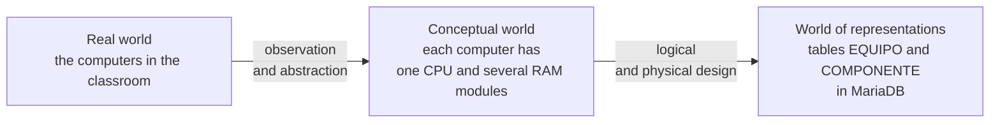

The same real world gives rise to different conceptual worlds depending on what interests the
observer, and each conceptual world allows several representations. They are not all equivalent:
design decisions and the chosen technology change how efficient the result is.

### 1.2 Entities, attributes and values

| Element | What it is | Example |
|---|---|---|
| Entity (*entidad*) | An object of the real world that we conceptualise, distinguishable from the others | The computer `EQ-04` |
| Attribute (*atributo*) | A property of the entity that interests us | `num_serie`, `estado`, `ram_total` |
| Value (*valor*) | The specific content of the attribute | `SN-7781`, `arranca`, `8` |

With only two of the three there is no information: `8`, without knowing which computer or which
property, says nothing.

An attribute must hold **a single value** at any moment. Multivalued attributes
(a list inside a cell) are incompatible with the relational model.

### 1.3 Entity type and entity instance

- **Entity type** (*entidad tipo*): the generic class — computers, in general.
- **Entity instance** (*entidad instancia*): a specific object — the computer `EQ-04`.

In terms of sets, the entity type is the set and each instance is an element.

### 1.4 Data type and domain

- **Data type** (*tipo de dato*): a set of values with common characteristics and a set of
  permitted operations. Integers allow integer division, not exact division.
- **Domain** (*dominio*): the set of valid values for a specific attribute. It does not define
  operations, and in practice it is a subset of a data type.

Example: `ram_gb` is of integer type, but its domain is the values `1, 2, 4, 8, 16, 32`.

### 1.5 Null value

The null value (*valor nulo*) indicates **absence of a value**: unknown or non-existent. Whether it
is allowed or not is decided when defining the attribute's domain.

It is not zero or the empty string, which are values with their own meaning. `ram_gb = 0` means
“it has no RAM”; `ram_gb = NULL` means “we don't know how much it has”.

### 1.6 Identifying attributes and keys

- **Identifying attribute** (*atributo identificador*): its value is unique and is not repeated
  among instances.
- **Key** (*clave*): any attribute or set of attributes that unambiguously identifies the instances.

Every identifier is a key, but a key may need several attributes. Whether an attribute works as an
identifier depends on what the entity models:

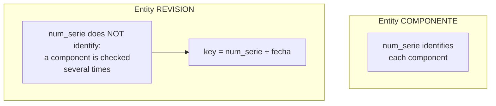

Neither identifiers nor the attributes that are part of a key ever allow the null value.

### 1.7 Tabular representation and files

The usual representation in databases is the **table** (*tabla*): each row is an entity instance,
each column an attribute, each cell a value.

Its computer implementation is the **data file** (*fichero de datos*): the row is called a
**record** (*registro*) and the column a **field** (*campo*). It is stored in external memory
(disk) because internal memory is volatile.

Adding instances or attributes only adds rows or columns: the structure does not get more complex.

### 1.8 Text files and binary files

| | Text | Binary |
|---|---|---|
| What it contains | Readable characters, line by line | Bytes in whatever format the program decides |
| How it is opened | With any editor (`nano`, Notepad, VS Code) | Only with the program that understands it |
| Examples | `.csv`, `.txt`, `.json`, `.xml`, `.sql`, `.html` | `.xlsx`, `.ods`, `.jpg`, `.pdf`, internal files of a database |
| Advantage | Anyone can read it, on any system, 30 years from now | Takes up less space, is processed faster, keeps formatting |
| Problem | Encoding: an `ñ` saved in Windows-1252 comes out as `ñ` if read as UTF-8 | If the program disappears, the file cannot be read |

An `.xlsx` or an `.ods` is actually a `.zip` with XML files inside: it is binary for the
user, even though there is text inside.

**CSV** (*comma-separated values*) is plain text with one record per line and the fields separated
by a character. A spreadsheet, a database manager and a script can all understand it, and that is
why it is the usual exchange format.

```text
Equipo;Aula;Grupo;Placa;RAM;Obs.
EQ-01;1.12;G1;Asus P8H61-M LX;2x4GB DDR3 Kingston;
EQ-02;1.12;G1;Asus P8H61-M LX;"4GB DDR3 kingston; 2GB Samsung";ranura 3 rota
EQ-03;1.12;Grupo 2;ASUS P8H61-MLX;4096MB DDR3 KINGSTON;no arranca
```

| Element | What it is | What goes wrong if it is not respected |
|---|---|---|
| Header | First line, with the field names | Without it, nobody knows what each column is |
| Separator | The character between fields. `,` in English; `;` in Spanish, because the comma is the decimal separator | A `3,2 GHz` with separator `,` splits the field in two |
| Quotes | Enclose a field that contains the separator | Without quotes, `4GB DDR3 kingston; 2GB Samsung` becomes two fields and the row no longer lines up |
| Encoding | UTF-8 almost always | Broken accents and eñes when opened on another system: `Pérez` read with the wrong encoding comes out as `Pérez` |
| Quotes inside a field | They are written doubled: `"monitor de 24"" pulgadas"` | The field is cut where it should not be |
| BOM | Some invisible bytes that Excel puts at the start of a UTF-8 CSV | Another program reads them as part of the name of the first column |
| End of line | Windows uses two characters (CR LF); Linux, one (LF) | A strange character appears at the end of the last field of each row |

These rules are collected in a standard, RFC 4180, although each program follows them in its own
way.

What CSV does **not** have: data types (everything is text), rules (nothing prevents writing `Grupo 2`
where others write `G2`) or relationships with other files.

### 1.9 Databases: interrelated files

There are usually several entity types, and the tables that represent them are not independent.
**Relationships** (*interrelaciones*) associate entities with each other, through fields of the
same type that store the same values.

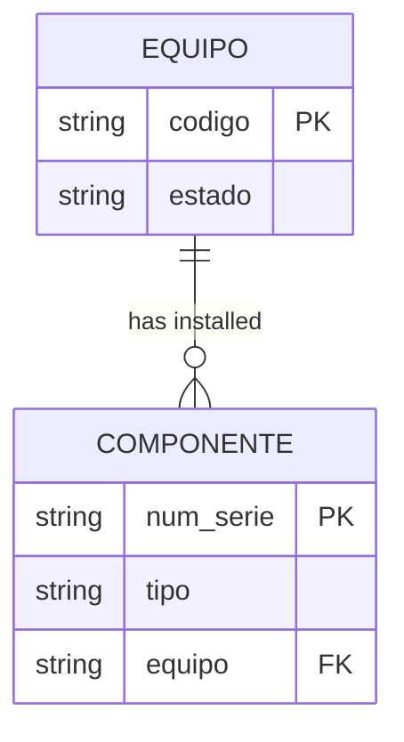

> A database is a set of interrelated data files.

Keeping that consistency by hand is costly: if a value that serves as a link changes or is deleted,
it has to be reflected in all the files involved. Hence DBMSs (database management systems,
*SGBD*).

### 1.10 Logical level and physical level

| Level | What you work with | When |
|---|---|---|
| Logical | Tables, fields, records, relationships | Whenever possible: it is the most productive |
| Physical | Record chaining, compression, index types | Only when optimisation is needed |

---

## 2. Files and databases

### 2.1 Where databases come from

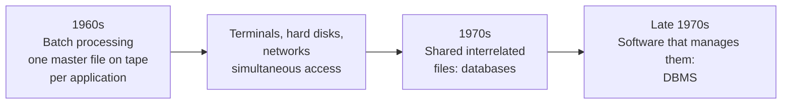

Each new application copied into its own file data that already existed in another one. That
simplified the program, but produced **redundancy** (*redundancia*) and with it the risk of
inconsistency.

> A database is the computer representation of sets of entity instances of different
> entity types and of the relationships between them, usable in a shared and simultaneous way by
> several users.

### 2.2 Files versus databases

| Aspect | Files | Databases |
|---|---|---|
| Entity types | One per file | Many, interrelated |
| Relationships | The system does not know about them | The system has tools for them |
| Redundancy | A custom file per application | All applications on the same DB |
| Inconsistencies | Possible if the programmer does not update all the copies | The data is stored only once |
| Getting data | Custom program, compile and run | Direct query, no programming |
| Integrity | Each program implements it | The manager implements it |
| Atomicity | Very hard to guarantee | Transactions |
| Concurrency | Simultaneous updating causes inconsistency | Locks |
| Security | One file, one view, all or nothing | Views and per-user permissions |

Files are still the reasonable option when the volume is small or there are no
relationships: configuration files for applications and systems, and event
records (*logs*). Setting up a DBMS there would only worsen performance.

#### The problems of a spreadsheet, by name

What was found in the classroom inventory spreadsheet has a technical name:

| Problem | Name | In the classroom spreadsheet |
|---|---|---|
| A cell with more than one value | **Non-atomic value** | `2x4GB DDR3 Kingston`; `WD 1TB, Kingston SSD 240` |
| The same data written in several ways | **No domain control**: nothing limits the valid values | `Kingston`, `kingston`, `KINGSTON` |
| The same fact repeated in many rows: changing it means changing all of them | **Update anomaly** | The socket of a motherboard, repeated in every computer that has it |
| Something cannot be stored without inventing the rest of the row | **Insertion anomaly** | The loose disk in the cupboard does not fit: it has no computer |
| Deleting a row loses information that had nothing to do with it | **Deletion anomaly** | Deleting EQ-04 deletes the only trace of its SSD |
| A value calculated from others, stored by hand | **Derived data** | The total RAM of EQ-02 does not match its modules |
| A rule that the data should always meet | **Integrity constraint**: the spreadsheet has nowhere to write it | Two loans of the same computer at the same time; `EQ-4` instead of `EQ-04` |

The three anomalies were described by Codd, the creator of the relational model. A good table design
([theory 2](../teoria-2-er-y-relacional.md)) avoids them: that is what you gain by moving the
spreadsheet to a database.

### 2.3 File organisation

A **logical storage system** is the way data is organised to store it and
retrieve it, regardless of the physical disk where it ends up. Before databases, each
program stored its data in its own files with one of these organisations:

| Organisation | How records are stored | How one is found | Advantage | Drawback |
|---|---|---|---|---|
| **Sequential** | One after another, in the order they arrive | Reading from the beginning until it is found | Simple; uses all the space | With two million records, finding one means reading two million |
| **Direct** (random, *hash*) | In a position calculated from the key | The position is calculated and you jump to it | Immediate access by key | Not suitable for going through in order; two keys can give the same position (collision) |
| **Indexed sequential** | Sorted by key, plus an index with the position of each block | The index is consulted, you jump to the block and read a short stretch | Good for finding one and for going through in order | Insertions disorder the file and it has to be reorganised |
| **Indexed** | In any order, with one or more separate indexes | Through whichever index is convenient | Several access paths: by label, by serial number | Indexes take up space and must be kept up to date |

An **index** (*índice*) works like the index of a book: a sorted list of keys with the page where
each one is. Database managers still use indexes internally; the difference is that the
system manages them, not the program.

The CSV of the classroom spreadsheet is a text file with sequential organisation.

### 2.4 Types of data access

Two classifications that cross: sequential or direct, by position or by value.

| | By position (P) | By value (V) |
|---|---|---|
| **Sequential (S)** | SP · list all computers unsorted | SV · list them sorted by code |
| **Direct (D)** | DP · *hash* index, binary search | DV · get the record of `EQ-04` |

### 2.5 The three views of data

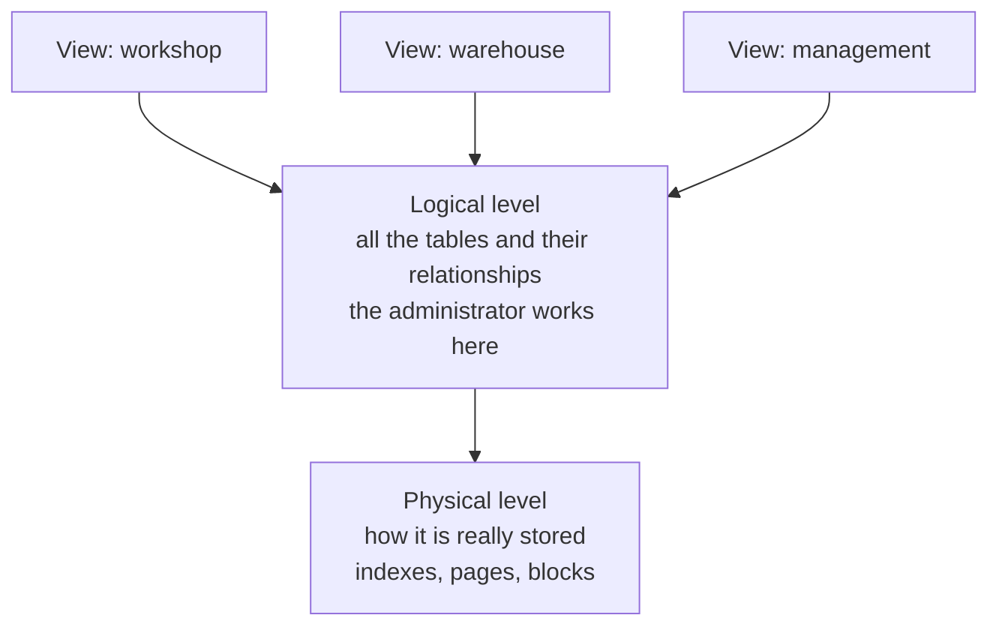

- **Physical**: the lowest. It is only touched to optimise.
- **Logical**: intermediate. It describes all the data with simple structures (tables).
- **Views**: the highest. Each view (*vista*) describes only the part of the DB that a user needs.
  It simplifies work and provides security and privacy.

---

## 3. The DBMS

> A DBMS (database management system, *SGBD, sistema gestor de bases de datos*) is the software
> whose purpose is managing and controlling databases.

### 3.1 Evolution

| Stage | What characterises it |
|---|---|
| 1950s | Punched and magnetic tapes: sequential access only, batch processing |
| 1960s-70s | Centralised systems, terminals with no processing power of their own. Programs depend on the physical level |
| 1980s | Relational DBMSs. SQL is standardised in 1986 (ANSI) and its use becomes widespread |
| 1990s | Distributed DBs, client/server architecture, fourth-generation languages (4GL) |
| Today | Multimedia, object orientation, the Internet, data warehouses, XML |

The relational model was defined in the early 1970s, but it took a decade to reach the
market: at first it performed worse than the hierarchical and network models.

### 3.2 Objectives and features

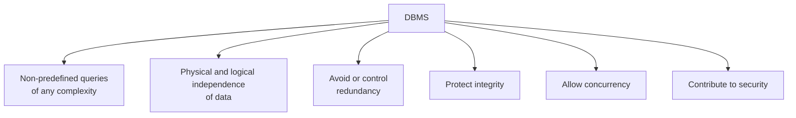

**Non-predefined queries.** Before, you had to list the whole file and select by hand, or
write a program. The DBMS itself answers an SQL statement.

**Independence.** Physical changes (adding an index) do not force you to touch queries or
applications. Logical changes (adding an attribute) do not prevent running the processes that are
not affected.

**Redundancy.** The cost of storage matters little today; the risk of losing integrity when
updating does. The manager must allow replicas and **derived data** (the result of calculations on
other data), taking care itself of keeping them up to date.

**Integrity.** It is protected with integrity rules and with backups.

| Type of rule | Who defines it | Example |
|---|---|---|
| Model constraint | Inherent to the model, the manager incorporates it | Two rows cannot have the same primary key (*clave primaria*) |
| User constraint | The designer or the administrator | A retired component cannot be installed in a computer |

**Concurrency.** Two techniques:

- **Transaction** (*transacción*): a set of operations executed as a unit. Either all of them, or
  none.
- **Lock** (*bloqueo*): preventing access to certain data while a transaction is using it, so that
  transactions run as if they were isolated.

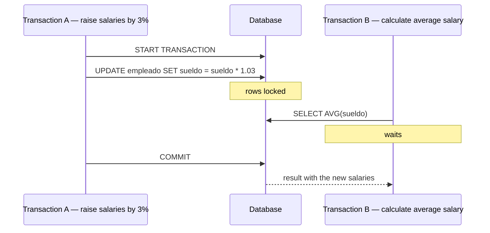

**Security.** Authorisations at the level of the DB, entity, attribute and type of operation, on
identified users. Also, encryption: it penalises performance, but passwords are always
encrypted.

### 3.3 Languages

Classic material distinguishes two types of language, **DDL** and **DML**. In current practice, the
statements of SQL —which is a single language— are grouped into four sublanguages:

| Sublanguage | What for | Statements |
|---|---|---|
| **DDL** · data definition | Create, modify and delete the structure | `CREATE`, `ALTER`, `DROP` |
| **DML** · data manipulation | Query and modify the content | `SELECT`, `INSERT`, `UPDATE`, `DELETE` |
| **DCL** · data control | Grant and revoke permissions | `GRANT`, `REVOKE` |
| **TCL** · transaction control | Commit or undo | `COMMIT`, `ROLLBACK`, `SAVEPOINT` |

In this RA it is enough to recognise them and know which group each one belongs to. They are written
from RA3 onwards.

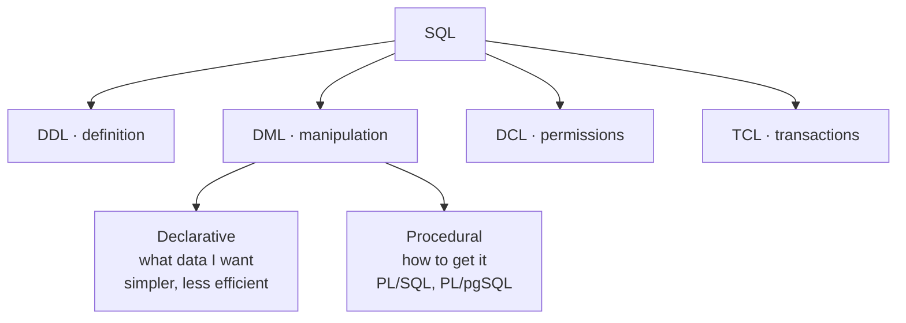

From external programming languages there are two ways in: calling libraries that
implement connectivity standards (**ODBC**, **JDBC**), or embedding SQL statements inside the
host program.

### 3.4 Users and administrators

| Type | How they interact |
|---|---|
| External user | Through an application made by others. Someone withdrawing money from an ATM |
| Sophisticated user | Directly, writing queries in SQL |
| Application programmer | Writes the programs that external users use |
| Administrator (DBA) | Manages and controls: schemas, permissions, backups, space, performance |

The administrator's tasks: create and manage schemas, manage security, make periodic
backups, monitor disk space, watch over integrity, observe performance, advise
programmers and users, change the physical design and handle emergencies. Their main
responsibility is not to fix incidents, but to prevent them.

### 3.5 Functional components

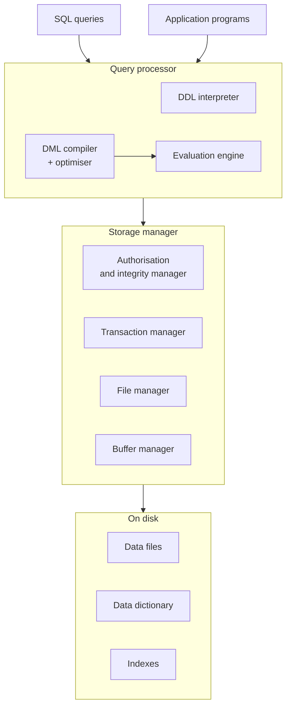

### 3.6 Data dictionary

A set of **metadata** (*metadatos*) with information about the content and organisation of the
database. It is also called the system catalogue or metadata repository. It contains:

- Schema definitions.
- Description of tables, fields, views, indexes, functions, procedures, triggers.
- Referential integrity constraints.
- Access control: users, roles, privileges.
- Storage location parameters and usage statistics.

Each manager implements it in its own way:

```sql
-- Oracle: views with prefix USER_, ALL_ or DBA_
SELECT owner, object_name, object_type FROM ALL_OBJECTS;

-- MySQL and MariaDB: INFORMATION_SCHEMA schema
SELECT table_name, table_type, engine
FROM information_schema.tables
WHERE table_schema = 'inventario';
```

---

## 4. Database models

> A data model is a set of logical tools for describing data, their
> relationships, their meaning and the constraints that guarantee their consistency.

Every model provides three things: **data structures** (tables, trees), **integrity rules**
(types, domains, keys) and **operations** (inserts, deletes, updates, queries).

### 4.1 ANSI/SPARC architecture (1975)

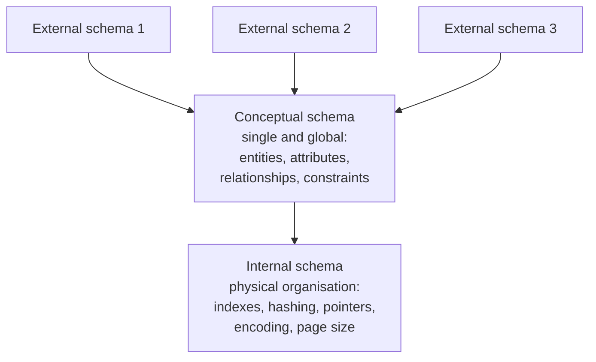

The **schema** (*esquema*) is the description of the structure of the DB, and the DBMS needs it
permanently in order to work. An external schema can rename attributes, define derived data, present
one entity as if it were two, or several as if they were one.

### 4.2 The most common models

**Hierarchical** (1960s). An inverted tree: each parent node has several children, the root has no
parent, the leaves have no children. Relationships are established at the physical level, with
pointers to the address of the parent record.

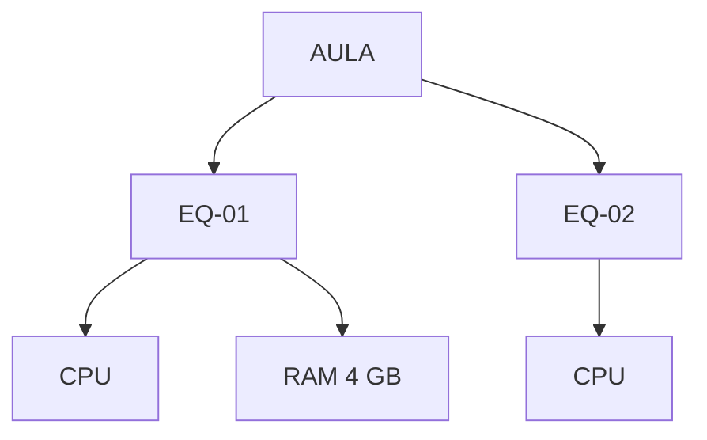

Very good performance towards the root, terrible in the opposite direction: it forces you to go
through all the records. It neither avoids redundancy nor guarantees referential integrity: when the
parent is deleted, the children are left orphaned. Managers: IMS (IBM), Adabas (Software AG).

**Network** (1970s). The same, but a node can have **more than one parent**. It controls
redundancy better, at the cost of complex administration. CODASYL standard; manager: IDMS.

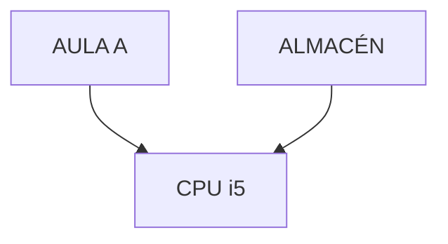

**Relational** (Codd, 1970; commercial in the 1980s). Based on predicate logic and set
theory. A single element: the **relation** or table. Relationships are implemented with
**foreign keys** (*claves ajenas*) that point to the primary key of another table.

Advantages over the earlier ones: it avoids duplicate records, it safeguards referential integrity
(it prevents or cascades deletions and updates) and it is limited to the logical level, which gives
physical data independence.

**Object-relational and object-oriented.** The first extends the relational model by allowing
abstract data types. The second defines the DB in terms of objects, their properties and their
operations (**methods**); objects with the same structure form a **class**, and classes are
organised in hierarchies with inheritance.

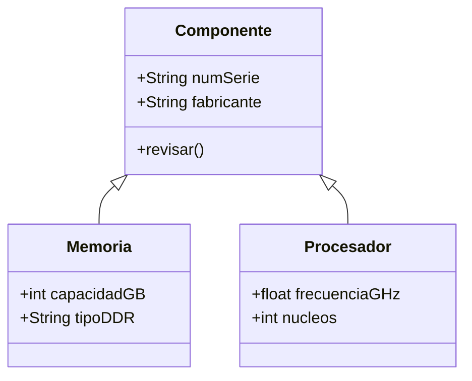

### 4.3 New models

When millions of historical records have to be queried to make decisions, the relational model does
not respond efficiently enough. Hence:

- **Data warehouses** (*almacenes de datos*): elaborated replicas of the data from daily
  operations, with extraction, transformation and loading tools.
- **Multidimensional DBs**: optimised for online analytical processing (**OLAP**). The
  data is organised in **cubes**, where each dimension is a query perspective: by
  product, by period, by town.
- **Multivalue DBs** (post-relational): attributes store lists of values. Languages closer
  to natural language than SQL, but with no common standard.

### 4.4 NoSQL

The IOC material is from 2011 and does not get this far, but the curriculum requires recognising the
types of database by model, and since 2009 the map includes **NoSQL** managers: an umbrella name
for whatever is not relational. They were born with the large-scale web, with more data and users
than a single relational server could handle and with data that does not fit into fixed tables.

The same fact, “EQ-04 is in the Workshop and has an 8 GB DDR4 Crucial module”, in three models:

**Relational** · tables related by keys:

| id_equipo | aula |
|---|---|
| EQ-04 | Taller |

| id_componente | id_equipo | tipo | fabricante | capacidad_gb |
|---|---|---|---|---|
| C-0117 | EQ-04 | RAM DDR4 | Crucial | 8 |

**Document** · one JSON document per computer, with everything inside:

```json
{
  "equipo": "EQ-04",
  "aula": "Taller",
  "componentes": [
    { "tipo": "RAM DDR4", "fabricante": "Crucial", "capacidad_gb": 8 }
  ]
}
```

**Key-value** · a key and a value, which the manager does not interpret:

```text
equipo:EQ-04:aula   →  "Taller"
equipo:EQ-04:ram_gb →  8
```

The four families:

| Family | How it stores | What it excels at | Examples |
|---|---|---|---|
| **Document** | JSON documents; each one can have different fields | Data with variable structure, catalogues, web content | MongoDB, CouchDB |
| **Key-value** | Key → value pairs, often in memory | Speed: caches, user sessions, queues | Redis, Valkey |
| **Columnar** (wide-column) | Rows with column families that can vary from one row to another, spread across many servers | Massive writes: sensors, logs, messaging | Cassandra, HBase |
| **Graph** | Nodes and edges with properties | Relationships: social networks, routes, recommendations | Neo4j |

| | Relational | NoSQL |
|---|---|---|
| Schema | Fixed: tables and columns are defined before storing | Flexible: each document or key can be different |
| Integrity | The manager guarantees it (foreign keys, constraints) | Usually the application guarantees it |
| Transactions | ACID | Depends on the manager; many prioritise speed and availability |
| Query | SQL, standard | Each manager's own language |
| Scaling | Better on a bigger server (vertical) | Designed to be spread across many servers (horizontal) |
| When | Structured data where consistency matters: inventory, billing, enrolment | Huge volume, changing structure or extreme speed |

The challenge's inventory is relational because its value lies in the relationships (component,
model, manufacturer, computer) and in the manager preventing inconsistent data.

### 4.5 Modelling with UML

UML class diagrams express the same as E/R diagrams for the static part of an information
system.

| E/R diagram | UML class diagram |
|---|---|
| Entity type | Class: box with name, attributes and operations |
| Binary relationship | Association: solid line between classes, with a name or roles |
| Attributes of the relationship | Additional box joined with a dashed line |
| Cardinality `máx..mín` | The same, but `n` is written `*` and the labels go on the opposite side |
| Generalisation | Line going from the subclass to the superclass, with a hollow arrowhead |

In an **overlapping** generalisation each subclass has its own arrow; in a **disjoint** one, the
lines converge in a single arrowhead. Relationships of degree higher than 2 cannot be
represented directly in UML.

---

## 5. Database location

Two different questions that are often confused: **where the manager is** (who runs the
software and how you reach it) and **where the data is** (on one machine or spread out).

### 5.1 Where the manager is

| Type | How it works | Advantages | Drawbacks | Examples |
|---|---|---|---|---|
| **Embedded** (local) | The database is a file inside the application; the manager is a library of the program itself. There is no server | Zero installation and zero administration | Only one program writing at a time; no users and no network access | SQLite on every Android phone, in Firefox and in WhatsApp |
| **Client-server** (on your own server) | A server process serves many clients over the network | Many users at once, permissions, full control | It has to be installed, maintained, protected and backed up | The classroom MariaDB, PostgreSQL in the 2nd year |
| **In the cloud** (DBaaS) | A provider offers the manager as a service; you pay per use | No hardware of your own; backups and high availability included | Ongoing cost, dependence on the provider, data outside your premises (data protection) | Amazon RDS, Azure SQL, Google Cloud SQL, MongoDB Atlas |

### 5.2 Where the data is

| Type | What it means | Example |
|---|---|---|
| **Centralised** | All the data in a single place | The classroom MariaDB |
| **Distributed** | The data is spread across several servers in different places, but the user sees it as a single database | A company with a branch in each city; each branch stores its data and they are queried together |
| Fragmented | Distributed where each server stores a different part | Customers from Aragón in Zaragoza, those from Catalonia in Barcelona |
| Replicated | Distributed where several servers store a copy of the same data | A primary server and a replica that takes over if the primary fails (set up in the 2nd year) |

A distributed database gains availability —if one site goes down, the others carry on— and brings
the data closer to those who use it; in exchange, keeping all the copies consistent is much harder.
The following sections develop this with the detail of the original material.

### 5.3 Architectures of distributed systems

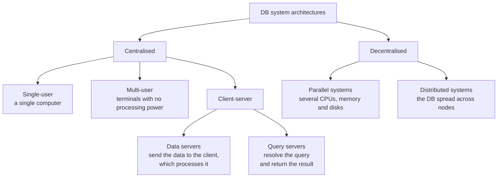

In client-server, the distinction is **logical, not physical**: a client can make requests to several
servers, a server can serve many clients, and both can reside on the same machine. Query
servers are the most widely deployed.

**Parallel systems.** They increase processing and I/O speed by using CPUs, memory and
disks in parallel. Essential with DBs in the order of terabytes or thousands of transactions per
second. Interconnection networks: bus (few processors), mesh (each node connected to its
neighbours), hypercube (lowest delay: each element at most log(n) nodes away). Models: shared memory,
shared disks, shared nothing and hierarchical.

**Distributed systems.** A set of partially independent DBs, on different computers, that
share a common schema and coordinate the transactions that access remote data. They share
neither memory nor disks.

| | Homogeneous | Heterogeneous |
|---|---|---|
| DBMS | The same on all nodes | Different on each node |
| Coupling | Tight, simple interaction | Harder, usually requires conversions |
| Updating the manager | Affects all nodes | Each node separately |

The user does not need to know where the data is or how it is organised: that is
**transparency**. The administrator does.

| Advantages | Drawbacks |
|---|---|
| Sharing with local autonomy | Higher software development cost |
| Reliability and availability in the event of failures | More chance of errors: the nodes operate in parallel |
| Queries can be split into parallel subqueries | Extra time for exchanging messages |

### 5.4 Distribution design

Objectives: favour **local processing** (bringing the data closer to whoever uses it most), spread
the **workload** well and control **storage costs**. The first two may
conflict.

| Strategy | When | How |
|---|---|---|
| Bottom-up (*ascendente*) | Integrating pre-existing DBs while keeping their location | Synthesising the local logical schemas up to the global schema |
| Top-down (*descendente*) | New DBs and applications | From requirements analysis to conceptual design, then logical design with the distribution decisions |

Systems resulting from a bottom-up design tend to be heterogeneous; in a top-down one it is
advisable to opt for a homogeneous system.

### 5.5 Distribution methodologies

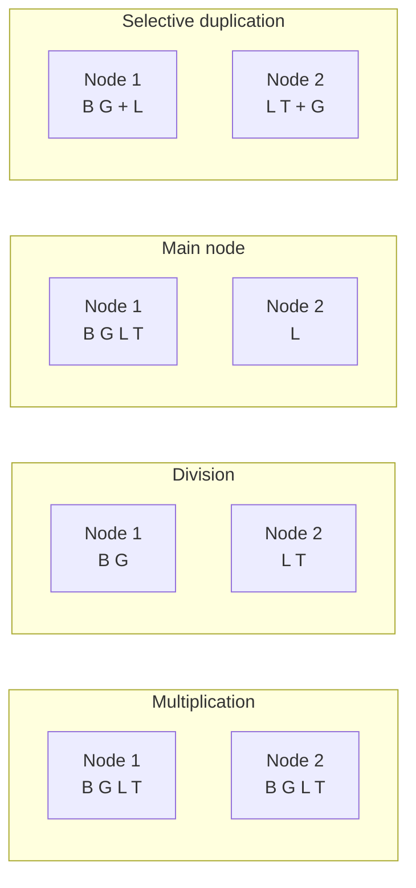

| Methodology | Advantage | Drawback |
|---|---|---|
| Multiplication · the whole DB on each node | Local and very fast queries; tolerates failures | Every update goes to all nodes: heavy traffic. Multiplies the space |
| Division · no part replicated | Simple updates; the space is that of a centralised DB | Almost all queries are global. If a node goes down, its part is lost |
| Main node · one has the whole DB, the others their part | Favours local processing, good availability | Updating and storage more expensive than in a centralised DB |
| Duplication on selected nodes · none has it all, but everything is duplicated | Like the previous one, with somewhat more availability | Similar to the previous one |

### 5.6 Duplication and fragmentation

- **Duplication**: identical copies of a relation on several nodes. It improves availability and
  parallelism; it overloads updates, which must keep the replicas consistent.
- **Fragmentation**: dividing relations into fragments that contain all the information
  needed to rebuild the original.

Starting from a relation `PROVEEDOR(NIF, nombre, telefono, direccion, localidad)`:

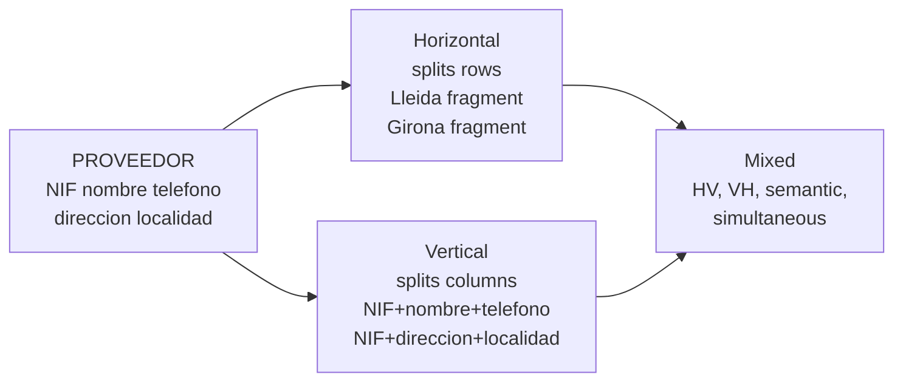

| Fragmentation | What it splits | Condition |
|---|---|---|
| Horizontal | The tuples (rows), according to the values of one or more attributes | Each tuple in at least one fragment |
| Vertical | The attributes (columns) | Each fragment includes the primary key, so it can be reassembled |
| Mixed | Both, in one order or the other | VH, HV, semantic and simultaneous |

The **degree of fragmentation** ranges from zero (the unit is the whole relation) to the maximum (each
tuple or each attribute is a fragment). The usual approach is to seek a compromise based on actual use.

### 5.7 Transactions and commit protocols

**ACID** properties, which every DBMS must guarantee:

| Property | What it means |
|---|---|
| Atomicity | Either all the operations of the transaction are done, or none |
| Consistency | Executed in isolation, the transaction preserves the consistency of the DB |
| Isolation | With concurrency, each transaction runs as if the others had not started or had already finished |
| Durability | Once successfully completed, the changes remain even in the event of system failures |

In a distributed system, the atomicity and isolation of global transactions are harder to
guarantee. **Commit protocols** are used for this.

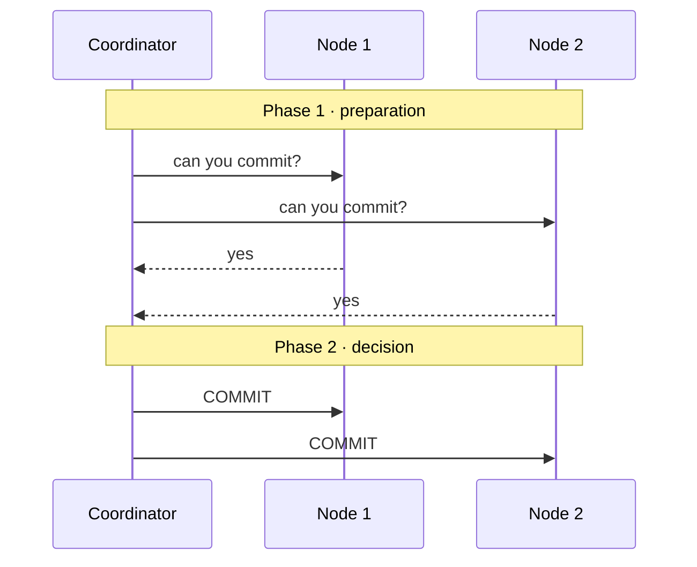

If any node answers no, the coordinator cancels the transaction on all of them.

The weak point of **two-phase commit** is blocking: if the coordinator goes down between the two
phases, the other nodes cannot cancel on their own —they do not know whether someone already
committed— and they wait indefinitely. **Three-phase commit** avoids this by involving additional
nodes in the decision, but it adds so much complexity and overhead that it is hardly used.

---

## 6. Classification of DBMSs

A manager is classified using several criteria at once. There is no single correct classification:
you have to be able to say, for a given manager, what it is according to each criterion.

| Criterion | Classes |
|---|---|
| **Data model** | Hierarchical, network, relational, object-relational, object-oriented, NoSQL (document, key-value, columnar, graph) |
| **Licence** | Free (can be used, studied, modified and redistributed); proprietary (paid, closed source); with a limited free edition; source-available (you can see the code, but the licence restricts uses, especially offering it as a service) |
| **Location and architecture** | Embedded, client-server, distributed, in the cloud |
| **Number of users** | Single-user (one user at a time) or multi-user |
| **Purpose** | General, or specific (time series, text search, geographic) |
| **Type of workload** | Transactional (OLTP: many small operations, such as bookings or sales) or analytical (OLAP: few huge queries on historical data, such as reports) |

> **The specific managers, in the research.** The table with MariaDB, PostgreSQL, SQLite,
> MongoDB, Redis and Oracle classified one by one is deliberately not here: it is exactly what the
> form in [`investigacion-1-gestores.md`](../../ejercicios/investigacion-1-gestores.md) asks for, and it comes from
> the official documentation of each manager. It will be published in this document after the
> presentation on 9 October.

---

## Glossary

| Term | Short definition |
|---|---|
| ACID | Atomicity, consistency, isolation, durability: the four guarantees of a transaction |
| Database | A set of interrelated data files, with no unnecessary redundancy, accessible to several users and programs |
| Lock | Preventing access to some data while a transaction is using it |
| Key | An attribute or set of attributes that unambiguously identifies an instance |
| Concurrency | Several users accessing the same data at the same time |
| CSV | A text file with one record per line and fields separated by a character |
| Derived data | Stored data that results from a calculation on other data in the same DB |
| DBaaS | Database as a service, in the cloud |
| DDL · DML · DCL · TCL | Statements for definition, manipulation, permission control and transaction control |
| Data dictionary | Metadata about the content and organisation of the DB: tables, columns, types, keys, users |
| Domain | The set of valid values for an attribute |
| Embedded | A database inside the application itself, with no server |
| Schema | Description of the structure of a DB |
| Fragmentation | Dividing a relation into parts distributed among nodes |
| Inconsistency | Copies of the same data that do not match |
| Physical / logical independence | Changing the storage, or the structure, without touching the applications |
| Index | An ordered structure that makes it possible to locate records without going through everything |
| Integrity | The data meeting the rules: types, keys, valid references |
| Metadata | Data that describes other data |
| Data model | A way of organising and relating data: relational, document… |
| NoSQL | Non-relational managers: document, key-value, columnar, graph |
| Redundancy | Unwanted repetition of data, with the risk of losing integrity |
| Record / field | Implementation of a row / of a column in a file |
| DBMS | Software that creates, maintains and controls access to a database |
| Transaction | A set of operations executed as a unit |
| Transparency | The user not needing to know where the data is or how it is organised |
| Null value | Absence of a value; different from zero and from the empty string |
| View | A partial description of the DB adapted to a user or group |

---

## Self-assessment

Try to answer before reading the answer, which is in the quote below each question. They are in
the style of the test.

**1. You open a CSV exported from the spreadsheet and the row for EQ-02 has one more field than the others. What happened and how can it be avoided?**

> A field contains the separator character (`4GB DDR3 kingston; 2GB Samsung` with separator `;`) and
> is not in quotes, so it is read as two fields. It is avoided by enclosing that field in quotes or,
> better, by not storing two pieces of data in one cell.

**2. Why is an .xlsx not a text file even though it has XML inside?**

> Because it is a `.zip`: to read it you have to decompress it and interpret its format with a program.
> Opened with a text editor, it is unreadable.

**3. A file of 2 million components has sequential organisation. What does it take to find one by its serial number? What organisation improves this?**

> In the worst case you have to read all 2 million records. An indexed organisation (or a direct one by
> serial number) lets you go to the record without going through the file.

**4. Name four problems of storing the inventory in a spreadsheet and what the DBMS provides for each one.**

> Any four from the table in section 2.2. For example: `4096MB` / `4 GB` / `4` → numeric
> type and a fixed unit in the column; a booking for `EQ-4` → a foreign key that rejects
> non-existent computers; two people editing at the same time → concurrency control; the email cannot be
> hidden → per-column permissions; a half-finished copy → consistent backups.

**5. Which sublanguage do GRANT, ALTER, DELETE and ROLLBACK belong to?**

> `GRANT`: DCL. `ALTER`: DDL. `DELETE`: DML. `ROLLBACK`: TCL.

**6. What does the data dictionary store? Give an example of something you can find out by querying it.**

> Metadata: which tables there are, their columns, types, keys, constraints, users and permissions.
> Example: which columns the table `EQUIPO` has and what type each one is, without looking at the data.

**7. The power goes out halfway through recording a loan: the booking had been created but the computer had not been marked as lent. Which transaction property solves this and what does the manager do when it comes back?**

> Atomicity. Since the transaction was never committed, when the manager starts up it undoes it using
> the transaction log: the booking disappears and the data is left as it was before starting.

**8. A company has a database in Zaragoza and an exact copy in Huesca that takes over if Zaragoza goes down. What type of database is it according to location?**

> Distributed and replicated. If each site stored only its own data, it would be fragmented.

**9. You add a column to the EQUIPO table and the loans application, which does not use it, keeps working. What is that property called? What would have happened with a CSV and a script?**

> Logical data independence. With a CSV, the script that read the fields by position would have read
> the wrong columns: dependence between program and data.

**10. Distinguish “real world”, “conceptual world” and “world of representations” using the classroom inventory.**

> Real world: the computers and components that are in the classroom. Conceptual world: what we decide
> interests us about them (each computer has one CPU and several RAM modules). World of
> representations: the tables `EQUIPO` and `COMPONENTE` in MariaDB.

**11. What is the difference between the data type and the domain of an attribute?**

> The type defines a set of values and the operations permitted on them. The domain is the
> set of valid values for that specific attribute, usually a subset of the type, and it does not
> define operations. `ram_gb` is of integer type; its domain is `1, 2, 4, 8, 16, 32`.


> **Three questions are missing.** The ones about classifying a specific manager —SQLite, MongoDB
> and Redis— will be added after the class discussion on 28 September: right now they would solve
> the [`investigacion-1-gestores.md`](../../ejercicios/investigacion-1-gestores.md) form for some of the teams.

---

## Annex · Data types

It is not part of RA1 (it is RA3.c), but it was covered in S1V and is in the same test.

| Type | What it stores | Operations | In MariaDB | Example |
|---|---|---|---|---|
| Text | Letters, codes, anything that is not calculated | Compare, sort alphabetically, search | `VARCHAR(n)`, `CHAR(n)`, `TEXT` | `Kingston`, `EQ-04`, `ST500DM002` |
| Integer | Numbers without decimals | Add, count, compare | `INT`, `SMALLINT` | `8` (GB), `350` (W) |
| Decimal | Numbers with exact decimals | Exact arithmetic | `DECIMAL(p,s)` | `3.20` (GHz), `49.90` (€) |
| Boolean | Yes or no | Filter | `BOOLEAN` | `prestable` |
| Date and time | A moment in time | Sort, subtract, filter by period | `DATE`, `DATETIME` | `2026-09-21` |

Three rules that came up with the classroom spreadsheet:

| Rule | Why | Example |
|---|---|---|
| What looks like a number but is not calculated is text | If it is stored as a number, leading zeros are lost and you cannot operate on it meaningfully | Postcode `04001`, phone number, label `EQ-04`, serial number |
| The unit goes in the column name, not in the value | `4 GB` is text and cannot be added; `4096MB` and `4` mix units | Column `ram_gb` with values `8`, `6`, `4` |
| Unknown is not zero | A `0` for the power supply says it has no power; if it is not known, the value is null (`NULL`) | Power supply of EQ-03: `NULL`, not `0` or `?` |

More details worth knowing:

| Topic | What | Example |
|---|---|---|
| Exact or approximate decimal | `DECIMAL` stores exactly what is written: mandatory for money. `FLOAT` and `DOUBLE` are approximate: fine for measurements | `49.90` € in `DECIMAL(6,2)` |
| Boolean in MariaDB | `BOOLEAN` is stored as a small integer: `1` is yes, `0` is no | `prestable = 1` |
| Dates | Always in ISO 8601 format, year-month-day: there is no doubt about whether it is day/month or month/day | `2026-09-21`, not `21/09/26` |
| Closed list of values | An `ENUM` or, better, a separate table with the possible values | Status: `pendiente`, `enviado`, `entregado` |
| Text ordering | Text is sorted letter by letter, according to a **collation** (*colación*, the sorting rules of a language): that is why `10` comes before `9` if they are stored as text | Labels with zeros: `EQ-09` before `EQ-10` |
| Zero padding | With a fixed width, alphabetical order matches numerical order | `EQ-04`, not `EQ-4` |
| Which unit to choose | The smallest one that avoids decimals, converted when displaying | `ram_mb`, `frecuencia_mhz`, price in cents |
| Serial number | It can contain letters and is not unique across manufacturers: it is text, and at most an alternate key | `ST500DM002`, `Z1D5K2XY` |
| Asking about a null | Any comparison with `NULL` gives “unknown”: `fuente_w = NULL` finds nothing. You ask with `IS NULL` | `WHERE fuente_w IS NULL` |
