<div dir="rtl">

> ترجمة عربية لملف `teoria-2-er-y-relacional.md`. النسخة الإسبانية هي المرجع؛ أسماء الكيانات والجداول والأعمدة تبقى بالإسبانية لتطابق التمارين.

# GBD · النظرية 2 · نموذج الكيان/العلاقة والنموذج العلائقي

نظرية نتيجة التعلم RA2: كيف تُصمَّم قاعدة البيانات. أولًا **مخطط الكيان/العلاقة** (*diagrama entidad/relación*)، الذي
يحدد ما الذي يجب حفظه؛ ثم تحويله إلى **جداول** (*tablas*)، أي النموذج العلائقي (*modelo relacional*)، الذي يحدد كيف
يُنظَّم. وهذا ما ستفعلونه مع جرد التحدي.

صُمِّمت لتُقرأ وحدها ولتُعرض في القسم: لكل مفهوم مخططه.

| القسم | المحتوى | يُتدرَّب عليه في |
|---|---|---|
| [1](#1--مخطط-er) | مخطط E/R: الكيان، السمة، العلاقة، التعددية، المفتاح | `ejercicios-er-1.md` |
| [2](#2--من-المخطط-إلى-الجداول) | من المخطط إلى الجداول: المفاتيح، الترميز، القواعد من 1 إلى 6، DrawDB | `ejercicios-er-1.md` |
| [3](#3--النموذج-العلائقي) | النموذج العلائقي: المفردات وقواعد السلامة | `ejercicios-er-2.md` |
| [4](#4--ما-تبقى-من-مخطط-er) | ما تبقى من E/R: أنواع السمات، الكيان الضعيف، العلاقات الانعكاسية، الثلاثية، 1:1، التسلسلات الهرمية | `ejercicios-er-2.md` |
| [5](#5--قواعد-التحويل-إلى-جداول-من-7-إلى-11) | قواعد التحويل إلى جداول من 7 إلى 11 | `ejercicios-er-2.md`، `ejercicios-er-3-equipos/` |

**للتوسع:** مواد IOC ‏(بالكتالانية، 2011)، وهي لدى الأستاذ: الوحدة 2، *Model Entitat-Relació* (الصفحات 83–154)، والوحدة 3، *Model relacional
i normalització* (الصفحات 155–215). في بداية كل قسم يُذكر الجزء الذي يوسّعه. نظرية
RA1 (الملفات، أنظمة الإدارة، نماذج قواعد البيانات) موجودة في
[`teoria-1-introduccion-bd.md`](../teoria-1-introduccion-bd.md).

**كيف تُقرأ المخططات.** مخططات E/R في هذه الوثيقة تتبع ترميز القسم:
مستطيل للكيان، ومعيّن للعلاقة، وشكل بيضاوي للسمة، و`(mín,máx)` بجانب
الكيان. المفتاح، الذي يُسطَّر على الورق، يحمل هنا 🔑. مخططات الجداول تستخدم ترميز
DrawDB، أي قدم الغراب، المشروح في القسم 2.

---

## 1 · مخطط E/R

*IOC، الوحدة 2، القسم 1 (الصفحات 89–108).*

اقترح بيتر تشين (Peter Chen) نموذج الكيان/العلاقة سنة 1976. وهو يصف العالم الذي نريد حفظه بثلاث
قطع: **الكيانات** (*entidades*) (الأشياء)، و**السمات** (*atributos*) (بياناتها)، و**العلاقات** (*relaciones*) (كيف ترتبط).
لا يعتمد على أي نظام إدارة: إنه رسم يساعد على التفكير.

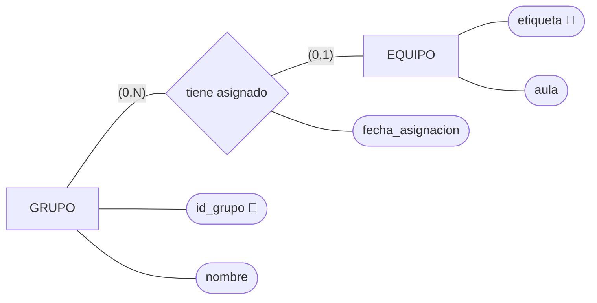
```mermaid
flowchart LR
  G[GRUPO] ---|"(0,N)"| R{tiene asignado}
  R ---|"(0,1)"| E[EQUIPO]
  G --- g1([id_grupo 🔑])
  G --- g2([nombre])
  E --- e1([etiqueta 🔑])
  E --- e2([aula])
  R --- r1([fecha_asignacion])
```

| الرمز | ما هو | في المخطط أعلاه |
|---|---|---|
| مستطيل | **الكيان** (*entidad*): شيء نريد حفظ بياناته، ويوجد منه الكثير | GRUPO، EQUIPO |
| شكل بيضاوي | **السمة** (*atributo*): معلومة من معلومات الكيان | aula، nombre |
| سمة مسطَّرة (🔑) | **المفتاح** (*clave*): السمة (أو السمات) التي تميّز نسخة واحدة عن جميع النسخ الأخرى | etiqueta |
| معيّن | **العلاقة** (*relación*): فعل يربط بين الكيانات | GRUPO *tiene asignado* EQUIPO |
| `(mín,máx)` بجانب كيان | **التعددية** (*cardinalidad*): في كم نسخة من العلاقة تشارك نسخة **واحدة** من ذلك الكيان | `(0,N)`، `(0,1)` |

### 1.1 الكيان والسمة

نميّز بين **نوع الكيان** (*entidad tipo*) (EQUIPO، بشكل عام) وكل **نسخة** (*ocurrencia*) منه (الجهاز `EQ-04`).
لكل سمة **مجال** (*dominio*): القيم التي يمكن أن تأخذها (`aula` نص؛ و`ram_gb` عدد
صحيح من قائمة قصيرة).

**سمة أم كيان؟** يكون كيانًا إذا كانت له بيانات خاصة به غير الاسم، أو إذا كان يرتبط بأشياء
أخرى، أو إذا لزم التحكم في قائمة القيم الممكنة. وإلا فهو سمة. الشيء نفسه
قد يكون سمة في تصميم وكيانًا في تصميم آخر: ذلك يتوقف على الأسئلة التي يجب أن تجيب عنها
قاعدة البيانات. لا توجد إجابة عامة؛ توجد قرارات مبرَّرة.

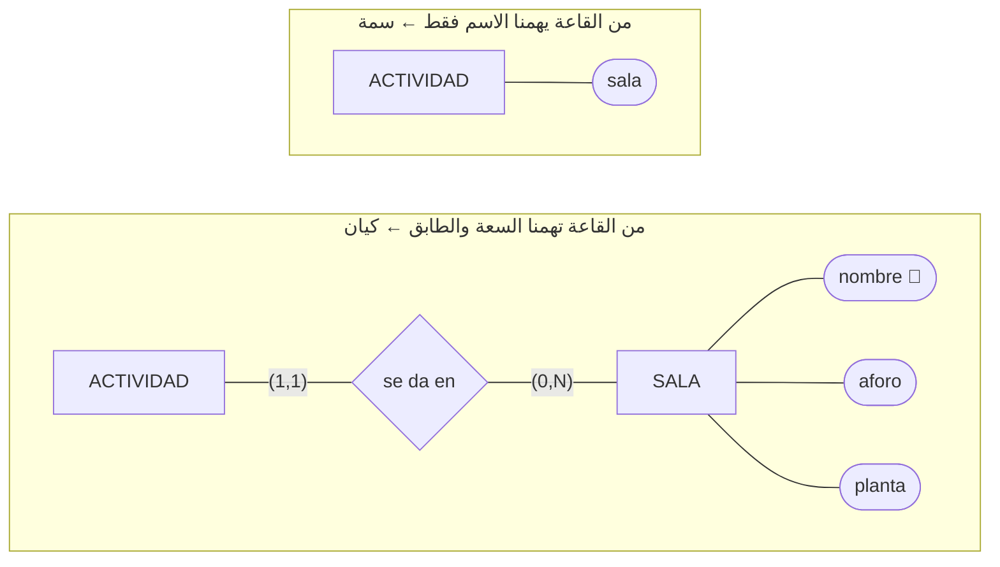
```mermaid
flowchart TB
  subgraph at["من القاعة يهمنا الاسم فقط ← سمة"]
    direction LR
    A1[ACTIVIDAD] --- a1([sala])
  end
  subgraph en["من القاعة تهمنا السعة والطابق ← كيان"]
    direction LR
    A2[ACTIVIDAD] ---|"(1,1)"| r{se da en} ---|"(0,N)"| S[SALA]
    S --- s1([nombre 🔑])
    S --- s2([aforo])
    S --- s3([planta])
  end
  at ~~~ en
```

### 1.2 العلاقة

العلاقة **فعل** يربط بين الكيانات. وتُقرأ كجملة في الاتجاهين: «المجموعة
*tiene asignados* (لديها مخصَّصة) أجهزة»، «الجهاز *está asignado a* (مخصَّص لـ) مجموعة». إذا لم يكن ممكنًا قراءتها بصوت
عالٍ، فهي خاطئة.

عندما يؤدي الكيان نفسه دورين مختلفين، يكون كل دور علاقة مستقلة باسمها
الخاص: للمباراة فريق **مضيف** (*local*) وفريق **زائر** (*visitante*).

**سمة العلاقة** (*atributo de relación*) معلومة لا تنتمي إلى أيٍّ من الكيانين، بل إلى حقيقة
أنهما مرتبطان: تاريخ تخصيص جهاز لمجموعة، وعدد وحدات منتج
في طلبية. إذا بدا أن سمة العلاقة يجب أن تكون لأحد الكيانين، فغالبًا
ما تكون التعددية خاطئة.

### 1.3 التعددية

لكل علاقة يُطرح **سؤالان**، واحد من كل جهة، مع التفكير دائمًا في نسخة **واحدة**
أيًّا كانت:

> مجموعة واحدة (GRUPO)، مع كم جهازًا (EQUIPOS) على الأقل وعلى الأكثر؟ ← `(0,N)`: قد لا يكون لديها أي جهاز، وقد يكون لديها الكثير.
>
> جهاز واحد (EQUIPO)، مع كم مجموعة (GRUPOS) على الأقل وعلى الأكثر؟ ← `(0,1)`: قد لا يكون مخصَّصًا، وعلى الأكثر لمجموعة واحدة.

تُكتب التعددية **بجانب الكيان الذي تتحدث عنه**. هناك كتب ومواقع تضعها في
الطرف المقابل؛ إذا بحثتم على الإنترنت، فانتبهوا إلى الاصطلاح الذي يستخدمه كل منها.

| الحد الأدنى | المعنى |
|---|---|
| 0 | مشاركة **اختيارية** (*opcional*): يمكن أن يوجد دون أن يشارك في العلاقة |
| 1 | مشاركة **إلزامية** (*obligatoria*): لا يمكن أن يوجد دون أن يشارك |

**نوع العلاقة** يُستخرج من الحدين الأقصيين:

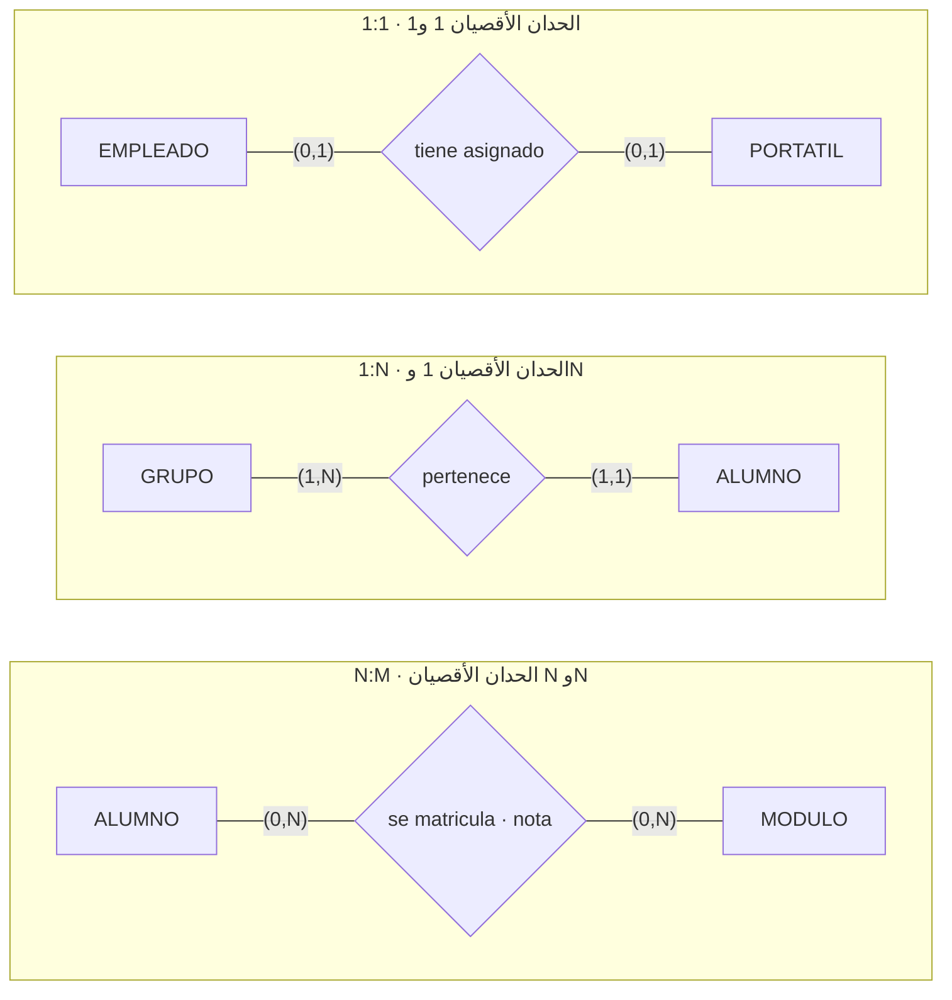
```mermaid
flowchart TB
  subgraph t1["1:1 · الحدان الأقصيان 1 و1"]
    direction LR
    E1[EMPLEADO] ---|"(0,1)"| x1{tiene asignado} ---|"(0,1)"| P1[PORTATIL]
  end
  subgraph t2["1:N · الحدان الأقصيان 1 وN"]
    direction LR
    G2[GRUPO] ---|"(1,N)"| x2{pertenece} ---|"(1,1)"| A2[ALUMNO]
  end
  subgraph t3["N:M · الحدان الأقصيان N وN"]
    direction LR
    A3[ALUMNO] ---|"(0,N)"| x3{se matricula · nota} ---|"(0,N)"| M3[MODULO]
  end
  t1 ~~~ t2 ~~~ t3
```

### 1.4 المفتاح

**المفتاح** (*clave*) يحدد كل نسخة دون أي احتمال للالتباس. المفتاح الجيد **فريد**،
و**لا يغيب أبدًا**، و**لا يتغير** مع الزمن، و**قصير**. اسم الشخص يتكرر؛ والبريد
الإلكتروني يتغير؛ والرقم التسلسلي قد يغيب. عندما لا توجد أي معلومة من هذا النوع، يُخترع رمز:
وهذا ما تفعلونه عند وضع ملصقات على الأجهزة (`EQ-04`). في القسم 2 توجد جميع أنواع المفاتيح.

### 1.5 مثال: مخزن القسم

> في المخزن قطع منفصلة. كل قطعة من طراز (*Kingston KVR16N11/4*)، وكل
> طراز يصنعه مُصنِّع. يمكن أن تكون القطعة مركَّبة في جهاز أو محفوظة على
> رف. ونريد أن نعرف عن كل قطعة من أي جهاز أخرجناها، حتى لو كانت الآن مركَّبة
> في جهاز آخر.

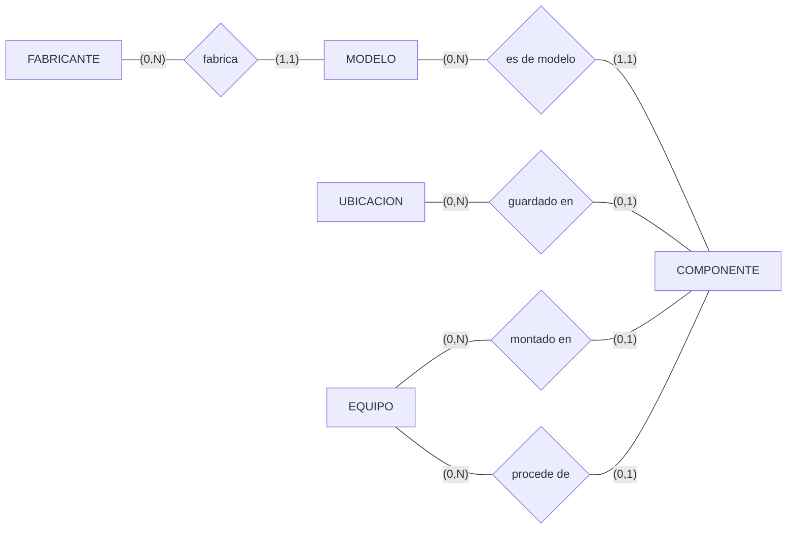
```mermaid
flowchart LR
  F[FABRICANTE] ---|"(0,N)"| r1{fabrica} ---|"(1,1)"| M[MODELO]
  M ---|"(0,N)"| r2{es de modelo} ---|"(1,1)"| C[COMPONENTE]
  U[UBICACION] ---|"(0,N)"| r3{guardado en} ---|"(0,1)"| C
  E[EQUIPO] ---|"(0,N)"| r4{montado en} ---|"(0,1)"| C
  E ---|"(0,N)"| r5{procede de} ---|"(0,1)"| C
```

| ما يُعلِّمه | أين |
|---|---|
| «Kingston» تُكتب مرة واحدة | FABRICANTE منفصل عن MODELO |
| القطعة موجودة حتى لو لم تكن في أي جهاز | `(0,1)` في *montado en* |
| علاقتان بين الكيانين نفسيهما | *montado en* و*procede de*: لو كانت علاقة واحدة فقط، لضاع مصدر القطعة عند نقلها |
| هناك قواعد لا يستطيع المخطط رسمها | *guardado en* و*montado en* تستبعد إحداهما الأخرى: القطعة في مكان أو في الآخر، لا في الاثنين. وتُسجَّل على حدة بوصفها **قيدًا** (*restricción*) |

### 1.6 مفاهيم التمارين من 1 إلى 4

| المفهوم | ما هو | كيف يُعرف في نص التمرين |
|---|---|---|
| **سمة أم كيان** | انظر 1.1 | «من القاعة يهمنا الاسم فقط» ← سمة. «عن كل قاعة، السعة والطابق» ← كيان |
| **سمة العلاقة** | انظر 1.2 | «كم وحدة من كل منتج **في طلبية**»: ليست للمنتج ولا للطلبية |
| **البيان المشتق** (*dato derivado*) | معلومة تُحسب انطلاقًا من معلومات أخرى. لا تُحفظ: لو حُفظت، لفقدت تزامنها عند تغيُّر البيانات التي تُستخرج منها | «المجموع يُحسب»، «النتيجة تُعدّ انطلاقًا من الأهداف»، «ذاكرة RAM المركَّبة في كل جهاز» |
| **البيان التاريخي** (*dato histórico*) | يبدو مشتقًا وليس كذلك: إنه صورة لقيمة في لحظة معينة، لا يجب أن تتغير حتى لو تغيّر الأصل. يُحفظ | السعر الذي بيع به منتج في طلبية، حتى لو ارتفع سعر المنتج غدًا. لو حُسب انطلاقًا من السعر الحالي، لتغيّرت الفواتير القديمة |
| **علاقتان بين الكيانين نفسيهما** | انظر 1.2 و1.5 | للمباراة فريق **مضيف** وفريق **زائر** |
| **الكيان الضعيف** (*entidad débil*) | كيان لا يُعرَّف إلا داخل كيان آخر. انظر 4.2 | «الهدف الثالث» لا معنى له إلا داخل مباراة محددة |
| **قيد غير قابل للتمثيل** (*restricción no representable*) | قاعدة من نص التمرين لا يستطيع المخطط رسمها. تُكتب في قائمة منفصلة، مع ذكر أين سيُضمن تطبيقها | «يجب أن يكون فريقا المباراة مختلفين» |

---

## 2 · من المخطط إلى الجداول

*IOC، الوحدة 3، القسم 1.3 (الصفحات 180–192).*

مخطط E/R يصف **ما** يجب حفظه. والجداول تصف **كيف** يُحفظ في
نظام إدارة علائقي مثل MariaDB. الانتقال من أحدهما إلى الآخر شبه آلي: تُطبَّق دائمًا
القواعد نفسها.

### 2.1 المفردات

| المصطلح | ما هو | يأتي من المخطط… |
|---|---|---|
| **الجدول** (*tabla*) | مجموعة صفوف لها الأعمدة نفسها | من كل كيان، ومن بعض العلاقات |
| **الصف** (*fila*) (السجل *registro*، الصف *tupla*) | نسخة واحدة: جهاز محدد | — |
| **العمود** (*columna*) (الحقل *campo*) | معلومة واحدة، لها نوع واسم | من كل سمة |
| **المجال** (*dominio*) | القيم الصالحة لعمود: نوعه وحدوده | — |
| **القيمة الفارغة** (*nulo*، `NULL`) | العمود فارغ لذلك الصف: غير معروف أو لا ينطبق | من المشاركات الاختيارية والسمات غير الإلزامية |

### 2.2 المفاتيح

هذا أهم ما في التحويل إلى جداول.

| المفتاح | ما هو | مثال |
|---|---|---|
| **المفتاح المرشَّح** (*clave candidata*) | أي عمود، أو مجموعة أعمدة، لا يتكرر أبدًا ويصلح لتعريف الصف | في SOCIO: `id_socio` وأيضًا `email` |
| **المفتاح الأساسي** (*clave primaria*، PK) | المفتاح المرشَّح الذي يُختار معرِّفًا رسميًا. لا يتكرر أبدًا ولا يكون فارغًا أبدًا. يوجد واحد بالضبط في كل جدول | `id_socio` |
| **المفتاح البديل** (*clave alternativa*، UK، *unique*) | مفتاح مرشَّح لم يُختر أساسيًا. ويظل نظام الإدارة يمنع تكراره | `email` |
| **المفتاح الطبيعي** (*clave natural*) | معلومة كانت موجودة أصلًا في العالم الحقيقي وهي فريدة | اسم استوديو، رقم ISBN |
| **المفتاح الاصطناعي** (*clave subrogada*) | رمز مُخترَع، بلا معنى، للتعريف فقط: `id_...`، وعادة رقم يضعه نظام الإدارة | `id_juego` |
| **المفتاح المركَّب** (*clave compuesta*) | المكوَّن من عدة أعمدة معًا: لا يكون أيٌّ منها فريدًا بمفرده، أما التركيبة فنعم | `(titulo, anio)`: توجد لعبتان باسم *Doom*، لكن لا توجد لعبتان *Doom* من سنة 1993 |
| **المفتاح الأجنبي** (*clave ajena*، FK، *foreign key*) | عمود يحفظ المفتاح الأساسي لجدول **آخر**. وهو ما يربط الجداول | `id_estudio` في الجدول JUEGO |

طبيعي أم اصطناعي؟ استخدم المفتاح الطبيعي فقط إذا كنت متأكدًا أنه موجود دائمًا، ولا يتكرر أبدًا، ولا يتغير
أبدًا. عند الشك، اصطناعي، والطبيعي يكون بديلًا.

المفتاح الأجنبي هو ما يمنح **السلامة المرجعية** (*integridad referencial*): لا يسمح نظام الإدارة بحفظ قيمة في
`JUEGO.id_estudio` غير موجودة في `ESTUDIO`، ولا بحذف استوديو له ألعاب. وهذا
ما كان سيرفض حجز `EQ-4` في جدول بيانات القسم.

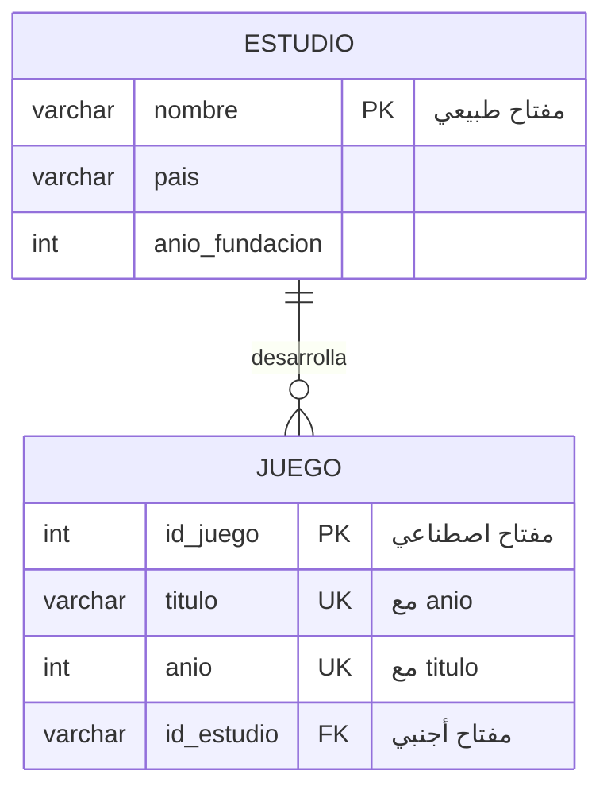
```mermaid
erDiagram
  ESTUDIO ||--o{ JUEGO : "desarrolla"
  ESTUDIO {
    varchar nombre PK "مفتاح طبيعي"
    varchar pais
    int anio_fundacion
  }
  JUEGO {
    int id_juego PK "مفتاح اصطناعي"
    varchar titulo UK "مع anio"
    int anio UK "مع titulo"
    varchar id_estudio FK "مفتاح أجنبي"
  }
```

### 2.3 الترميز

على الورق: المفتاح الأساسي **مسطَّر** وكل مفتاح أجنبي بـ**سهم** نحو الجدول الذي
يشير إليه. وفي النص، وهي الطريقة التي يجب أن تسلّم بها العمل:

```text
TABLA(columna_pk PK, columna, columna?, columna_fk FK → OTRA_TABLA)
      UK(columna_unica)
```

| العلامة | المعنى |
|---|---|
| `PK` | المفتاح الأساسي. إذا كان مركَّبًا: `PK(a, b)` في السطر التالي |
| `FK → TABLA` | مفتاح أجنبي يشير إلى المفتاح الأساسي للجدول TABLA |
| `?` في نهاية الاسم | العمود يقبل القيمة الفارغة. بدون `?`، يكون إلزاميًا (`NOT NULL`) |
| `UK(…)` | مفتاح بديل: يمنع نظام الإدارة تكراره |

### 2.4 قدم الغراب: كيف يرسم DrawDB

لا يستخدم DrawDB المعيّنات: إنه يرسم الجداول ويربطها بخطوط تحمل التعددية في
أطرافها، بترميز **قدم الغراب** (*pata de gallo*، *crow's foot*). مخططات الجداول في هذه الوثيقة
تستخدم الترميز نفسه.

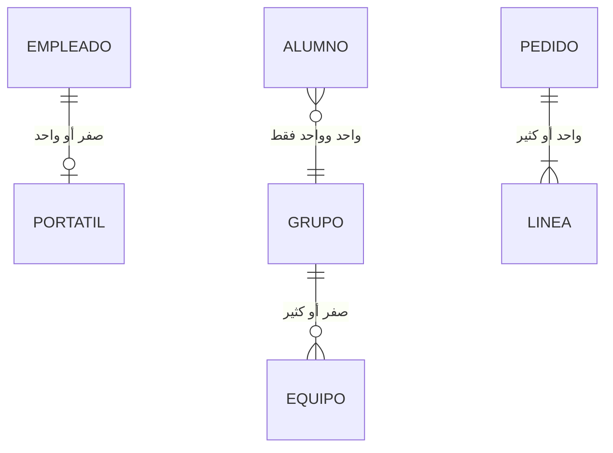
```mermaid
erDiagram
  EMPLEADO ||--o| PORTATIL : "صفر أو واحد"
  GRUPO ||--o{ EQUIPO : "صفر أو كثير"
  PEDIDO ||--|{ LINEA : "واحد أو كثير"
  ALUMNO }o--|| GRUPO : "واحد وواحد فقط"
```

| طرف الخط | يُقرأ |
|---|---|
| شرطتان: `──‖` | واحد وواحد فقط |
| دائرة وشرطة: `──o‖` | صفر أو واحد |
| شرطة وقدم غراب: `──‖<` | واحد أو كثير |
| دائرة وقدم غراب: `──o<` | صفر أو كثير |

الرمز الداخلي (دائرة أو شرطة) هو الحد الأدنى؛ والخارجي (شرطة أو قدم غراب) هو الحد الأقصى.

انتبه: في قدم الغراب تُرسم التعددية في الطرف **المقابل** لطرفها في ترميز
القسم. `GRUPO ──(0,N)── EQUIPO` في القسم تُرسم بقدم الغراب ملتصقة بـEQUIPO: «للمجموعة
صفر أو كثير من الأجهزة» تُقرأ من GRUPO نحو EQUIPO، والرمز يكون عند الطرف.

### 2.5 القواعد من 1 إلى 6

**القاعدة 1 · كل كيان جدول.** سماته أعمدة؛ ومفتاحه هو المفتاح الأساسي.
السمات المشتقة **لا** تُنقل: لا تُحفظ. أما التاريخية فنعم (القسم 1.6).

**القاعدة 2 · علاقة 1:N ← المفتاح الأجنبي يذهب إلى الكيان الذي بجانبه الحد الأقصى 1.** ذلك
الجدول يتلقى عمودًا فيه مفتاح الكيان الآخر. لا يُنشأ جدول جديد.

انتبه إلى ترميز القسم: يُكتب N بجانب الكيان الذي **لا** يتلقى المفتاح الأجنبي.
في `GRUPO (0,N) — tiene asignado — (0,1) EQUIPO`، يكون N بجانب GRUPO والمفتاح الأجنبي يذهب إلى
EQUIPO، الذي لديه `(0,1)`. السؤال الذي يحسم الأمر: نسخة واحدة من هذا الكيان، مع
كم نسخة من الكيان الآخر على الأكثر؟ إذا كانت الإجابة واحدة، فالمفتاح الأجنبي يذهب إلى هنا.

- إذا كان لذلك الكيان **حد أدنى 1**، يكون المفتاح الأجنبي إلزاميًا.
- إذا كان له **حد أدنى 0**، يقبل المفتاح الأجنبي القيمة الفارغة (`?`).
- إذا كانت للعلاقة سمات، فإنها تذهب إلى الجدول نفسه الذي فيه المفتاح الأجنبي.

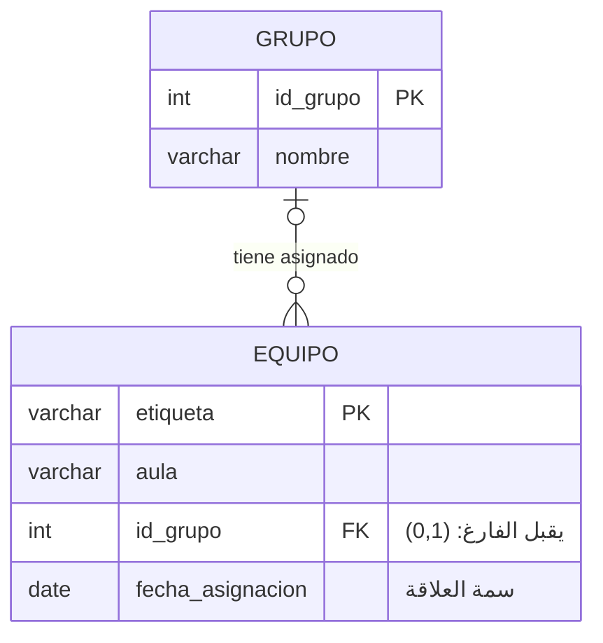
```mermaid
erDiagram
  GRUPO |o--o{ EQUIPO : "tiene asignado"
  GRUPO {
    int id_grupo PK
    varchar nombre
  }
  EQUIPO {
    varchar etiqueta PK
    varchar aula
    int id_grupo FK "يقبل الفارغ: (0,1)"
    date fecha_asignacion "سمة العلاقة"
  }
```

لماذا في EQUIPO وليس العكس؟ لأن للمجموعة أجهزة كثيرة: لو كان المفتاح في
GRUPO، لوجب وضع عدة أجهزة في خلية واحدة، وهذا بالضبط خطأ جدول بيانات القسم.
أما كل جهاز، فيشير إلى مجموعة واحدة فقط.

**القاعدة 3 · علاقة N:M ← جدول جديد.** مفتاحه الأساسي مركَّب، مكوَّن من المفاتيح
الأجنبية إلى الكيانين. سمات العلاقة أعمدة في ذلك الجدول. ويُعطى
اسمًا يدل على ما يحفظه (INSCRIPCION، MATRICULA، LINEA_PEDIDO).

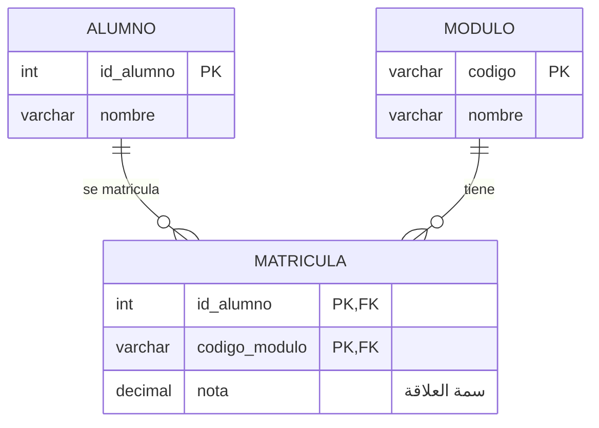
```mermaid
erDiagram
  ALUMNO ||--o{ MATRICULA : "se matricula"
  MODULO ||--o{ MATRICULA : "tiene"
  ALUMNO {
    int id_alumno PK
    varchar nombre
  }
  MATRICULA {
    int id_alumno PK, FK
    varchar codigo_modulo PK, FK
    decimal nota "سمة العلاقة"
  }
  MODULO {
    varchar codigo PK
    varchar nombre
  }
```

علاقة N:M ذات سمات كثيرة أو ذات حياة خاصة (تُنشأ، تتغير حالتها، تُغلق) تكون عادة في
الحقيقة كيانًا: PEDIDO، RESERVA، PRÉSTAMO.

**علاقة N:M تحفظ التاريخ.** مع المفتاح المركَّب، لا يمكن أن يظهر الزوج نفسه مرتين. في
التسجيل (*matrícula*) هذا بالضبط ما نريده؛ أما في الإعارة (*préstamo*) فلا: يمكن للمشترك نفسه أن يستعير النسخة
نفسها في مارس ومرة أخرى في مايو، و`PK(id_socio, id_ejemplar)` يرفض الإعارة الثانية. هناك
حلان:

| الحل | الجدول | متى |
|---|---|---|
| التاريخ داخل المفتاح الأساسي | `PRESTAMO(id_socio FK, id_ejemplar FK, fecha_prestamo, fecha_devolucion?)` مع `PK(id_socio, id_ejemplar, fecha_prestamo)` | إذا كان التاريخ كافيًا للتمييز بين نسختين |
| مفتاح اصطناعي | `PRESTAMO(id_prestamo PK, id_socio FK, id_ejemplar FK, fecha_prestamo, fecha_devolucion?)` | إذا كانت جداول أخرى ستشير إلى الإعارة، أو إذا كان التاريخ قد يتكرر |

السؤال الذي يحسم الأمر: هل يمكن أن يتكرر الزوج نفسه في لحظات مختلفة؟ إذا كان الجواب نعم، فالزوج
وحده ليس مفتاحًا. يحدث هذا مع الإعارات، والحجوزات، والمراجعات، وأي سجل تاريخي. في IOC، الوحدة 2،
القسم 3.1.5، *L'entitat DATA*.

**القاعدة 4 · علاقة 1:1 ← مفتاح أجنبي في أحد الطرفين، مع UK.** يوضع في الطرف الذي
يشارك إلزاميًا، لتجنب القيم الفارغة؛ وإذا كان الطرفان اختياريين، ففي الطرف الذي يترك أقل
عدد من القيم الفارغة. يمنع UK أن يشير صفان إلى الصف نفسه. إذا كان لدى الطرفين `(1,1)`، فقبل إنشاء جدولين
تحقَّق مما إذا لم يكونا الكيان نفسه (القسم 4.3).

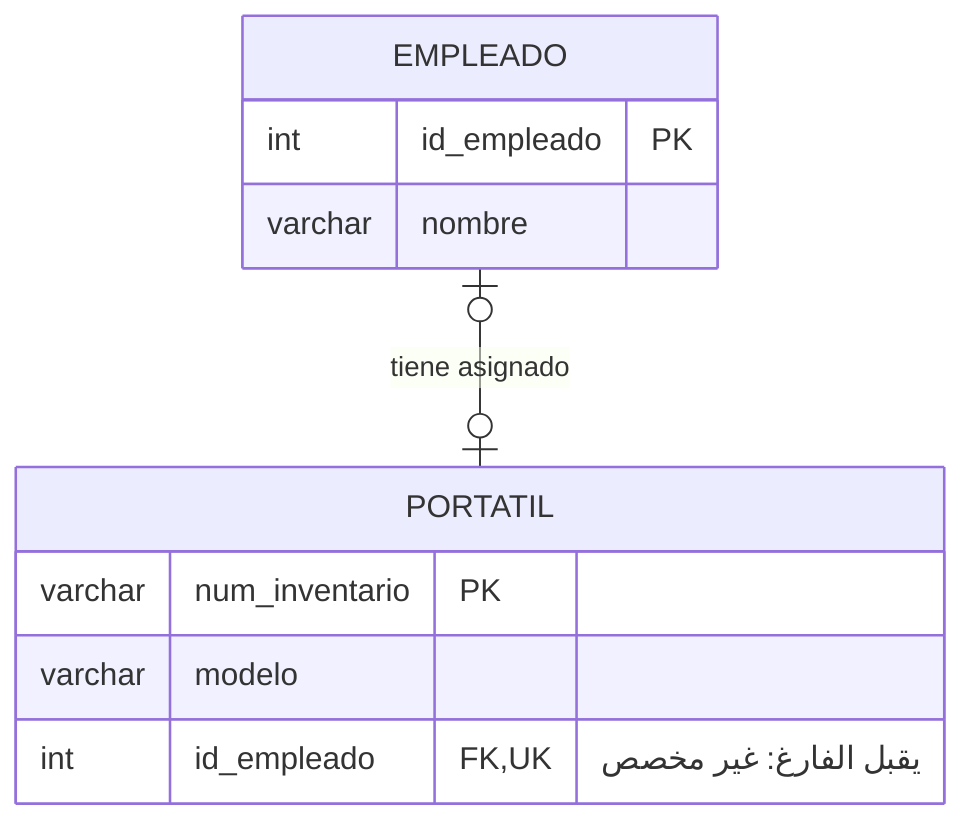
```mermaid
erDiagram
  EMPLEADO |o--o| PORTATIL : "tiene asignado"
  EMPLEADO {
    int id_empleado PK
    varchar nombre
  }
  PORTATIL {
    varchar num_inventario PK
    varchar modelo
    int id_empleado FK, UK "يقبل الفارغ: غير مخصص"
  }
```

**القاعدة 5 · الكيان الضعيف ← مفتاحه الأساسي هو مفتاح الكيان القوي مضافًا إليه المميِّز.** مفتاح
الكيان القوي هو في الوقت نفسه جزء من المفتاح الأساسي ومفتاح أجنبي. (الكيان الضعيف: القسم 4.2.)

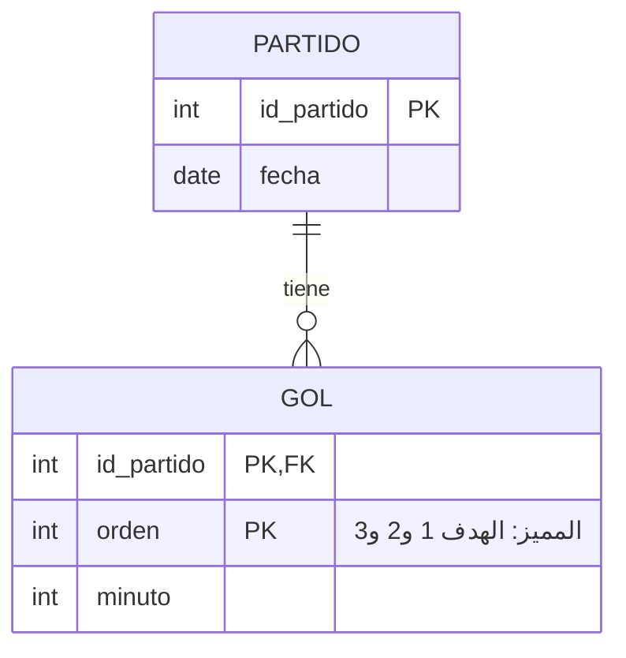
```mermaid
erDiagram
  PARTIDO ||--o{ GOL : "tiene"
  PARTIDO {
    int id_partido PK
    date fecha
  }
  GOL {
    int id_partido PK, FK
    int orden PK "المميز: الهدف 1 و2 و3"
    int minuto
  }
```

**القاعدة 6 · علاقتان بين الجدولين نفسيهما ← مفتاحان أجنبيان باسمين مختلفين.**
كل منهما يدل على الدور الذي يمثله.

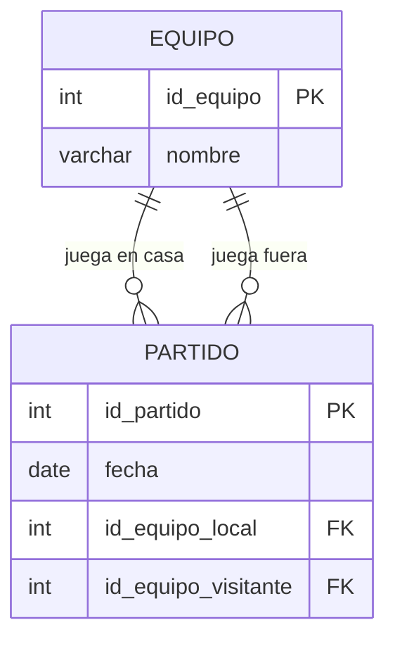
```mermaid
erDiagram
  EQUIPO ||--o{ PARTIDO : "juega en casa"
  EQUIPO ||--o{ PARTIDO : "juega fuera"
  EQUIPO {
    int id_equipo PK
    varchar nombre
  }
  PARTIDO {
    int id_partido PK
    date fecha
    int id_equipo_local FK
    int id_equipo_visitante FK
  }
```

### 2.6 ما لا تستطيع الجداول التعبير عنه

الجداول بمفاتيحها تضمن الأنواع، والتفرد، ووجود المراجع. لكن هناك أشياء من
المخطط، ومن نص التمرين، تضيع في الطريق، ويجب تسجيلها بوصفها قيودًا:

| ما يضيع | مثال | لماذا |
|---|---|---|
| الحد الأدنى 1 للكيان الذي ليس فيه مفتاح أجنبي في علاقة 1:N | «لكل مجموعة طالب واحد على الأقل» | المفتاح الأجنبي موجود في ALUMNO: لا شيء يُلزم بوجود صف ما يشير إلى هذه المجموعة |
| قواعد بين الصفوف أو بين الجداول | «اللاعب الذي يسجل الهدف ينتمي إلى أحد فريقي المباراة» | المفتاح الأجنبي يتحقق من أن اللاعب موجود، لا من الفريق الذي ينتمي إليه |
| علاقات يستبعد بعضها بعضًا | «القطعة مركَّبة أو محفوظة، لا الاثنان معًا» | هما مفتاحان أجنبيان مستقلان؛ وشرط ألا يكونا مملوءين معًا يُوضع على حدة، بـ`CHECK` |
| قواعد على القيم | «الكمية أكبر من 0» | يمكن وضعها بـ`CHECK` في نظام الإدارة، لكنها لا تظهر في المخطط |

### 2.7 مثال محلول · المجموعات والأجهزة والوحدات الدراسية

> في المعهد مجموعات (1ASIR، 1SMR…). لكل مجموعة تُخصَّص عدة أجهزة من القسم؛
> يمكن أن يكون الجهاز مخصَّصًا لمجموعة واحدة أو لا لأي مجموعة، ونريد معرفة التاريخ الذي خُصِّص منه.
> عن كل جهاز يُحفظ ملصقه، وهو فريد (`EQ-04`)، والقاعة. الطلاب، الذين يُحفظ
> اسمهم وبريدهم الإلكتروني، ينتمون إلى مجموعة واحدة فقط، ويسجلون في عدة وحدات دراسية؛ وعن كل
> تسجيل تهمنا العلامة.

**مخطط E/R:**

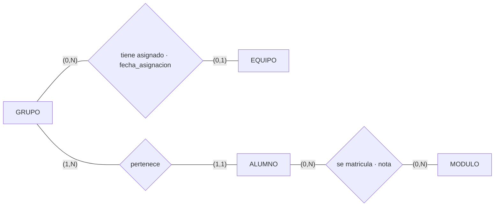
```mermaid
flowchart LR
  G[GRUPO] ---|"(0,N)"| r1{tiene asignado · fecha_asignacion} ---|"(0,1)"| E[EQUIPO]
  G ---|"(1,N)"| r2{pertenece} ---|"(1,1)"| A[ALUMNO]
  A ---|"(0,N)"| r3{se matricula · nota} ---|"(0,N)"| M[MODULO]
```

**الجداول، بتطبيق القواعد:**

```text
GRUPO(id_grupo PK, nombre)                                      UK(nombre)
EQUIPO(etiqueta PK, aula, id_grupo? FK → GRUPO, fecha_asignacion?)
ALUMNO(id_alumno PK, nombre, email, id_grupo FK → GRUPO)        UK(email)
MODULO(codigo PK, nombre)
MATRICULA(id_alumno FK → ALUMNO, codigo_modulo FK → MODULO, nota?)
          PK(id_alumno, codigo_modulo)
```

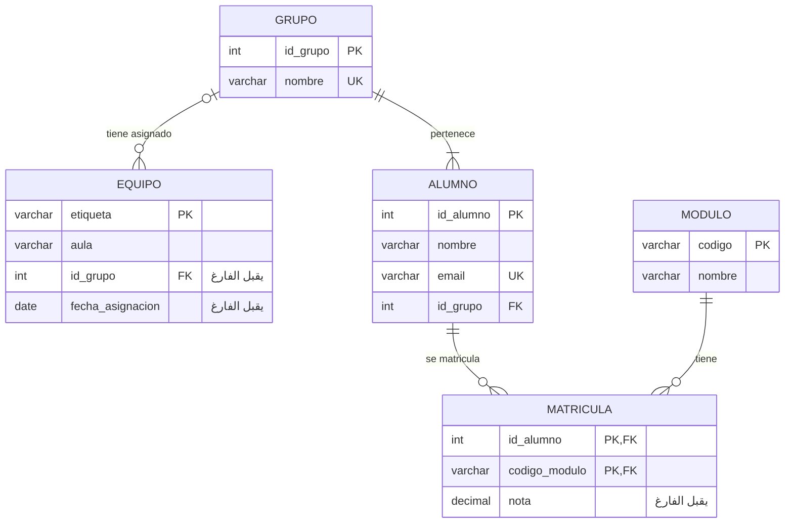
```mermaid
erDiagram
  GRUPO |o--o{ EQUIPO : "tiene asignado"
  GRUPO ||--|{ ALUMNO : "pertenece"
  ALUMNO ||--o{ MATRICULA : "se matricula"
  MODULO ||--o{ MATRICULA : "tiene"
  GRUPO {
    int id_grupo PK
    varchar nombre UK
  }
  EQUIPO {
    varchar etiqueta PK
    varchar aula
    int id_grupo FK "يقبل الفارغ"
    date fecha_asignacion "يقبل الفارغ"
  }
  ALUMNO {
    int id_alumno PK
    varchar nombre
    varchar email UK
    int id_grupo FK
  }
  MODULO {
    varchar codigo PK
    varchar nombre
  }
  MATRICULA {
    int id_alumno PK, FK
    varchar codigo_modulo PK, FK
    decimal nota "يقبل الفارغ"
  }
```

| القرار | القاعدة |
|---|---|
| `etiqueta` هو مفتاح EQUIPO، بدون مفتاح اصطناعي | القاعدة 1. إنه طبيعي، وفريد، وموجود دائمًا، ولا يتغير |
| `id_grupo` يذهب إلى EQUIPO، ويقبل القيمة الفارغة | القاعدة 2. لدى EQUIPO حد أقصى 1؛ وحده الأدنى 0: قد لا يكون مخصَّصًا |
| `fecha_asignacion` يذهب إلى EQUIPO | القاعدة 2. سمة لعلاقة 1:N: تذهب مع المفتاح الأجنبي |
| `id_grupo` في ALUMNO إلزامي | القاعدة 2. لدى ALUMNO `(1,1)`: كل طالب ينتمي إلى مجموعة |
| MATRICULA جدول | القاعدة 3. ALUMNO–MODULO علاقة N:M. العلامة تخص التسجيل، لا الطالب ولا الوحدة الدراسية |
| مفتاح MATRICULA مركَّب | القاعدة 3. لا يسجل الطالب مرتين في الوحدة الدراسية نفسها |
| «لكل مجموعة طالب واحد على الأقل» لا يظهر | `(1,N)` الخاص بـGRUPO يضيع. ويذهب إلى قائمة القيود |

لاحظ أن `id_grupo` يظهر في ثلاثة جداول وأنه **المعلومة نفسها**: المفتاح الأساسي لـ
GRUPO، منسوخًا حيثما يلزم الربط. هذا ليس تكرارًا زائدًا (*redundancia*): إنه الطريقة الوحيدة لربط
الجداول.

---

## 3 · النموذج العلائقي

*IOC، الوحدة 3، القسمان 1.1 و1.2 (الصفحات 163–179).*

مخطط E/R هو **النموذج المفاهيمي** (*modelo conceptual*): ما يوجد في العالم الذي نريد حفظه، دون التفكير
في أي نظام إدارة. **النموذج العلائقي** (*modelo relacional*) هو **النموذج المنطقي** (*modelo lógico*): كيف يُنظَّم ذلك في جداول.
اقترحه إدغار ف. كود (Edgar F. Codd) سنة 1970 وهو الذي تستخدمه MariaDB وPostgreSQL وSQLite وOracle وSQL Server.
**النموذج الفيزيائي** (*modelo físico*) هو الطريقة التي يحفظ بها نظام إدارة محدد ذلك على القرص، بأنواعه وملفاته.

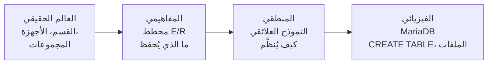
```mermaid
flowchart LR
  MR["العالم الحقيقي<br/>القسم، الأجهزة،<br/>المجموعات"] --> C["المفاهيمي<br/>مخطط E/R<br/>ما الذي يُحفظ"]
  C --> L["المنطقي<br/>النموذج العلائقي<br/>كيف يُنظَّم"]
  L --> F["الفيزيائي<br/>MariaDB<br/>CREATE TABLE، الملفات"]
```

| المستوى | يعتمد على… |
|---|---|
| المفاهيمي | لا شيء: إنه رسم لنشاط العمل |
| المنطقي | نوع نظام الإدارة (علائقي)، لا المنتج |
| الفيزيائي | المنتج المحدد: MariaDB لا تحفظ البيانات بالطريقة نفسها التي تحفظ بها PostgreSQL |

### 3.1 المفردات

جدول، بالأسماء الرسمية:

**EQUIPO** · الدرجة 3 (أعمدة) · التعددية 4 (صفوف)

| etiqueta 🔑 | aula | id_grupo |
|---|---|---|
| EQ-01 | 1.12 | 1 |
| EQ-02 | 1.12 | 1 |
| EQ-03 | 1.12 | 2 |
| EQ-04 | Taller | *فارغ* |

| المصطلح الرسمي | المصطلح اليومي | ما هو |
|---|---|---|
| **العلاقة** (*relación*) | الجدول | مجموعة صفوف لها الأعمدة نفسها. انتبه: «العلاقة» هنا **ليست** المعيّن في E/R |
| **الصف** (*tupla*) | الصف، السجل | نسخة محددة: `EQ-03, 1.12, 2` |
| **السمة** (*atributo*) | العمود، الحقل | معلومة لها اسم: `aula` |
| **المجال** (*dominio*) | النوع والقيم الصالحة | القيم التي يمكن أن تأخذها السمة: `entero entre 1 y 64` (عدد صحيح بين 1 و64)، `DDR3, DDR4 o DDR5` |
| **الدرجة** (*grado*) | عدد الأعمدة | درجة EQUIPO هي 3 |
| **التعددية** (*cardinalidad*) | عدد الصفوف | تتغير في كل مرة يُدرج فيها صف أو يُحذف. لا تخلطها بالتعددية `(mín,máx)` في E/R |
| **البنية** (*esquema*) | الرأس | اسم الجدول وأعمدته: `EQUIPO(etiqueta PK, aula, id_grupo)` |
| **المثيل** (*instancia*) (الامتداد *extensión*) | المحتوى | الصفوف الموجودة في هذه اللحظة |

### 3.2 خصائص الجدول العلائقي

جدول البيانات (*hoja de cálculo*) لا يحقق أيًّا من هذه الخصائص. أما الجدول، فيحققها جميعًا:

1. **لا يوجد صفان متطابقان.** لهذا السبب لكل جدول مفتاح أساسي.
2. **كل خلية فيها قيمة واحدة فقط** (قيمة ذرية *valor atómico*). لا مكان لـ`2x4GB` ولا لـ`WD 1TB, Kingston SSD`.
3. **جميع قيم العمود من المجال نفسه.** لا مكان لـ`4096MB` و`4 GB` و`4` في
   العمود نفسه.
4. **ترتيب الصفوف لا يهم**، ولا ترتيب الأعمدة كذلك. لا يوجد «الصف 3»: يوجد «الصف
   الذي مفتاحه `EQ-03`».

### 3.3 قواعد السلامة

هي القواعد التي يفرضها نظام الإدارة من تلقاء نفسه، دون برمجة أي شيء:

| القاعدة | ماذا تقول | ما الذي يرفضه نظام الإدارة |
|---|---|---|
| **سلامة الكيان** (*integridad de entidad*) | المفتاح الأساسي لا يكون فارغًا أبدًا ولا يتكرر أبدًا | تسجيل `EQ-04` ثانٍ، أو جهاز بلا ملصق |
| **السلامة المرجعية** (*integridad referencial*) | المفتاح الأجنبي إما فارغ وإما مساوٍ لمفتاح أساسي ما في الجدول الذي يشير إليه | حفظ `EQ-4` في قطعة إذا لم يكن الجهاز `EQ-4` موجودًا |
| **سلامة المجال** (*integridad de dominio*) | كل قيمة تنتمي إلى مجال عمودها | حفظ `ocho` في عمود من نوع عدد صحيح، أو `-2` إذا كان هناك `CHECK (capacidad_gb > 0)` |

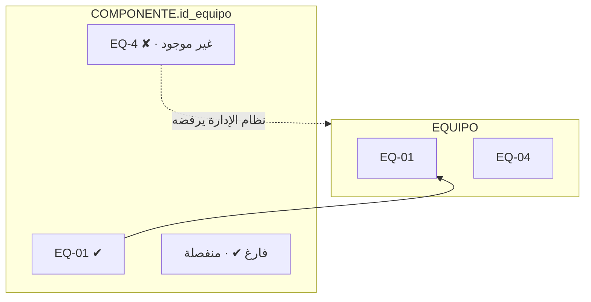
```mermaid
flowchart TB
  subgraph EQ["EQUIPO"]
    direction LR
    e1["EQ-01"]
    e4["EQ-04"]
  end
  subgraph CO["COMPONENTE.id_equipo"]
    direction LR
    c1["EQ-01 ✔"]
    c2["فارغ ✔ · منفصلة"]
    c3["EQ-4 ✘ · غير موجود"]
  end
  c1 --> e1
  c3 -. "نظام الإدارة يرفضه" .-> EQ
  EQ ~~~ CO
```

وماذا لو حُذف جهاز فيه قطع مركَّبة؟ يُقرَّر ذلك عند إنشاء المفتاح الأجنبي:

| الخيار | ما الذي يحدث للقطع | متى يكون منطقيًا |
|---|---|---|
| `RESTRICT` (المعتاد) | نظام الإدارة **لا يسمح** بحذف الجهاز ما دامت فيه قطع | في أغلب الأحيان: يُلزم بفكّ القطع أولًا |
| `SET NULL` | تبقى القطع وقيمة `id_equipo` فيها فارغة: تصبح منفصلة | إذا كان المفتاح الأجنبي يقبل القيمة الفارغة وكانت حالة «منفصلة» حالة صالحة |
| `CASCADE` | تُحذف القطع أيضًا | فقط في الكيانات الضعيفة: إذا حُذفت مباراة، تُحذف أهدافها |

---

## 4 · ما تبقى من مخطط E/R

*IOC، الوحدة 2: الأقسام 1.1.3–1.1.6 (السمات، الصفحات 93–96)، و1.2.2–1.2.4 (الدرجة والعلاقات
الانعكاسية، الصفحات 99–106)، و1.3 (الكيانات الضعيفة، الصفحات 106–108)، و2.2.1 (التخصيص، الصفحات
126–133) و3.1.3 (ثنائية أم ثلاثية، الصفحة 145).*

### 4.1 أنواع السمات

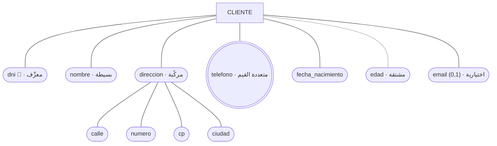
```mermaid
flowchart TB
  C[CLIENTE] --- dni(["dni 🔑 · معرِّف"])
  C --- nom(["nombre · بسيطة"])
  C --- dir(["direccion · مركَّبة"])
  dir --- ca([calle])
  dir --- nu([numero])
  dir --- cp([cp])
  dir --- ci([ciudad])
  C --- tel((("telefono · متعددة القيم")))
  C --- fn([fecha_nacimiento])
  C -.- ed(["edad · مشتقة"])
  C --- em(["email (0,1) · اختيارية"])
```

| النوع | ما هو | كيف تُرسم في القسم | مثال |
|---|---|---|---|
| **بسيطة** (*simple*) | لا تُجزَّأ | شكل إهليلجي | `nombre` |
| **مركَّبة** (*compuesto*) | تتكون من سمات أخرى تهمنا كلٌّ على حدة | شكل إهليلجي تتدلى منه أشكال إهليلجية أخرى | `direccion` = الشارع + الرقم + الرمز البريدي + المدينة |
| **أحادية القيمة** (*monovaluado*) | قيمة واحدة فقط لكل نسخة | شكل إهليلجي | `fecha_nacimiento` |
| **متعددة القيم** (*multivaluado*) | يمكن أن تكون لها عدة قيم للنسخة نفسها | شكل إهليلجي مزدوج | هواتف أحد الزبائن |
| **إلزامية / اختيارية** (*obligatorio / opcional*) | هل يمكن أن تبقى بلا قيمة | الاختيارية: يُكتب `(0,1)` بجانب الشكل الإهليلجي | `email` إذا لم يرغب الزبون في إعطائه |
| **مشتقة** (*derivado*) | تُحسب انطلاقًا من سمات أخرى. لا تُحفظ | شكل إهليلجي بخط متقطع | `edad`، انطلاقًا من `fecha_nacimiento` |
| **معرِّفة** (*identificador*) | المفتاح | مسطَّرة | `dni` |

مركَّبة أم بسيطة؟ يتوقف ذلك على الأسئلة. إذا احتاج سؤال ما إلى «زبائن Huesca»،
فيجب أن تكون المدينة منفصلة. وإذا كان العنوان يُطبع فقط على ملصق، فيكفي نص واحد.

### 4.2 الكيان القوي والكيان الضعيف

**الكيان الضعيف** (*entidad débil*) يعتمد على كيان آخر (**القوي** *fuerte*). هناك طريقتان للاعتماد، ومن المهم عدم
الخلط بينهما:

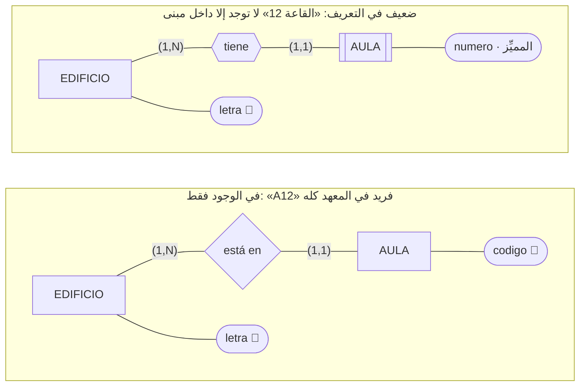
```mermaid
flowchart TB
  subgraph id["ضعيف في التعريف: «القاعة 12» لا توجد إلا داخل مبنى"]
    direction LR
    E1[EDIFICIO] ---|"(1,N)"| r1{{tiene}} ---|"(1,1)"| A1[[AULA]]
    E1 --- e1([letra 🔑])
    A1 --- a1(["numero · المميِّز"])
  end
  subgraph ex["في الوجود فقط: «A12» فريد في المعهد كله"]
    direction LR
    E2[EDIFICIO] ---|"(1,N)"| r2{está en} ---|"(1,1)"| A2[AULA]
    E2 --- e2([letra 🔑])
    A2 --- a2([codigo 🔑])
  end
  id ~~~ ex
```

| الاعتماد | معناه | مثال | كيف يُرسم | المفتاح في الجداول |
|---|---|---|---|---|
| **في الوجود** (*en existencia*) | لا يمكن أن يوجد دون الآخر، لكنه يُعرَّف وحده | سطر طلبية له `id_linea` خاص به؛ الموظف يكون دائمًا في قسم إداري | مستطيل عادي. و`(1,1)` في التعددية يدل على ذلك | مفتاحه الأساسي PK الخاص به. والمفتاح الأجنبي إلزامي |
| **في التعريف** (*en identificación*) | لا يمكن تعريفه دون الآخر: مفتاحه لا معنى له إلا داخل الكيان القوي | «القاعة 12» لا معنى لها إلا بذكر المبنى؛ و«الحلقة 3» لا معنى لها إلا داخل موسم | **مستطيل مزدوج** و**معيّن مزدوج** (علاقة معرِّفة *relación identificadora*؛ في مخططات هذه الوثيقة، شكل سداسي). و**المميِّز** (*discriminante*) مسطَّر بخط متقطع | PK = مفتاح الكيان القوي + المميِّز (القاعدة 5) |

كل اعتماد في التعريف هو أيضًا اعتماد في الوجود. والعكس غير صحيح.

### 4.3 العلاقات: الدرجة والنوع

**الدرجة** (*grado*) هي عدد الكيانات التي تربطها العلاقة. و**النوع** (1:1، 1:N، N:M) يُستخرج من الحدود القصوى،
كما في القسم 1.3.

| الدرجة | الاسم | مثال |
|---|---|---|
| 1 | **انعكاسية** (*reflexiva*) (أحادية *unaria*، تكرارية *recursiva*) | موظف EMPLEADO *es jefe de* (هو رئيس) موظفين EMPLEADOS آخرين |
| 2 | ثنائية (*binaria*) | جميع علاقات القسم 1 |
| 3 | **ثلاثية** (*ternaria*) | أستاذ PROFESOR *imparte* (يدرِّس) وحدة دراسية MÓDULO لمجموعة GRUPO |

**الانعكاسية.** يرتبط الكيان بنفسه. وبما أن الطرفين يصلان إلى المستطيل
نفسه، يُكتب على كل خط **الدور** (*papel*، *rol*) الذي تؤديه تلك النسخة: *jefe* (رئيس) و
*subordinado* (مرؤوس)، *seguidor* (متابِع) و*seguido* (متابَع)، *requisito* (متطلَّب سابق) و*requerido* (مطلوب له). السؤالان المعتادان
يُطرحان، سؤال لكل دور:

> موظف واحد، **بصفته رئيسًا**، كم موظفًا يدير؟ ← `(0,N)`
>
> موظف واحد، **بصفته مرؤوسًا**، كم رئيسًا لديه؟ ← `(0,1)`: المديرة ليس لديها رئيس

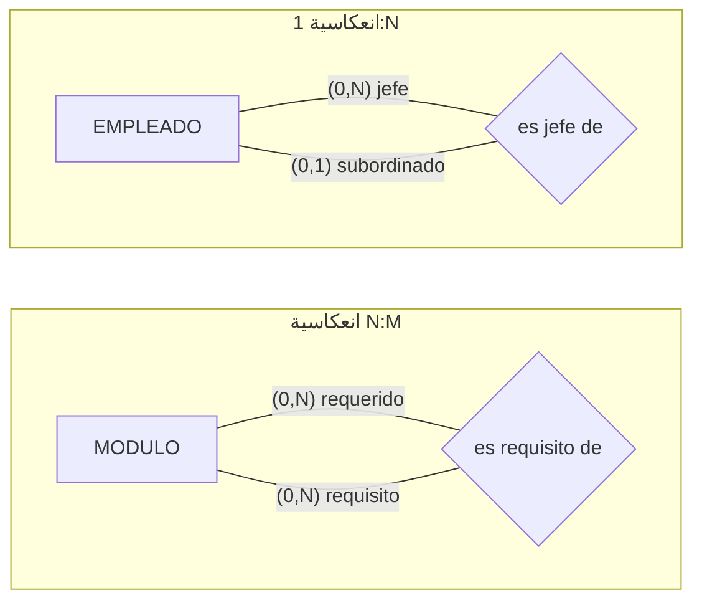
```mermaid
flowchart TB
  subgraph n1["انعكاسية 1:N"]
    direction LR
    E[EMPLEADO] ---|"(0,N) jefe"| R1{es jefe de}
    R1 ---|"(0,1) subordinado"| E
  end
  subgraph nm["انعكاسية N:M"]
    direction LR
    M[MODULO] ---|"(0,N) requerido"| R2{es requisito de}
    R2 ---|"(0,N) requisito"| M
  end
  n1 ~~~ nm
```

يمكن أن تكون 1:1 (*es la continuación de*، هو تتمة لـ، بين أجزاء سلسلة كتب)، أو 1:N (*es jefe de*) أو N:M
(*sigue a*، يتابع، *es requisito de*، هو متطلَّب سابق لـ).

**الثلاثية.** حقيقة لا معنى لها إلا مع الكيانات الثلاثة معًا. لاستخراج
تعددية كيان ما **نثبِّت الكيانين الآخرين** ونسأل عنه:

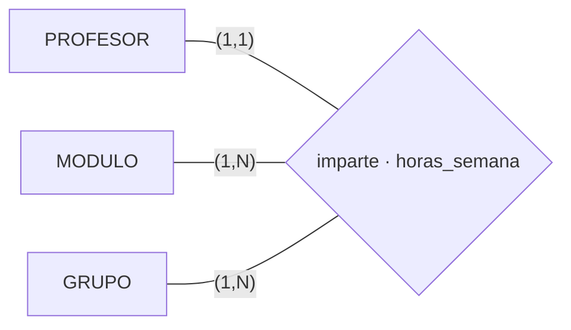
```mermaid
flowchart LR
  P[PROFESOR] ---|"(1,1)"| I{imparte · horas_semana}
  M[MODULO] ---|"(1,N)"| I
  G[GRUPO] ---|"(1,N)"| I
```

| الثابت | أسأل | الإجابة | يُكتب بجانب |
|---|---|---|---|
| وحدة دراسية ومجموعة | كم أستاذًا؟ | واحد | PROFESOR `(1,1)` |
| أستاذ ومجموعة | كم وحدة دراسية؟ | عدة | MODULO `(1,N)` |
| أستاذ ووحدة دراسية | كم مجموعة؟ | عدة | GRUPO `(1,N)` |

لماذا لا نستخدم ثلاث علاقات ثنائية؟ لأن المعلومات تضيع. إذا كانت آنا (Ana) تدرِّس BD وRedes، وآنا موجودة
في 1A وفي 1B، وBD تُدرَّس في 1A وفي 1B، فمع ثلاث علاقات ثنائية لا نعرف هل تدرِّس آنا Redes في 1A. أما
العلاقة الثلاثية فتحفظ الثلاثي كاملًا.

**1:1.** حد أقصى 1 في الطرفين. قبل إبقائها هكذا، اسأل نفسك هل هما الكيان نفسه: إذا
كان لدى الاثنين `(1,1)` ولا يوجدان أبدًا منفصلين، فهما عادة كذلك. إذا كان لأحدهما حد أدنى 0،
يُبقيان منفصلين: الحاسوب المحمول قد يكون غير مخصَّص، والموظف قد لا يكون لديه حاسوب محمول.

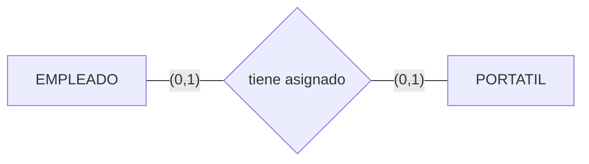
```mermaid
flowchart LR
  E[EMPLEADO] ---|"(0,1)"| R{tiene asignado} ---|"(0,1)"| P[PORTATIL]
```

### 4.4 التسلسلات الهرمية: التعميم والتخصيص

عندما توجد عدة أصناف من الشيء نفسه، لكل منها سمات خاصة به، يُرسم
**نوع أعلى** (*supertipo*) فيه المشترك و**أنواع فرعية** (*subtipos*) فيها الخاص، تربط بينها مثلث *es un* (هو) (في
مخططات هذه الوثيقة، شبه منحرف). الأنواع الفرعية ترث سمات النوع الأعلى ومفتاحه.

```mermaid
flowchart TB
  C[COMPONENTE] --- h[/"es un · كلي، حصري"\]
  h --- R[RAM]
  h --- D[DISCO]
  h --- U[CPU]
  C --- a1([id_componente 🔑])
  C --- a2([fabricante])
  C --- a3([estado])
  R --- r1([capacidad_gb])
  R --- r2([tipo_memoria])
  D --- d1([capacidad_gb])
  D --- d2([tecnologia])
  U --- u1([nucleos])
  U --- u2([frecuencia_ghz])
```

تُصنَّف بسؤالين:

| السؤال | نعم | لا |
|---|---|---|
| هل كل نسخة من النوع الأعلى تنتمي إلى نوع فرعي ما؟ | **كلي** (*total*): لا توجد قطع «بلا أي نوع» | **جزئي** (*parcial*): هناك موظفون ليسوا تقنيين ولا تجاريين |
| هل يمكن أن تنتمي نسخة واحدة إلى نوعين فرعيين في الوقت نفسه؟ | **متداخل** (*solapada*): يمكن لشخص أن يكون طالبًا ومشرفًا في آن واحد | **حصري** (*exclusiva*): القطعة إما RAM وإما قرص، لا الاثنان معًا |

```mermaid
flowchart TB
  E[EMPLEADO] --- h[/"es un · جزئي، حصري"\]
  h --- T[TECNICO]
  h --- C[COMERCIAL]
  E --- n["الإدارة والمديرية:<br/>ليسوا تقنيين ولا تجاريين"]
```

لا يستحق الأمر تسلسلًا هرميًا إلا إذا كانت للأنواع الفرعية **سمات أو علاقات خاصة بها**. وإذا كان الذي يتغير هو
اسم النوع فقط، فتكفي سمة `tipo`.

### 4.5 ملخص الرموز

| على الورق | في مخططات هذه الوثيقة | المعنى |
|---|---|---|
| مستطيل | مستطيل | كيان قوي |
| مستطيل مزدوج | مستطيل بإطار مزدوج | كيان ضعيف (في التعريف) |
| معيّن | معيّن | علاقة |
| معيّن مزدوج | شكل سداسي | علاقة معرِّفة، بين الكيان الضعيف وكيانه القوي |
| معيّن يصل خطاه إلى الكيان نفسه، مع الأدوار | مثله | علاقة انعكاسية |
| معيّن بثلاثة خطوط | مثله | علاقة ثلاثية |
| شكل إهليلجي / إهليلجي مزدوج / متقطع | شكل بيضاوي / دائرة مزدوجة / خط متقطع | سمة / متعددة القيم / مشتقة |
| شكل إهليلجي تتدلى منه أشكال إهليلجية | مثله | سمة مركَّبة |
| تسطير / تسطير متقطع | 🔑 / «المميِّز» | مفتاح / مميِّز الكيان الضعيف |
| مثلث *es un* | شبه منحرف *es un* | تسلسل هرمي، مع `(total/parcial, exclusiva/solapada)` |

---

## 5 · قواعد التحويل إلى جداول من 7 إلى 11

*IOC، الوحدة 3، الأقسام 1.3.2–1.3.4 (الصفحات 182–192).*

القواعد من 1 إلى 6 موجودة في القسم 2.5: كيان ← جدول، 1:N ← مفتاح أجنبي في الكيان ذي
الحد الأقصى 1، N:M ← جدول جديد، 1:1 ← مفتاح أجنبي مع UK، ضعيف ← مفتاح القوي مضافًا إليه المميِّز، علاقتان
← مفتاحان أجنبيان باسم الدور.

**القاعدة 7 · انعكاسية 1:N ← مفتاح أجنبي إلى الجدول نفسه.** يُسمّى باسم الدور، وليس أبدًا باسم
الجدول: `id_jefe`، لا `id_empleado2`. يقبل القيمة الفارغة إذا كان الحد الأدنى 0 (المديرة).
العلاقة الانعكاسية 1:1 هي الشيء نفسه مع `UK` على المفتاح الأجنبي.

```text
EMPLEADO(id_empleado PK, nombre, id_jefe? FK → EMPLEADO)
```

```mermaid
erDiagram
  EMPLEADO |o--o{ EMPLEADO : "es jefe de"
  EMPLEADO {
    int id_empleado PK
    varchar nombre
    int id_jefe FK "يقبل الفارغ"
  }
```

**القاعدة 8 · انعكاسية N:M ← جدول جديد بمفتاحين أجنبيين إلى الجدول نفسه.** كل منهما باسم
دوره؛ والمفتاح الأساسي هو الزوج.

```text
REQUISITO(codigo_modulo FK → MODULO, codigo_requisito FK → MODULO)
          PK(codigo_modulo, codigo_requisito)
```

```mermaid
erDiagram
  MODULO ||--o{ REQUISITO : "exige"
  MODULO ||--o{ REQUISITO : "es requisito en"
  MODULO {
    varchar codigo PK
    varchar nombre
  }
  REQUISITO {
    varchar codigo_modulo PK, FK
    varchar codigo_requisito PK, FK
  }
```

**القاعدة 9 · ثلاثية ← جدول جديد بثلاثة مفاتيح أجنبية.** يتكون المفتاح الأساسي من المفاتيح
الأجنبية للكيانات ذات **الحد الأقصى N**. أما مفتاح الكيان ذي الحد الأقصى 1 فيذهب إلى الجدول لكن خارج
المفتاح الأساسي، لأن المفتاحين الآخرين يحددانه أصلًا. إذا كان للثلاثة حد أقصى N، فالمفتاح
الأساسي هو الثلاثة معًا.

```text
IMPARTE(id_profesor FK → PROFESOR, codigo_modulo FK → MODULO, id_grupo FK → GRUPO, horas_semana)
        PK(codigo_modulo, id_grupo)          ← PROFESOR tiene máximo 1
```

```mermaid
erDiagram
  PROFESOR ||--o{ IMPARTE : "imparte"
  MODULO ||--o{ IMPARTE : "se imparte"
  GRUPO ||--o{ IMPARTE : "recibe"
  IMPARTE {
    int id_profesor FK "خارج PK: الحد الأقصى 1"
    varchar codigo_modulo PK, FK
    int id_grupo PK, FK
    int horas_semana
  }
```

**القاعدة 10 · السمات الخاصة.**

| السمة | في الجداول |
|---|---|
| المركَّبة | تُحفظ مكوناتها أعمدةً: `calle`، `numero`، `cp`، `ciudad`. وتختفي السمة «العنوان» (*dirección*) |
| متعددة القيم | **جدول جديد**: مفتاح الكيان + القيمة، وكلاهما في المفتاح الأساسي |
| المشتقة | لا تُحفظ (القاعدة 1) |
| الاختيارية | العمود يقبل القيمة الفارغة: `email?` |

```mermaid
erDiagram
  CLIENTE ||--|{ TELEFONO_CLIENTE : "tiene"
  CLIENTE {
    char dni PK
    varchar nombre
    varchar calle "مركبة: العنوان"
    varchar numero
    char cp
    varchar ciudad
    date fecha_nacimiento "العمر لا يُحفظ"
    varchar email "اختيارية: تقبل الفارغ"
  }
  TELEFONO_CLIENTE {
    char dni PK, FK
    varchar telefono PK "متعددة القيم"
  }
```

لماذا لا يمكن أن تكون السمة متعددة القيم `telefono1`، `telefono2`، `telefono3`؟ لأن شخصًا ما سيكون لديه
أربعة، ومعظم الناس ستكون لديهم أعمدة فارغة، والسؤال «لمن هذا الهاتف؟» يُلزم
بالنظر في ثلاثة أعمدة.

**القاعدة 11 · التسلسل الهرمي ← ثلاثة خيارات.**

| الخيار | الجداول | الميزة | العيب |
|---|---|---|---|
| **A · جدول واحد للكل** | `COMPONENTE(id PK, fabricante, estado, tipo, capacidad_gb?, tipo_memoria?, tecnologia?, nucleos?, frecuencia_ghz?)` | جدول واحد فقط؛ استعلامات بسيطة | قيم فارغة كثيرة. نظام الإدارة لا يمنع أن تكون لذاكرة RAM أنوية |
| **B · النوع الأعلى + جدول لكل نوع فرعي** | جدول المخطط أدناه | بلا قيم فارغة؛ لكل نوع فرعي أعمدته الإلزامية؛ العلاقات المشتركة تشير إلى COMPONENTE | يجب ضم جدولين لرؤية ذاكرة RAM كاملة |
| **C · الأنواع الفرعية فقط** | `RAM(id PK, fabricante, estado, capacidad_gb, tipo_memoria)`، والشيء نفسه لـDISCO وCPU | بلا قيم فارغة، جدول واحد لكل استعلام عن نوع واحد | المشترك يتكرر. «جميع القطع المعطَّلة» تصبح ثلاثة استعلامات. لا يصلح إلا إذا كان التسلسل كليًا وحصريًا |

افتراضيًا، **B**. المفتاح الأساسي لكل نوع فرعي هو في الوقت نفسه مفتاح أجنبي إلى النوع الأعلى: إنها علاقة
1:1. إذا كان التسلسل الهرمي حصريًا، فإن `tipo` في النوع الأعلى يدل على النوع الفرعي الذي يجب البحث فيه.

```mermaid
erDiagram
  COMPONENTE ||--o| RAM : "es"
  COMPONENTE ||--o| DISCO : "es"
  COMPONENTE ||--o| CPU : "es"
  COMPONENTE {
    int id_componente PK
    varchar fabricante
    varchar estado
    varchar tipo "RAM أو DISCO أو CPU"
  }
  RAM {
    int id_componente PK, FK
    int capacidad_gb
    varchar tipo_memoria
  }
  DISCO {
    int id_componente PK, FK
    int capacidad_gb
    varchar tecnologia
  }
  CPU {
    int id_componente PK, FK
    int nucleos
    decimal frecuencia_ghz
  }
```

### 5.1 ما يبقى خارج الإمكان

التسلسلات الهرمية والعلاقات الانعكاسية تجلب قيودًا جديدة لا يضمنها المخطط ولا
الجداول:

| القيد | مثال |
|---|---|
| لا أحد يرتبط بنفسه | الموظف ليس رئيس نفسه؛ والوحدة الدراسية ليست متطلَّبًا سابقًا لنفسها |
| بلا دورات | A رئيس B، وB رئيس C، وC رئيس A |
| حصري | لا يمكن أن يكون `id_componente` نفسه في RAM وفي DISCO في الوقت نفسه (الخيار B) |
| كلي | لكل COMPONENTE صفه في نوع فرعي ما |
| الاتساق في العلاقة الثلاثية | الأستاذ الذي يدرِّس وحدة دراسية ينتمي إلى القسم الذي تتبعه |

---

آخر تحديث: 2 أكتوبر 2026.

</div>
