> English translation of `teoria-2-er-y-relacional.md`. The Spanish version is the reference; entity, table and column names are kept in Spanish to match the exercises.

# GBD · Theory 2 · Entity/relationship model and relational model

Theory for RA2: how a database is designed. First the **entity/relationship diagram**, which
says what has to be stored; then its mapping to **tables** (*paso a tablas*), the relational model,
which says how it is organised. This is what you will do with the inventory in the challenge.

It is meant to be read on your own and to be projected in class: every concept comes with its diagram.

| Section | What | Practised in |
|---|---|---|
| [1](#1--the-er-diagram) | The E/R diagram: entity, attribute, relationship, cardinality, key | `ejercicios-er-1.md` |
| [2](#2--from-the-diagram-to-the-tables) | From the diagram to the tables: keys, notation, rules 1 to 6, DrawDB | `ejercicios-er-1.md` |
| [3](#3--the-relational-model) | The relational model: vocabulary and integrity rules | `ejercicios-er-2.md` |
| [4](#4--what-remains-of-the-er-diagram) | What remains of E/R: attribute types, weak entity, reflexive, ternary, 1:1, hierarchies | `ejercicios-er-2.md` |
| [5](#5--rules-for-mapping-to-tables-7-to-11) | Rules for mapping to tables 7 to 11 | `ejercicios-er-2.md`, `ejercicios-er-3-equipos/` |

**Further reading:** the IOC material (in Catalan, 2011), held by the teacher: unit 2, *Model Entitat-Relació* (pp. 83–154), and unit 3, *Model relacional
i normalització* (pp. 155–215). At the start of each section it says which part it expands on. The theory
for RA1 (files, DBMSs, database models) is in
[`teoria-1-introduccion-bd.md`](../teoria-1-introduccion-bd.md).

**How to read the diagrams.** The E/R diagrams in this document follow the class notation:
rectangle for the entity, diamond for the relationship, oval for the attribute and `(min,max)` next to the
entity. The key, which is underlined on paper, is marked here with 🔑. The table diagrams use the DrawDB
notation, crow's foot, explained in section 2.

---

## 1 · The E/R diagram

*IOC, unit 2, section 1 (pp. 89–108).*

The entity/relationship model was proposed by Peter Chen in 1976. It describes the world we want to store with
three pieces: **entities** (the things), **attributes** (their data) and **relationships** (how they are linked).
It does not depend on any DBMS: it is a drawing to think with.

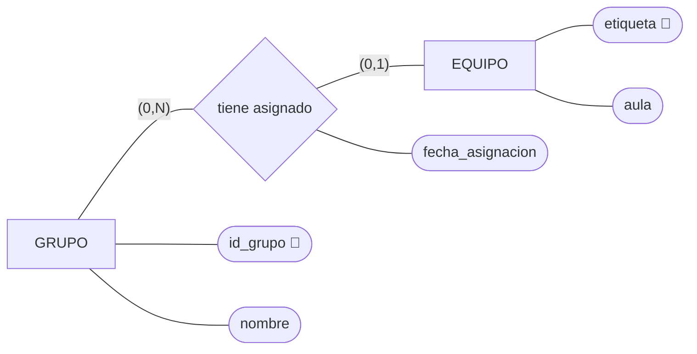
```mermaid
flowchart LR
  G[GRUPO] ---|"(0,N)"| R{tiene asignado}
  R ---|"(0,1)"| E[EQUIPO]
  G --- g1([id_grupo 🔑])
  G --- g2([nombre])
  E --- e1([etiqueta 🔑])
  E --- e2([aula])
  R --- r1([fecha_asignacion])
```

| Symbol | What it is | In the diagram above |
|---|---|---|
| Rectangle | **Entity**: a thing we want to store data about, and of which there are many | GRUPO, EQUIPO |
| Oval | **Attribute**: a piece of data of the entity | aula, nombre |
| Underlined attribute (🔑) | **Key**: the attribute (or attributes) that distinguishes one occurrence from all the others | etiqueta |
| Diamond | **Relationship**: a verb that links entities | GRUPO *tiene asignado* (“has assigned”) EQUIPO |
| `(min,max)` next to an entity | **Cardinality** (*cardinalidad*): in how many occurrences of the relationship **one** occurrence of that entity takes part | `(0,N)`, `(0,1)` |

### 1.1 Entity and attribute

We distinguish the **entity type** (EQUIPO, in general) from each **occurrence** (the computer `EQ-04`).
Each attribute has a **domain**: the values it can take (`aula` is text; `ram_gb`, an
integer from a short list).

**Attribute or entity?** It is an entity if it has data of its own besides the name, if it is related to
other things, or if the list of possible values needs to be controlled. Otherwise, it is an attribute. The same thing
can be an attribute in one design and an entity in another: it depends on the questions the
database has to answer. There is no universal answer; there are justified decisions.

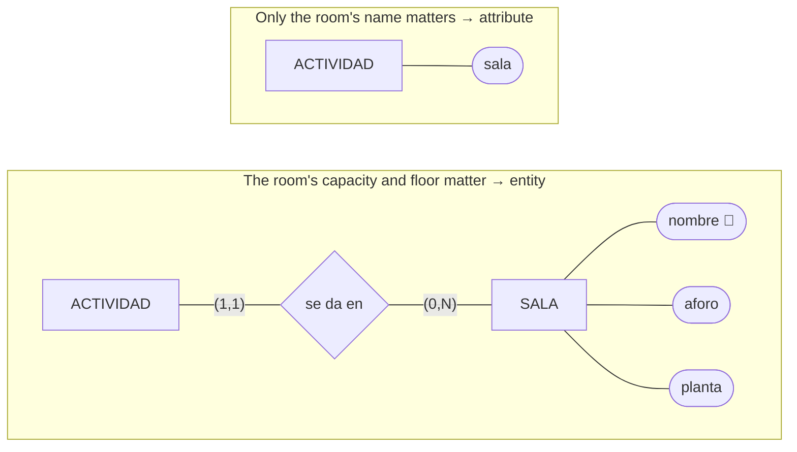
```mermaid
flowchart TB
  subgraph at["Only the room's name matters → attribute"]
    direction LR
    A1[ACTIVIDAD] --- a1([sala])
  end
  subgraph en["The room's capacity and floor matter → entity"]
    direction LR
    A2[ACTIVIDAD] ---|"(1,1)"| r{se da en} ---|"(0,N)"| S[SALA]
    S --- s1([nombre 🔑])
    S --- s2([aforo])
    S --- s3([planta])
  end
  at ~~~ en
```

### 1.2 Relationship

A relationship is a **verb** that links entities. It reads as a sentence in both directions: “a
group *has assigned* computers”, “a computer *is assigned to* a group”. If it cannot be read out
loud, it is wrong.

When the same entity plays two different roles, each role is a relationship of its own, with its own
name: a match has a **home** team and an **away** team.

A **relationship attribute** is a piece of data that belongs to neither of the two entities, but to the fact
that they are related: the date on which a computer was assigned to a group, the units of a product
in an order. If a relationship attribute looks as if it should belong to one of the entities, it almost always
means the cardinality is wrong.

### 1.3 Cardinality

For each relationship you ask **two questions**, one from each side, always thinking about **one**
arbitrary occurrence:

> One GRUPO, with how many EQUIPOS at least and at most? → `(0,N)`: it may have none, it may have many.
>
> One EQUIPO, with how many GRUPOS at least and at most? → `(0,1)`: it may be unassigned, and at most to one.

The cardinality is written **next to the entity it talks about**. Some books and websites put it at
the opposite end; if you search the internet, check which convention each one uses.

| Minimum | Means |
|---|---|
| 0 | **Optional** participation: it can exist without taking part in the relationship |
| 1 | **Mandatory** participation: it cannot exist without taking part |

The **relationship type** comes from the two maximums:

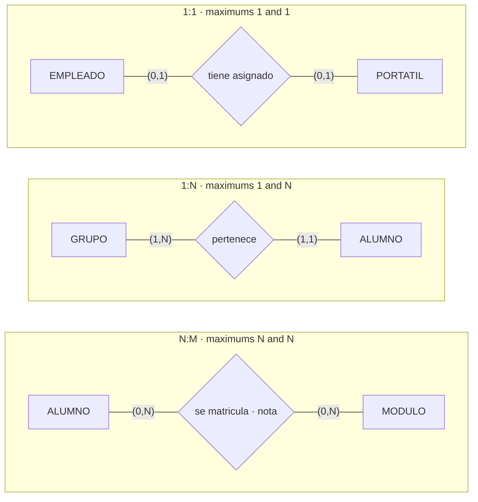
```mermaid
flowchart TB
  subgraph t1["1:1 · maximums 1 and 1"]
    direction LR
    E1[EMPLEADO] ---|"(0,1)"| x1{tiene asignado} ---|"(0,1)"| P1[PORTATIL]
  end
  subgraph t2["1:N · maximums 1 and N"]
    direction LR
    G2[GRUPO] ---|"(1,N)"| x2{pertenece} ---|"(1,1)"| A2[ALUMNO]
  end
  subgraph t3["N:M · maximums N and N"]
    direction LR
    A3[ALUMNO] ---|"(0,N)"| x3{se matricula · nota} ---|"(0,N)"| M3[MODULO]
  end
  t1 ~~~ t2 ~~~ t3
```

### 1.4 Key

A **key** identifies each occurrence with no possibility of confusion. A good key is **unique**,
**never missing**, **does not change** over time and is **short**. A person's name repeats; an
email changes; a serial number may be missing. When there is no such data, a code is invented:
that is what you do when you label the computers (`EQ-04`). Section 2 has all the key types.

### 1.5 Example: the classroom storeroom

> The storeroom has loose components. Each component is of a model (*Kingston KVR16N11/4*), and
> each model is made by a manufacturer. A component can be mounted in a computer or stored on a
> shelf. And for each component we want to know which computer we took it from, even if it is now mounted
> in another one.

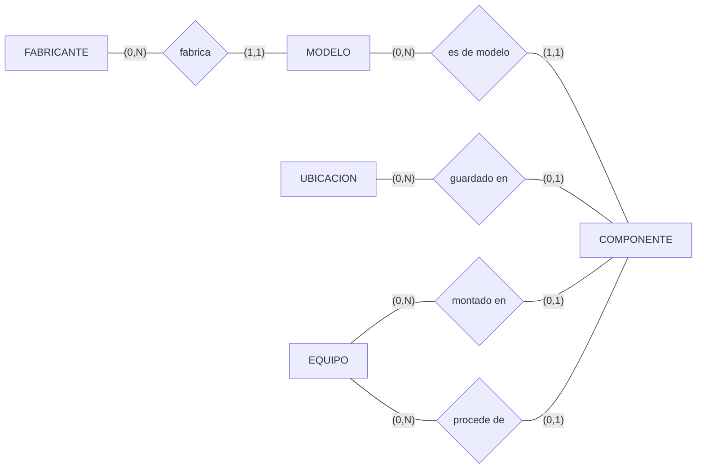
```mermaid
flowchart LR
  F[FABRICANTE] ---|"(0,N)"| r1{fabrica} ---|"(1,1)"| M[MODELO]
  M ---|"(0,N)"| r2{es de modelo} ---|"(1,1)"| C[COMPONENTE]
  U[UBICACION] ---|"(0,N)"| r3{guardado en} ---|"(0,1)"| C
  E[EQUIPO] ---|"(0,N)"| r4{montado en} ---|"(0,1)"| C
  E ---|"(0,N)"| r5{procede de} ---|"(0,1)"| C
```

| What it shows | Where |
|---|---|
| “Kingston” is written once | FABRICANTE separate from MODELO |
| A component exists even if it is not in any computer | `(0,1)` on *montado en* (“mounted in”) |
| Two relationships between the same entities | *montado en* (“mounted in”) and *procede de* (“comes from”): with only one, when a component is moved you lose where it came from |
| There are rules the diagram cannot draw | *Guardado en* (“stored in”) and *montado en* exclude each other: a component is in one place or the other, not both. It is noted separately as a **constraint** |

### 1.6 Concepts for exercises 1 to 4

| Concept | What it is | How to recognise it in a problem statement |
|---|---|---|
| **Attribute or entity** | See 1.1 | “Only the room's name matters” → attribute. “For each room, capacity and floor” → entity |
| **Relationship attribute** | See 1.2 | “How many units of each product there are **in an order**”: it belongs neither to the product nor to the order |
| **Derived data** | Data calculated from other data. It is not stored: if it were, it would get out of sync when the data it comes from changes | “The total is calculated”, “the result is counted from the goals”, “the RAM mounted in each computer” |
| **Historical data** | Looks derived but is not: it is a snapshot of a value at a moment, which must not change even if the original changes. It is stored | The price at which a product was sold in an order, even if the product goes up tomorrow. If it were calculated from the current price, old invoices would change |
| **Two relationships between the same entities** | See 1.2 and 1.5 | A match has a **home** team and an **away** team |
| **Weak entity** (*entidad débil*) | An entity that can only be identified within another one. See 4.2 | “The third goal” only means something within a specific match |
| **Non-representable constraint** | A rule from the statement that the diagram cannot draw. It is written in a separate list, saying where it would be enforced | “The two teams in a match must be different” |

---

## 2 · From the diagram to the tables

*IOC, unit 3, section 1.3 (pp. 180–192).*

The E/R diagram describes **what** has to be stored. The tables describe **how** it is stored in a
relational DBMS such as MariaDB. Going from one to the other is almost mechanical: the same
rules are always applied.

### 2.1 Vocabulary

| Term | What it is | From the diagram it comes from… |
|---|---|---|
| **Table** | Set of rows with the same columns | Each entity, and some relationships |
| **Row** (record, tuple) | One occurrence: a specific computer | — |
| **Column** (field) | A piece of data, with a type and a name | Each attribute |
| **Domain** | The valid values of a column: its type and its limits | — |
| **Null** (`NULL`) | The column is empty for that row: unknown or not applicable | Optional participations and non-mandatory attributes |

### 2.2 Keys

This is the most important part of mapping to tables.

| Key | What it is | Example |
|---|---|---|
| **Candidate key** (*clave candidata*) | Any column, or group of columns, that never repeats and serves to identify the row | In SOCIO: `id_socio` and also `email` |
| **Primary key** (*clave primaria*, PK) | The candidate chosen as the official identifier. It never repeats and is never null. There is exactly one per table | `id_socio` |
| **Alternate key** (*clave alternativa*, UK, *unique*) | A candidate that has not been chosen as primary. The DBMS still prevents it from repeating | `email` |
| **Natural key** (*clave natural*) | Data that already existed in the real world and is unique | The name of a studio, an ISBN |
| **Surrogate key** (*clave subrogada*) | An invented code, with no meaning, only to identify: `id_...`, normally a number set by the DBMS | `id_juego` |
| **Composite key** (*clave compuesta*) | One made of several columns together: none is unique on its own, the combination is | `(titulo, anio)`: there are two *Doom*, but not two *Doom* from 1993 |
| **Foreign key** (*clave ajena*, FK) | A column that stores the primary key of **another** table. It is what links the tables | `id_estudio` in the JUEGO table |

Natural or surrogate? Use a natural one only if you are sure it always exists, never repeats and never
changes. When in doubt, surrogate, with the natural one as alternate key.

The foreign key is what provides **referential integrity**: the DBMS does not let you store in
`JUEGO.id_estudio` a value that does not exist in `ESTUDIO`, nor delete a studio that has games. It is
what would have rejected the booking of `EQ-4` in the classroom spreadsheet.

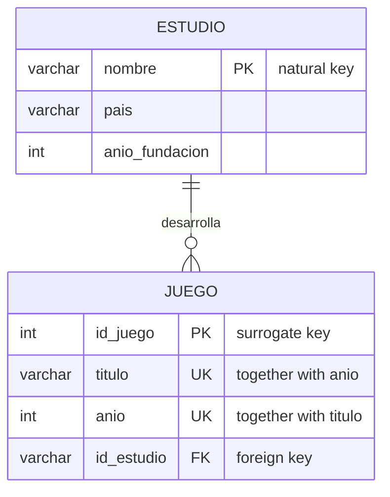
```mermaid
erDiagram
  ESTUDIO ||--o{ JUEGO : "desarrolla"
  ESTUDIO {
    varchar nombre PK "natural key"
    varchar pais
    int anio_fundacion
  }
  JUEGO {
    int id_juego PK "surrogate key"
    varchar titulo UK "together with anio"
    int anio UK "together with titulo"
    varchar id_estudio FK "foreign key"
  }
```

### 2.3 Notation

On paper: the primary key **underlined** and each foreign key with an **arrow** to the table it
points to. In text, which is how you have to hand it in:

```text
TABLA(columna_pk PK, columna, columna?, columna_fk FK → OTRA_TABLA)
      UK(columna_unica)
```

| Mark | Means |
|---|---|
| `PK` | Primary key. If composite: `PK(a, b)` on the line below |
| `FK → TABLA` | Foreign key that points to the primary key of TABLA |
| `?` at the end of the name | The column allows null. Without `?`, it is mandatory (`NOT NULL`) |
| `UK(…)` | Alternate key: the DBMS prevents it from repeating |

### 2.4 Crow's foot: how DrawDB draws

DrawDB does not use diamonds: it draws the tables and links them with lines that carry the cardinality at the
ends, in **crow's foot** notation (*pata de gallo*). The table diagrams in this document
use the same notation.

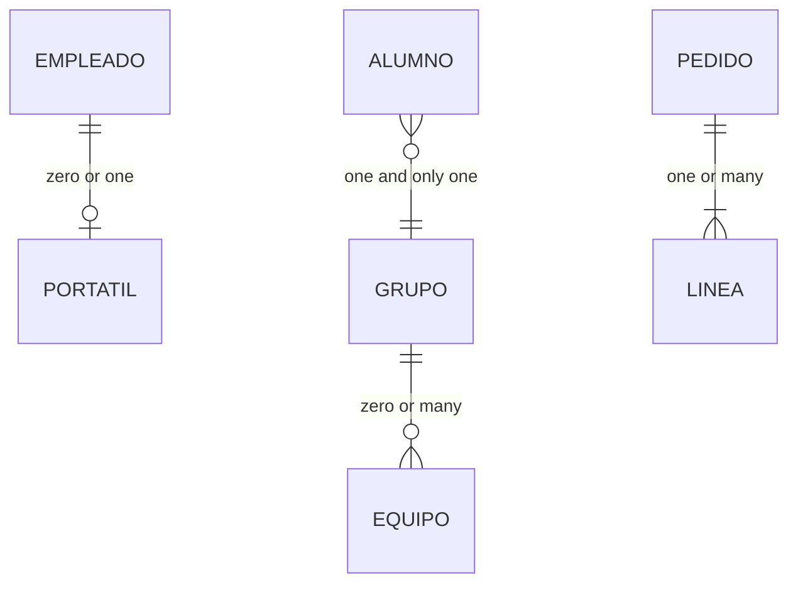
```mermaid
erDiagram
  EMPLEADO ||--o| PORTATIL : "zero or one"
  GRUPO ||--o{ EQUIPO : "zero or many"
  PEDIDO ||--|{ LINEA : "one or many"
  ALUMNO }o--|| GRUPO : "one and only one"
```

| End of the line | Reads as |
|---|---|
| two bars: `──‖` | One and only one |
| circle and bar: `──o‖` | Zero or one |
| bar and crow's foot: `──‖<` | One or many |
| circle and crow's foot: `──o<` | Zero or many |

The inner symbol (circle or bar) is the minimum; the outer one (bar or crow's foot), the maximum.

Watch out: in crow's foot the cardinality is drawn at the **opposite** end from the class
notation. `GRUPO ──(0,N)── EQUIPO` in class is drawn with the crow's foot next to EQUIPO: “a group
has zero or many computers” is read from GRUPO towards EQUIPO, and the symbol goes at the tip.

### 2.5 Rules 1 to 6

**Rule 1 · Each entity is a table.** Its attributes are columns; its key is the primary key.
Derived attributes are **not** carried over: they are not stored. Historical ones are (section 1.6).

**Rule 2 · 1:N relationship → the foreign key goes to the entity that has maximum 1 next to it.** That
table gets a column with the key of the other one. No new table is created.

Watch out with the class notation: the N is written next to the entity that does **not** get the foreign key.
In `GRUPO (0,N) — tiene asignado — (0,1) EQUIPO`, the N is next to GRUPO and the foreign key goes to
EQUIPO, which has the `(0,1)`. The question that decides it: one occurrence of this entity, with
how many of the other at most? If the answer is one, the foreign key goes here.

- If that entity has **minimum 1**, the foreign key is mandatory.
- If it has **minimum 0**, the foreign key allows null (`?`).
- If the relationship has attributes, they go to the same table as the foreign key.

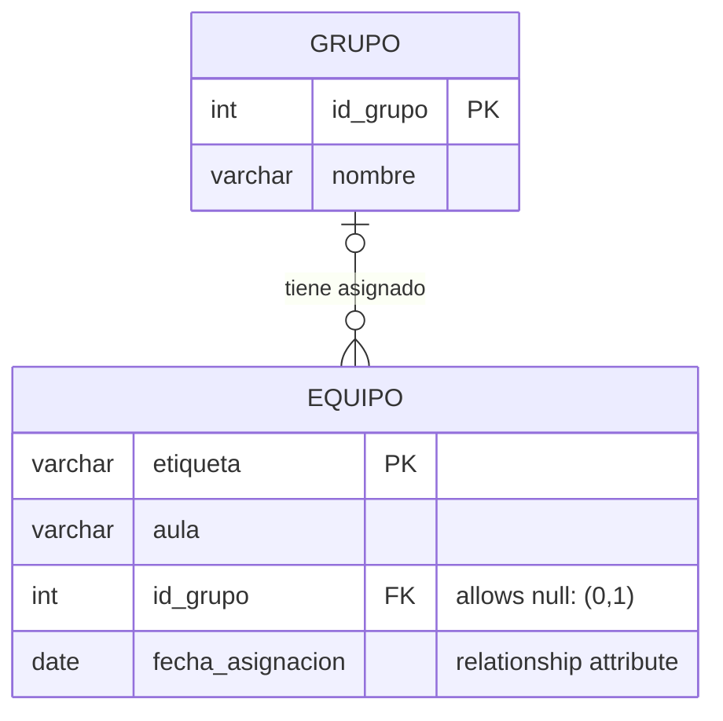
```mermaid
erDiagram
  GRUPO |o--o{ EQUIPO : "tiene asignado"
  GRUPO {
    int id_grupo PK
    varchar nombre
  }
  EQUIPO {
    varchar etiqueta PK
    varchar aula
    int id_grupo FK "allows null: (0,1)"
    date fecha_asignacion "relationship attribute"
  }
```

Why in EQUIPO and not the other way round? Because a group has many computers: if the key went in
GRUPO, you would have to put several computers in one cell, which is exactly the mistake in the classroom spreadsheet.
Each computer, on the other hand, points to a single group.

**Rule 3 · N:M relationship → new table.** Its primary key is composite, made of the foreign keys
to the two entities. The attributes of the relationship are columns of that table. It is given a
name that says what it stores (INSCRIPCION, MATRICULA, LINEA_PEDIDO).

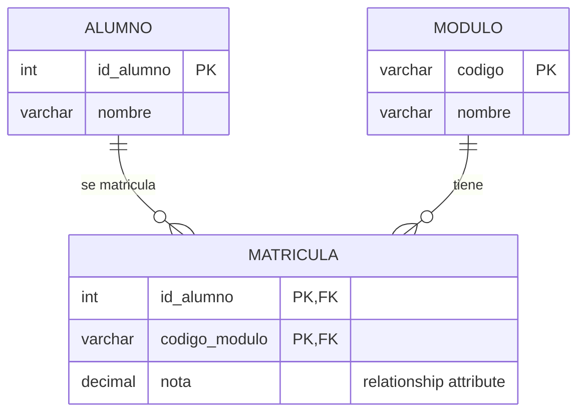
```mermaid
erDiagram
  ALUMNO ||--o{ MATRICULA : "se matricula"
  MODULO ||--o{ MATRICULA : "tiene"
  ALUMNO {
    int id_alumno PK
    varchar nombre
  }
  MATRICULA {
    int id_alumno PK, FK
    varchar codigo_modulo PK, FK
    decimal nota "relationship attribute"
  }
  MODULO {
    varchar codigo PK
    varchar nombre
  }
```

An N:M with many attributes or with a life of its own (it is created, changes state, is closed) is usually
really an entity: PEDIDO, RESERVA, PRÉSTAMO.

**N:M that keeps history.** With the composite key, the same pair cannot appear twice. In
an enrolment that is exactly what you want; in a loan, it is not: the same member can borrow the same
copy in March and again in May, and `PK(id_socio, id_ejemplar)` rejects the second loan. Two
solutions:

| Solution | Table | When |
|---|---|---|
| Date inside the primary key | `PRESTAMO(id_socio FK, id_ejemplar FK, fecha_prestamo, fecha_devolucion?)` with `PK(id_socio, id_ejemplar, fecha_prestamo)` | If the date is enough to tell two occurrences apart |
| Surrogate key | `PRESTAMO(id_prestamo PK, id_socio FK, id_ejemplar FK, fecha_prestamo, fecha_devolucion?)` | If other tables have to point to the loan, or if the date can repeat |

The question that decides it: can the same pair repeat at different moments? If so, the pair
alone is not a key. This happens with loans, bookings, inspections and any history. In the IOC, unit 2,
section 3.1.5, *L'entitat DATA*.

**Rule 4 · 1:1 relationship → foreign key on one of the two sides, with UK.** It goes on the side that
participates mandatorily, to avoid nulls; if both are optional, on the one that leaves fewer
nulls. The UK prevents two rows from pointing to the same one. If both sides have `(1,1)`, before making two tables
check whether they are not the same entity (section 4.3).

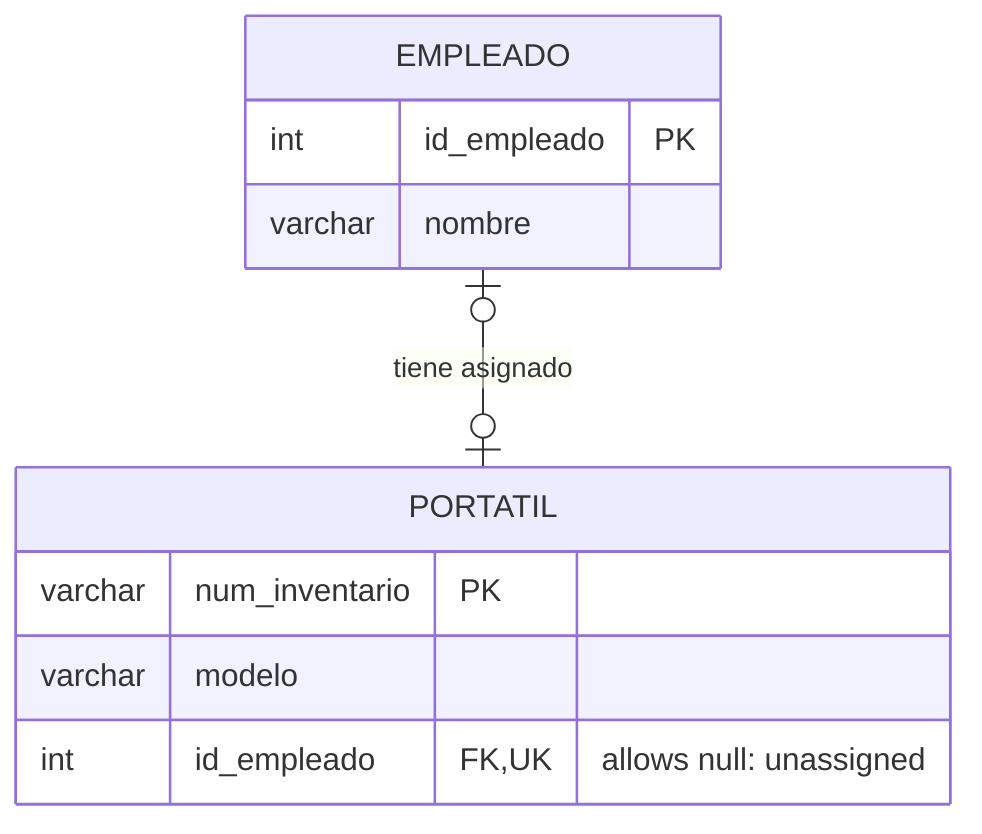
```mermaid
erDiagram
  EMPLEADO |o--o| PORTATIL : "tiene asignado"
  EMPLEADO {
    int id_empleado PK
    varchar nombre
  }
  PORTATIL {
    varchar num_inventario PK
    varchar modelo
    int id_empleado FK, UK "allows null: unassigned"
  }
```

**Rule 5 · Weak entity → its primary key is the key of the strong one plus the discriminator.** The
key of the strong one is at the same time part of the primary key and a foreign key. (Weak entity: section 4.2.)

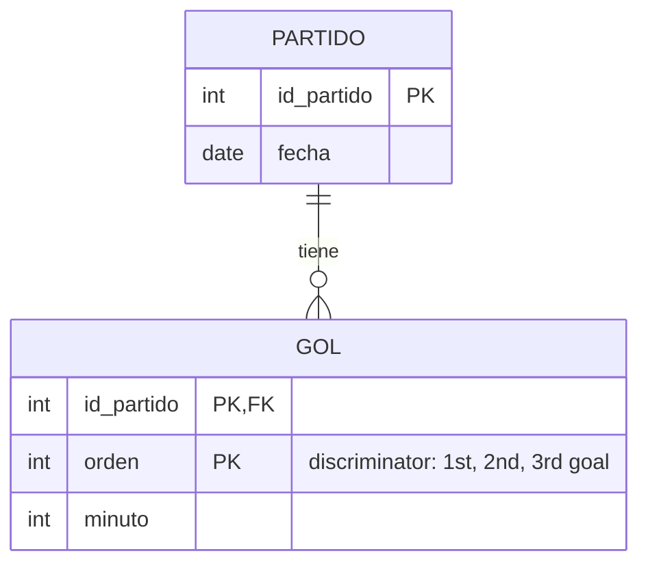
```mermaid
erDiagram
  PARTIDO ||--o{ GOL : "tiene"
  PARTIDO {
    int id_partido PK
    date fecha
  }
  GOL {
    int id_partido PK, FK
    int orden PK "discriminator: 1st, 2nd, 3rd goal"
    int minuto
  }
```

**Rule 6 · Two relationships between the same tables → two foreign keys with different names.**
Each one says which role it represents.

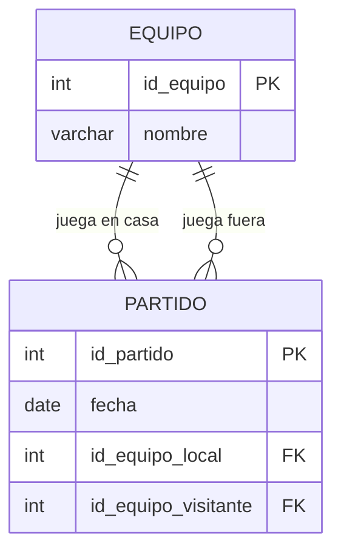
```mermaid
erDiagram
  EQUIPO ||--o{ PARTIDO : "juega en casa"
  EQUIPO ||--o{ PARTIDO : "juega fuera"
  EQUIPO {
    int id_equipo PK
    varchar nombre
  }
  PARTIDO {
    int id_partido PK
    date fecha
    int id_equipo_local FK
    int id_equipo_visitante FK
  }
```

### 2.6 What tables cannot express

Tables with their keys guarantee types, uniqueness and that references exist. Some things from the
diagram, and from the statement, are lost along the way, and must be written down as constraints:

| What is lost | Example | Why |
|---|---|---|
| The minimum 1 of the entity without the foreign key in a 1:N | “Every group has at least one student” | The foreign key is in ALUMNO: nothing forces some row pointing to this group to exist |
| Rules between rows or between tables | “The player who scores belongs to one of the two teams in the match” | A foreign key checks that the player exists, not which team they are on |
| Mutually exclusive relationships | “A component is mounted or stored, not both” | They are two independent foreign keys; that both are not filled in is stated separately, with a `CHECK` |
| Rules on values | “The quantity is greater than 0” | It can be set with `CHECK` in the DBMS, but it is not visible in the diagram |

### 2.7 Worked example · Groups, computers and modules

> In the school there are groups (1ASIR, 1SMR…). Each group is assigned several computers from the classroom;
> a computer can be assigned to one group or to none, and we want to know since what date it has been.
> For each computer we store its label, which is unique (`EQ-04`), and the classroom. Students, for whom we
> store name and email, are in a single group, and enrol in several modules; for each
> enrolment we are interested in the mark.

**E/R diagram:**

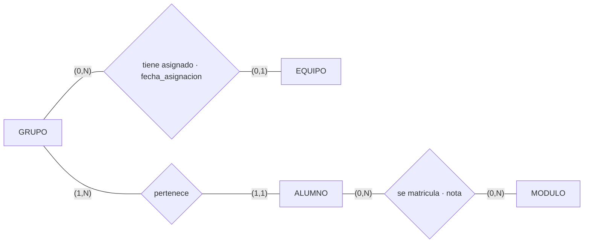
```mermaid
flowchart LR
  G[GRUPO] ---|"(0,N)"| r1{tiene asignado · fecha_asignacion} ---|"(0,1)"| E[EQUIPO]
  G ---|"(1,N)"| r2{pertenece} ---|"(1,1)"| A[ALUMNO]
  A ---|"(0,N)"| r3{se matricula · nota} ---|"(0,N)"| M[MODULO]
```

**Tables, applying the rules:**

```text
GRUPO(id_grupo PK, nombre)                                      UK(nombre)
EQUIPO(etiqueta PK, aula, id_grupo? FK → GRUPO, fecha_asignacion?)
ALUMNO(id_alumno PK, nombre, email, id_grupo FK → GRUPO)        UK(email)
MODULO(codigo PK, nombre)
MATRICULA(id_alumno FK → ALUMNO, codigo_modulo FK → MODULO, nota?)
          PK(id_alumno, codigo_modulo)
```

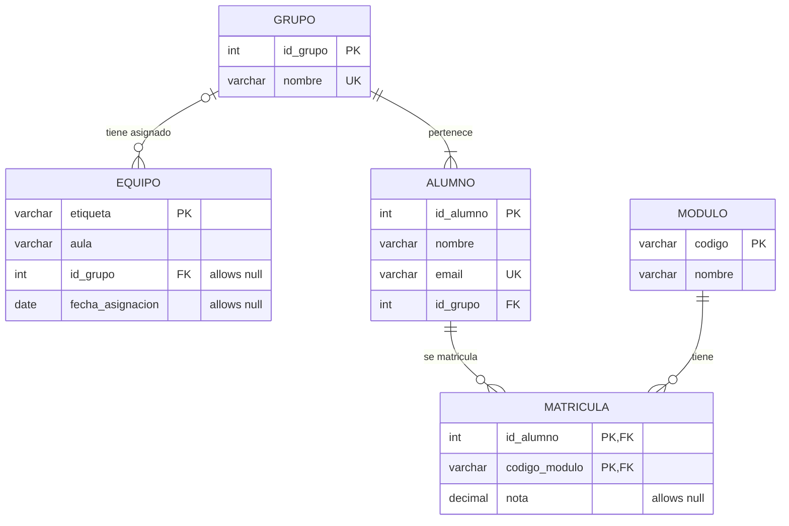
```mermaid
erDiagram
  GRUPO |o--o{ EQUIPO : "tiene asignado"
  GRUPO ||--|{ ALUMNO : "pertenece"
  ALUMNO ||--o{ MATRICULA : "se matricula"
  MODULO ||--o{ MATRICULA : "tiene"
  GRUPO {
    int id_grupo PK
    varchar nombre UK
  }
  EQUIPO {
    varchar etiqueta PK
    varchar aula
    int id_grupo FK "allows null"
    date fecha_asignacion "allows null"
  }
  ALUMNO {
    int id_alumno PK
    varchar nombre
    varchar email UK
    int id_grupo FK
  }
  MODULO {
    varchar codigo PK
    varchar nombre
  }
  MATRICULA {
    int id_alumno PK, FK
    varchar codigo_modulo PK, FK
    decimal nota "allows null"
  }
```

| Decision | Rule |
|---|---|
| `etiqueta` is the key of EQUIPO, with no surrogate | Rule 1. It is natural, unique, always exists and does not change |
| `id_grupo` goes in EQUIPO, and allows null | Rule 2. EQUIPO has maximum 1; its minimum is 0: it may be unassigned |
| `fecha_asignacion` goes in EQUIPO | Rule 2. Attribute of a 1:N: it goes with the foreign key |
| `id_grupo` in ALUMNO is mandatory | Rule 2. ALUMNO has `(1,1)`: every student is in a group |
| MATRICULA is a table | Rule 3. ALUMNO–MODULO is N:M. The mark belongs to the enrolment, not to the student or the module |
| The key of MATRICULA is composite | Rule 3. A student does not enrol twice in the same module |
| “Every group has at least one student” does not appear | The `(1,N)` of GRUPO is lost. It goes to the list of constraints |

Notice that `id_grupo` appears in three tables and **is the same information**: the primary key of
GRUPO, copied wherever a link is needed. That is not redundancy: it is the only way to relate
tables.

---

## 3 · The relational model

*IOC, unit 3, sections 1.1 and 1.2 (pp. 163–179).*

The E/R diagram is the **conceptual model**: what there is in the world we want to store, without thinking
about any DBMS. The **relational model** is the **logical model**: how that is organised in tables.
It was proposed by Edgar F. Codd in 1970 and it is the one used by MariaDB, PostgreSQL, SQLite, Oracle and SQL Server.
The **physical model** is how a specific DBMS stores it on disk, with its types and files.

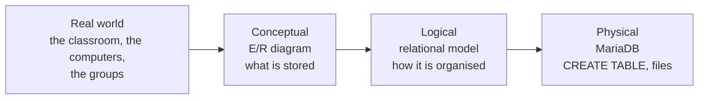
```mermaid
flowchart LR
  MR["Real world<br/>the classroom, the computers,<br/>the groups"] --> C["Conceptual<br/>E/R diagram<br/>what is stored"]
  C --> L["Logical<br/>relational model<br/>how it is organised"]
  L --> F["Physical<br/>MariaDB<br/>CREATE TABLE, files"]
```

| Level | Depends on… |
|---|---|
| Conceptual | Nothing: it is a drawing of the business |
| Logical | The type of DBMS (relational), not the product |
| Physical | The specific product: MariaDB does not store things the same way as PostgreSQL |

### 3.1 Vocabulary

A table, with the formal names:

**EQUIPO** · degree 3 (columns) · cardinality 4 (rows)

| etiqueta 🔑 | aula | id_grupo |
|---|---|---|
| EQ-01 | 1.12 | 1 |
| EQ-02 | 1.12 | 1 |
| EQ-03 | 1.12 | 2 |
| EQ-04 | Taller | *null* |

| Formal term | Everyday term | What it is |
|---|---|---|
| **Relation** | Table | Set of rows with the same columns. Watch out: “relation” here is **not** the E/R diamond |
| **Tuple** | Row, record | A specific occurrence: `EQ-03, 1.12, 2` |
| **Attribute** | Column, field | A named piece of data: `aula` |
| **Domain** | Type and valid values | The values an attribute can take: `integer between 1 and 64`, `DDR3, DDR4 or DDR5` |
| **Degree** | Number of columns | EQUIPO has degree 3 |
| **Cardinality** | Number of rows | Changes every time a row is inserted or deleted. Not to be confused with the E/R `(min,max)` cardinality |
| **Schema** | The header | Name of the table and its columns: `EQUIPO(etiqueta PK, aula, id_grupo)` |
| **Instance** (extension) | The content | The rows that are there right now |

### 3.2 Properties of a relational table

A spreadsheet meets none of these. A table, all of them:

1. **There are no two identical rows.** That is why every table has a primary key.
2. **Each cell has a single value** (atomic value). No `2x4GB` or `WD 1TB, Kingston SSD`.
3. **All the values in a column are from the same domain.** No `4096MB`, `4 GB` and `4` in the
   same column.
4. **The order of the rows does not matter**, nor does the order of the columns. There is no “row 3”: there is “the
   row whose key is `EQ-03`”.

### 3.3 Integrity rules

These are the rules the DBMS enforces by itself, without programming anything:

| Rule | What it says | What the DBMS rejects |
|---|---|---|
| **Entity integrity** | The primary key is never null and never repeats | Adding a second `EQ-04`, or a computer without a label |
| **Referential integrity** | A foreign key is either null or equal to some primary key of the table it points to | Storing `EQ-4` in a component if computer `EQ-4` does not exist |
| **Domain integrity** | Each value belongs to the domain of its column | Storing `ocho` (“eight”) in an integer column, or `-2` if there is a `CHECK (capacidad_gb > 0)` |

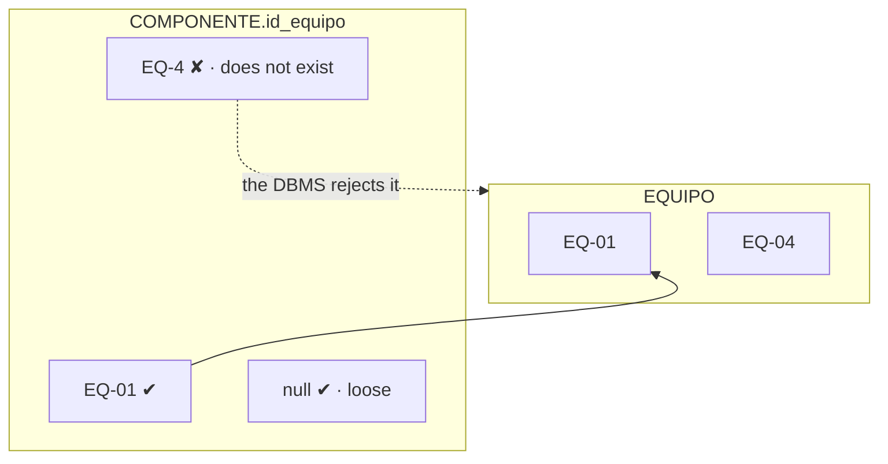
```mermaid
flowchart TB
  subgraph EQ["EQUIPO"]
    direction LR
    e1["EQ-01"]
    e4["EQ-04"]
  end
  subgraph CO["COMPONENTE.id_equipo"]
    direction LR
    c1["EQ-01 ✔"]
    c2["null ✔ · loose"]
    c3["EQ-4 ✘ · does not exist"]
  end
  c1 --> e1
  c3 -. "the DBMS rejects it" .-> EQ
  EQ ~~~ CO
```

And what if you delete a computer that has components mounted? It is decided when creating the foreign key:

| Option | What happens to the components | When it makes sense |
|---|---|---|
| `RESTRICT` (the usual) | The DBMS **does not let** you delete the computer while it has components | Almost always: it forces you to dismount first |
| `SET NULL` | The components are left with `id_equipo` set to null: they become loose | If the foreign key allows null and “loose” is a valid state |
| `CASCADE` | The components are deleted too | Only for weak entities: if a match is deleted, its goals are deleted |

---

## 4 · What remains of the E/R diagram

*IOC, unit 2: sections 1.1.3–1.1.6 (attributes, pp. 93–96), 1.2.2–1.2.4 (degree and
reflexive, pp. 99–106), 1.3 (weak entities, pp. 106–108), 2.2.1 (specialisation, pp.
126–133) and 3.1.3 (binary or ternary, p. 145).*

### 4.1 Attribute types

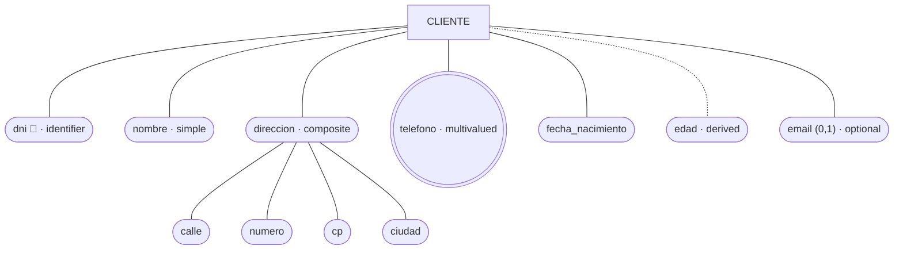
```mermaid
flowchart TB
  C[CLIENTE] --- dni([dni 🔑 · identifier])
  C --- nom([nombre · simple])
  C --- dir([direccion · composite])
  dir --- ca([calle])
  dir --- nu([numero])
  dir --- cp([cp])
  dir --- ci([ciudad])
  C --- tel((("telefono · multivalued")))
  C --- fn([fecha_nacimiento])
  C -.- ed([edad · derived])
  C --- em(["email (0,1) · optional"])
```

| Type | What it is | How it is drawn in class | Example |
|---|---|---|---|
| **Simple** | Cannot be broken down | Ellipse | `nombre` |
| **Composite** (*atributo compuesto*) | Made of other attributes that matter separately | Ellipse with other ellipses hanging from it | `direccion` = street + number + postcode + city |
| **Single-valued** | One single value per occurrence | Ellipse | `fecha_nacimiento` |
| **Multivalued** (*atributo multivaluado*) | Can have several values for the same occurrence | Double ellipse | The phone numbers of a customer |
| **Mandatory / optional** | Whether it can be left without a value | Optional: `(0,1)` is noted next to the ellipse | `email` if the customer does not want to give it |
| **Derived** (*atributo derivado*) | Calculated from others. It is not stored | Dashed-line ellipse | `edad`, from `fecha_nacimiento` |
| **Identifier** | The key | Underlined | `dni` |

Composite or simple? It depends on the questions. If any question needs “customers from Huesca”,
the city has to be separate. If the address is only printed on a label, a single text is enough.

### 4.2 Strong entity and weak entity

A **weak entity** depends on another one (the **strong** one). There are two ways of depending, and it is worth not
mixing them up:

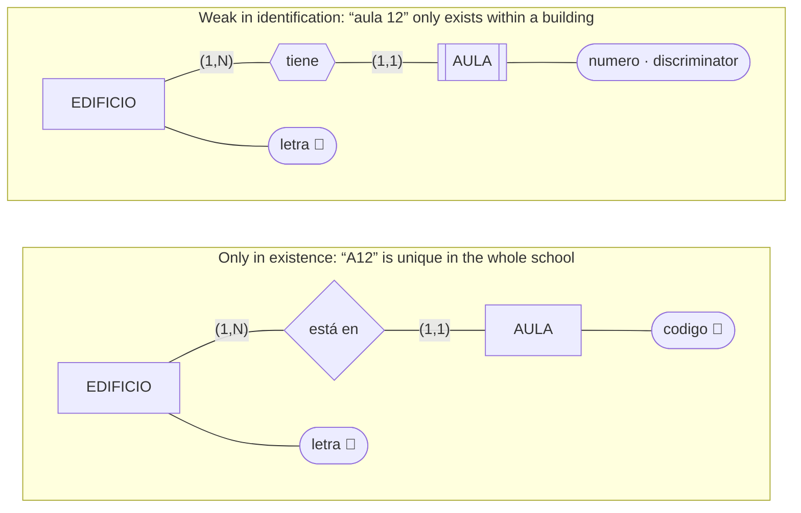
```mermaid
flowchart TB
  subgraph id["Weak in identification: “aula 12” only exists within a building"]
    direction LR
    E1[EDIFICIO] ---|"(1,N)"| r1{{tiene}} ---|"(1,1)"| A1[[AULA]]
    E1 --- e1([letra 🔑])
    A1 --- a1([numero · discriminator])
  end
  subgraph ex["Only in existence: “A12” is unique in the whole school"]
    direction LR
    E2[EDIFICIO] ---|"(1,N)"| r2{está en} ---|"(1,1)"| A2[AULA]
    E2 --- e2([letra 🔑])
    A2 --- a2([codigo 🔑])
  end
  id ~~~ ex
```

| Dependency | What it means | Example | How it is drawn | Key in tables |
|---|---|---|---|---|
| **In existence** | Cannot exist without the other, but is identified on its own | An order line with its own `id_linea`; an employee is always in a department | Normal rectangle. The `(1,1)` in the cardinality already says it | Its own PK. The foreign key, mandatory |
| **In identification** | Cannot be identified without the other: its key only makes sense within the strong one | “Room 12” only makes sense when you say which building; “episode 3” only within a season | **Double rectangle** and **double diamond** (identifying relationship; in the diagrams in this document, hexagon). The **discriminator** underlined with a dashed line | PK = key of the strong one + discriminator (rule 5) |

Every dependency in identification is also one in existence. The other way round, it is not.

### 4.3 Relationships: degree and type

The **degree** is how many entities the relationship links. The **type** (1:1, 1:N, N:M) comes from the maximums,
as in section 1.3.

| Degree | Name | Example |
|---|---|---|
| 1 | **Reflexive** (*relación reflexiva*; unary, recursive) | An EMPLEADO *es jefe de* (“is the boss of”) other EMPLEADOS |
| 2 | Binary | All the ones in section 1 |
| 3 | **Ternary** (*ternaria*) | A PROFESOR *imparte* (“teaches”) a MÓDULO to a GRUPO |

**Reflexive.** The entity is related to itself. Since both ends reach the same
rectangle, on each line you write the **role** that occurrence plays: *jefe* (boss) and
*subordinado* (subordinate), *seguidor* (follower) and *seguido* (followed), *requisito* (prerequisite) and *requerido* (required). The usual two questions are
asked once per role:

> An employee, **as boss**, how many employees do they manage? → `(0,N)`
>
> An employee, **as subordinate**, how many bosses do they have? → `(0,1)`: the director has none

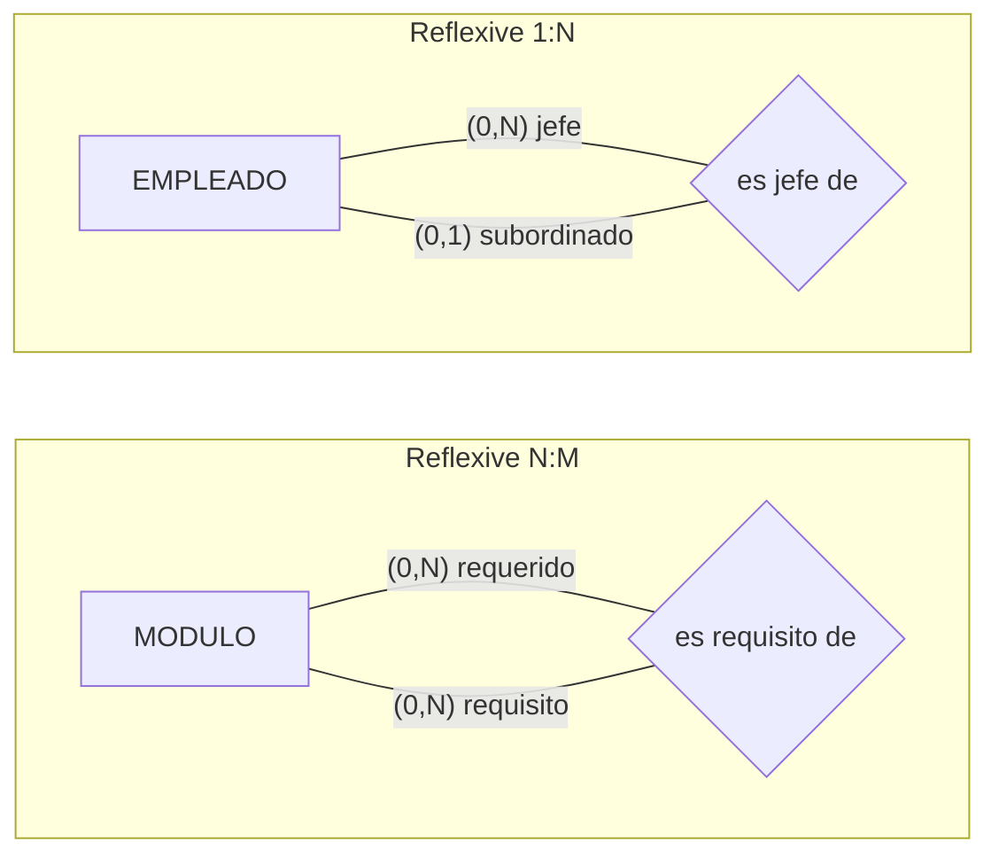
```mermaid
flowchart TB
  subgraph n1["Reflexive 1:N"]
    direction LR
    E[EMPLEADO] ---|"(0,N) jefe"| R1{es jefe de}
    R1 ---|"(0,1) subordinado"| E
  end
  subgraph nm["Reflexive N:M"]
    direction LR
    M[MODULO] ---|"(0,N) requerido"| R2{es requisito de}
    R2 ---|"(0,N) requisito"| M
  end
  n1 ~~~ nm
```

It can be 1:1 (*es la continuación de*, “is the sequel of”, between volumes of a saga), 1:N (*es jefe de*) or N:M
(*sigue a*, “follows”; *es requisito de*, “is a prerequisite of”).

**Ternary.** A fact that only makes sense with the three entities at once. To get the
cardinality of one entity you **fix the other two** and ask about it:

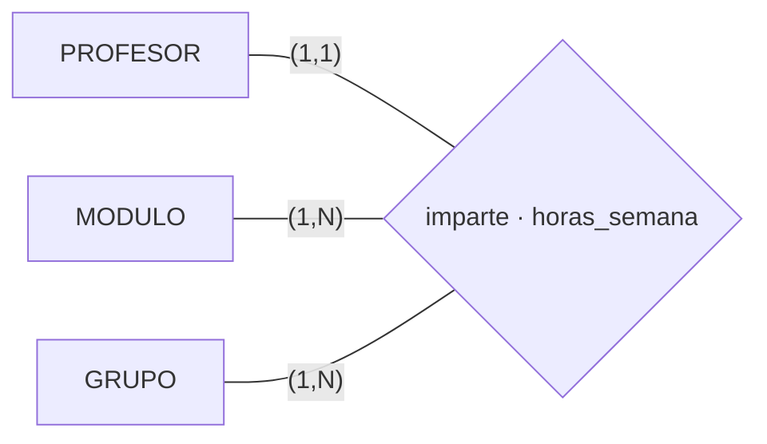
```mermaid
flowchart LR
  P[PROFESOR] ---|"(1,1)"| I{imparte · horas_semana}
  M[MODULO] ---|"(1,N)"| I
  G[GRUPO] ---|"(1,N)"| I
```

| Fixed | I ask | Answer | Written next to |
|---|---|---|---|
| one module and one group | how many teachers? | one | PROFESOR `(1,1)` |
| one teacher and one group | how many modules? | several | MODULO `(1,N)` |
| one teacher and one module | how many groups? | several | GRUPO `(1,N)` |

Why not three binary relationships? Because information is lost. If Ana teaches BD and Redes, Ana is
in 1A and in 1B, and BD is taught in 1A and in 1B, with three binaries you cannot tell whether Ana teaches Redes in 1A. The
ternary stores the complete trio.

**1:1.** Maximum 1 on both sides. Before leaving it like that, ask yourself whether they are not the same entity: if
both have `(1,1)` and never exist separately, they usually are. If either has minimum 0, they are
kept separate: a laptop can be unassigned, an employee may not have a laptop.

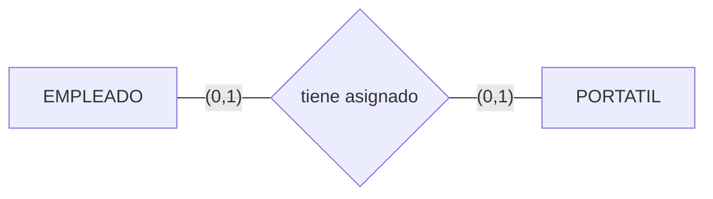
```mermaid
flowchart LR
  E[EMPLEADO] ---|"(0,1)"| R{tiene asignado} ---|"(0,1)"| P[PORTATIL]
```

### 4.4 Hierarchies: generalisation and specialisation

When there are several kinds of the same thing, each with its own attributes, you draw a
**supertype** with what is common and **subtypes** with what is particular, linked by an *is a* (*es un*) triangle (in the
diagrams in this document, a trapezoid). The subtypes inherit the attributes and the key of the supertype. This is a hierarchy (*jerarquía*).

```mermaid
flowchart TB
  C[COMPONENTE] --- h[/"is a · total, exclusive"\]
  h --- R[RAM]
  h --- D[DISCO]
  h --- U[CPU]
  C --- a1([id_componente 🔑])
  C --- a2([fabricante])
  C --- a3([estado])
  R --- r1([capacidad_gb])
  R --- r2([tipo_memoria])
  D --- d1([capacidad_gb])
  D --- d2([tecnologia])
  U --- u1([nucleos])
  U --- u2([frecuencia_ghz])
```

They are classified with two questions:

| Question | Yes | No |
|---|---|---|
| Is every occurrence of the supertype of some subtype? | **Total**: there are no components “of no type” | **Partial**: there are employees who are neither technicians nor sales staff |
| Can an occurrence be of two subtypes at once? | **Overlapping**: a person can be a student and an instructor | **Exclusive**: a component is RAM or disk, not both |

```mermaid
flowchart TB
  E[EMPLEADO] --- h[/"is a · partial, exclusive"\]
  h --- T[TECNICO]
  h --- C[COMERCIAL]
  E --- n["administration and management:<br/>neither technicians nor sales staff"]
```

A hierarchy is only worth it if the subtypes have **attributes or relationships of their own**. If only the
name of the type changes, a `tipo` attribute is enough.

### 4.5 Summary of symbols

| On paper | In the diagrams in this document | Means |
|---|---|---|
| Rectangle | Rectangle | Strong entity |
| Double rectangle | Double-bordered rectangle | Weak entity (in identification) |
| Diamond | Diamond | Relationship |
| Double diamond | Hexagon | Identifying relationship, between the weak entity and its strong one |
| Diamond with both lines to the same entity, with roles | Same | Reflexive relationship |
| Diamond with three lines | Same | Ternary relationship |
| Ellipse / double ellipse / dashed | Oval / double circle / dashed line | Attribute / multivalued / derived |
| Ellipse with ellipses hanging from it | Same | Composite attribute |
| Underlined / dashed underline | 🔑 / “discriminator” | Key / discriminator of the weak entity |
| *Is a* triangle | *Is a* trapezoid | Hierarchy, with `(total/partial, exclusive/overlapping)` |

---

## 5 · Rules for mapping to tables 7 to 11

*IOC, unit 3, sections 1.3.2–1.3.4 (pp. 182–192).*

Rules 1 to 6 are in section 2.5: entity → table, 1:N → foreign key in the entity with
maximum 1, N:M → new table, 1:1 → foreign key with UK, weak → key of the strong one plus discriminator, two relationships
→ two foreign keys named after the role.

**Rule 7 · Reflexive 1:N → foreign key to the same table.** It is named after the role, never after the
name of the table: `id_jefe`, not `id_empleado2`. It allows null if the minimum is 0 (the director).
A reflexive 1:1 is the same with `UK` on the foreign key.

```text
EMPLEADO(id_empleado PK, nombre, id_jefe? FK → EMPLEADO)
```

```mermaid
erDiagram
  EMPLEADO |o--o{ EMPLEADO : "es jefe de"
  EMPLEADO {
    int id_empleado PK
    varchar nombre
    int id_jefe FK "allows null"
  }
```

**Rule 8 · Reflexive N:M → new table with two foreign keys to the same table.** Each one with the
name of its role; the primary key is the pair.

```text
REQUISITO(codigo_modulo FK → MODULO, codigo_requisito FK → MODULO)
          PK(codigo_modulo, codigo_requisito)
```

```mermaid
erDiagram
  MODULO ||--o{ REQUISITO : "exige"
  MODULO ||--o{ REQUISITO : "es requisito en"
  MODULO {
    varchar codigo PK
    varchar nombre
  }
  REQUISITO {
    varchar codigo_modulo PK, FK
    varchar codigo_requisito PK, FK
  }
```

**Rule 9 · Ternary → new table with three foreign keys.** The primary key is made of the foreign
keys of the entities with **maximum N**. The one of an entity with maximum 1 goes in the table but outside
the primary key, because the other two already determine it. If all three have maximum N, the primary
key is all three.

```text
IMPARTE(id_profesor FK → PROFESOR, codigo_modulo FK → MODULO, id_grupo FK → GRUPO, horas_semana)
        PK(codigo_modulo, id_grupo)          ← PROFESOR has maximum 1
```

```mermaid
erDiagram
  PROFESOR ||--o{ IMPARTE : "imparte"
  MODULO ||--o{ IMPARTE : "se imparte"
  GRUPO ||--o{ IMPARTE : "recibe"
  IMPARTE {
    int id_profesor FK "outside the PK: maximum 1"
    varchar codigo_modulo PK, FK
    int id_grupo PK, FK
    int horas_semana
  }
```

**Rule 10 · Special attributes.**

| Attribute | In tables |
|---|---|
| Composite | Its components are stored as columns: `calle`, `numero`, `cp`, `ciudad`. The “address” attribute disappears |
| Multivalued | **New table**: the key of the entity + the value, both in the primary key |
| Derived | Not stored (rule 1) |
| Optional | The column allows null: `email?` |

```mermaid
erDiagram
  CLIENTE ||--|{ TELEFONO_CLIENTE : "tiene"
  CLIENTE {
    char dni PK
    varchar nombre
    varchar calle "composite: address"
    varchar numero
    char cp
    varchar ciudad
    date fecha_nacimiento "age is not stored"
    varchar email "optional: allows null"
  }
  TELEFONO_CLIENTE {
    char dni PK, FK
    varchar telefono PK "multivalued"
  }
```

Why can the multivalued attribute not be `telefono1`, `telefono2`, `telefono3`? Because someone will have
four, most people will have empty columns, and the question “whose phone number is this?” forces you to
look at three columns.

**Rule 11 · Hierarchy → three options.**

| Option | Tables | Advantage | Drawback |
|---|---|---|---|
| **A · One table for everything** | `COMPONENTE(id PK, fabricante, estado, tipo, capacidad_gb?, tipo_memoria?, tecnologia?, nucleos?, frecuencia_ghz?)` | A single table; simple queries | Many nulls. The DBMS does not prevent a RAM from having cores |
| **B · Supertype + one table per subtype** | The one in the diagram below | No nulls; each subtype has its mandatory columns; common relationships point to COMPONENTE | You have to join two tables to see a complete RAM |
| **C · Only the subtypes** | `RAM(id PK, fabricante, estado, capacidad_gb, tipo_memoria)`, the same for DISCO and CPU | No nulls, one table per query on one type | What is common is repeated. “All faulty components” are three queries. Only valid if it is total and exclusive |

By default, **B**. The primary key of each subtype is at the same time a foreign key to the supertype: it is a
1:1. If the hierarchy is exclusive, the supertype's `tipo` says which subtype to look in.

```mermaid
erDiagram
  COMPONENTE ||--o| RAM : "es"
  COMPONENTE ||--o| DISCO : "es"
  COMPONENTE ||--o| CPU : "es"
  COMPONENTE {
    int id_componente PK
    varchar fabricante
    varchar estado
    varchar tipo "RAM, DISCO or CPU"
  }
  RAM {
    int id_componente PK, FK
    int capacidad_gb
    varchar tipo_memoria
  }
  DISCO {
    int id_componente PK, FK
    int capacidad_gb
    varchar tecnologia
  }
  CPU {
    int id_componente PK, FK
    int nucleos
    decimal frecuencia_ghz
  }
```

### 5.1 What still does not fit

Hierarchies and reflexive relationships bring new constraints that neither the diagram nor the tables
guarantee:

| Constraint | Example |
|---|---|
| Nobody is related to themselves | An employee is not their own boss; a module is not a prerequisite of itself |
| No cycles | A boss of B, B boss of C, C boss of A |
| Exclusive | The same `id_componente` cannot be in RAM and in DISCO at the same time (option B) |
| Total | Every COMPONENTE has its row in some subtype |
| Consistency in the ternary | The teacher who teaches a module belongs to its department |

---

Last updated: 2 October 2026.
